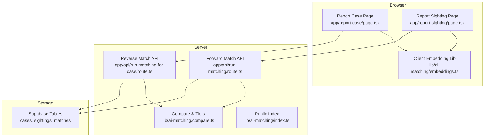
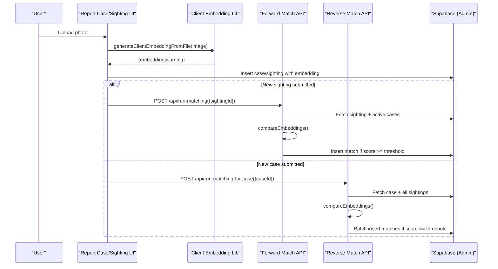
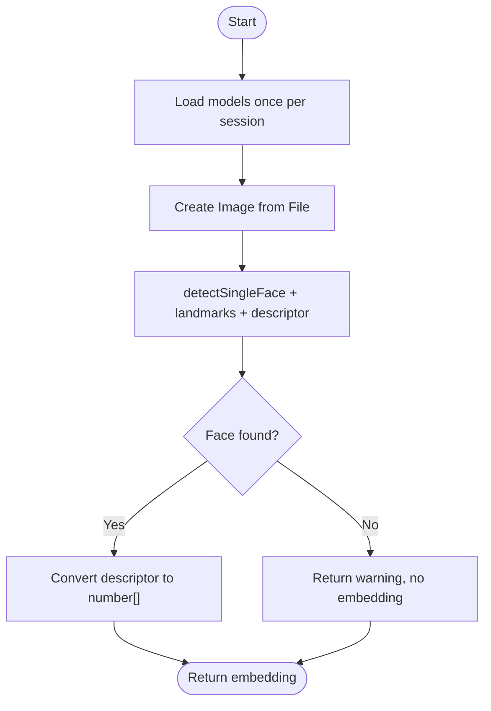
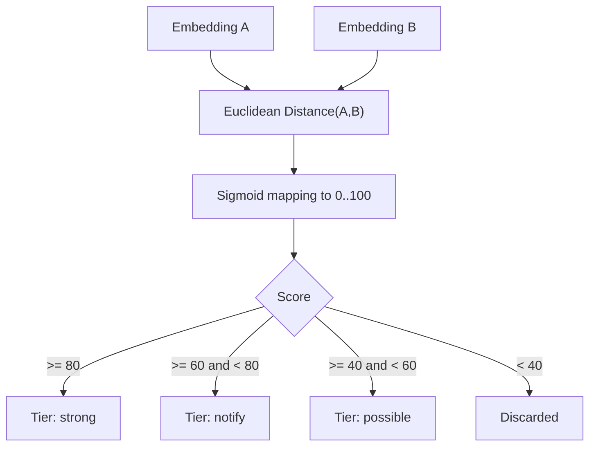
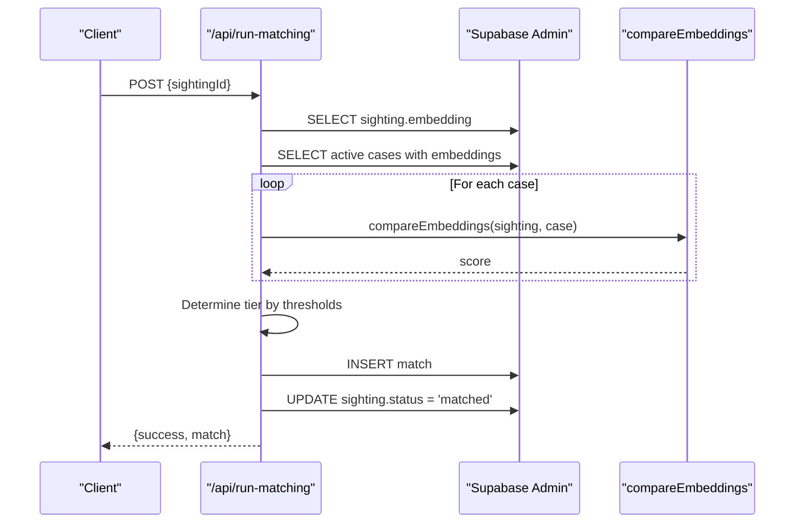
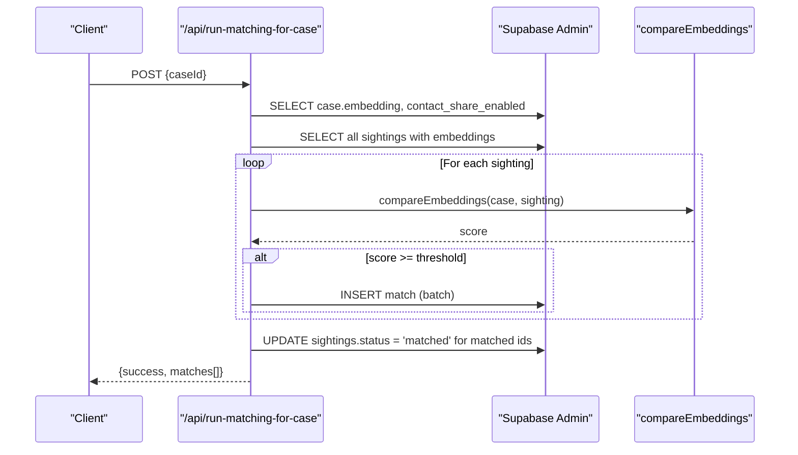
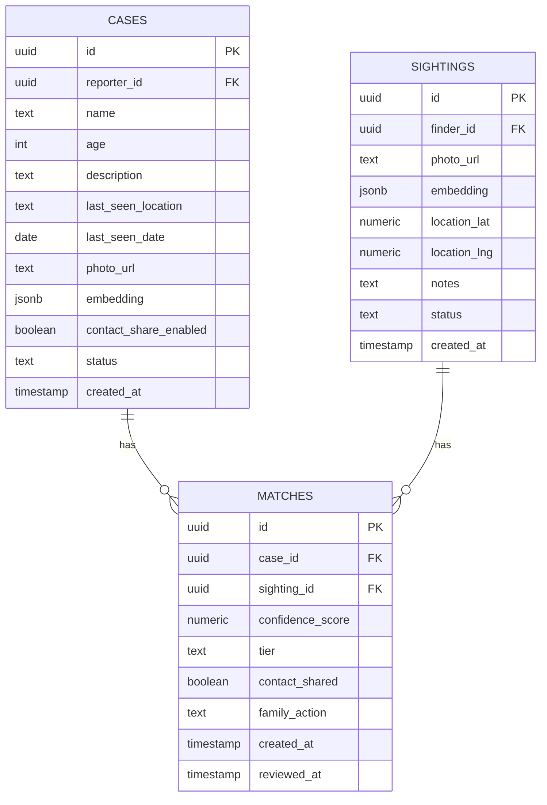
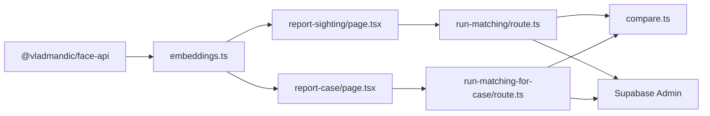

# AI Matching Engine

<cite>
**Referenced Files in This Document**
- [embeddings.ts](file://lib/ai-matching/embeddings.ts)
- [compare.ts](file://lib/ai-matching/compare.ts)
- [index.ts](file://lib/ai-matching/index.ts)
- [route.ts (run-matching)](file://app/api/run-matching/route.ts)
- [route.ts (run-matching-for-case)](file://app/api/run-matching-for-case/route.ts)
- [page.tsx (report-case)](file://app/report-case/page.tsx)
- [page.tsx (report-sighting)](file://app/report-sighting/page.tsx)
- [initial_schema.sql](file://supabase/migrations/20260903_initial_schema.sql)
- [package.json](file://package.json)
</cite>

## Table of Contents
1. Introduction
2. Project Structure
3. Core Components
4. Architecture Overview
5. Detailed Component Analysis
6. Dependency Analysis
7. Performance Considerations
8. Troubleshooting Guide
9. Conclusion
10. Appendices

## Introduction
This document explains the AI-powered facial recognition matching engine that powers Findora’s missing-person workflow. It covers:
- Client-side face detection and 128-dimensional embedding generation using @vladmandic/face-api running entirely in the browser.
- Server-side matching APIs that compare embeddings, classify confidence tiers, and persist match results.
- Thresholds and scoring logic for strong, notify, and possible matches.
- Configuration options, performance optimizations, error handling, and privacy considerations for sensitive biometric data.

## Project Structure
The matching system spans client UI components, a lightweight client-side AI library, and server API routes that perform batch comparisons against stored embeddings.

**Diagram sources**
- [page.tsx (report-case):1-200](file://app/report-case/page.tsx#L1-L200)
- [page.tsx (report-sighting):262-279](file://app/report-sighting/page.tsx#L262-L279)
- [embeddings.ts:20-102](file://lib/ai-matching/embeddings.ts#L20-L102)
- [route.ts (run-matching):10-186](file://app/api/run-matching/route.ts#L10-L186)
- [route.ts (run-matching-for-case):20-208](file://app/api/run-matching-for-case/route.ts#L20-L208)
- [compare.ts:1-72](file://lib/ai-matching/compare.ts#L1-L72)
- [index.ts:1-56](file://lib/ai-matching/index.ts#L1-L56)

**Section sources**
- [package.json:11-20](file://package.json#L11-L20)
- [initial_schema.sql:58-199](file://supabase/migrations/20260903_initial_schema.sql#L58-L199)

## Core Components
- Client-side embedding generator: Loads models once per session and extracts a 128-d vector from uploaded images directly in the browser.
- Matching algorithms: Computes similarity between embeddings and maps to confidence tiers.
- Server APIs: Forward matching (per sighting) and reverse matching (per case), both using Supabase Admin to bypass Row Level Security safely on the server.
- Data model: Stores embeddings as JSONB arrays in cases and sightings; persists matches with scores and tiers.

**Section sources**
- [embeddings.ts:1-102](file://lib/ai-matching/embeddings.ts#L1-L102)
- [compare.ts:1-72](file://lib/ai-matching/compare.ts#L1-L72)
- [index.ts:1-56](file://lib/ai-matching/index.ts#L1-L56)
- [route.ts (run-matching):10-186](file://app/api/run-matching/route.ts#L10-L186)
- [route.ts (run-matching-for-case):20-208](file://app/api/run-matching-for-case/route.ts#L20-L208)
- [initial_schema.sql:58-199](file://supabase/migrations/20260903_initial_schema.sql#L58-L199)

## Architecture Overview
End-to-end flow for embedding generation and matching:

**Diagram sources**
- [embeddings.ts:51-102](file://lib/ai-matching/embeddings.ts#L51-L102)
- [route.ts (run-matching):24-177](file://app/api/run-matching/route.ts#L24-L177)
- [route.ts (run-matching-for-case):37-199](file://app/api/run-matching-for-case/route.ts#L37-L199)

## Detailed Component Analysis

### Client-Side Face Detection and Embedding Generation
- Model loading: Preloads SSD MobileNet v1, 68-point landmarks, and face recognition nets from /public/models once per session.
- Image preprocessing: Converts File to an HTMLImageElement via object URL, waits for load, then runs detection pipeline.
- Descriptor extraction: Uses detectSingleFace().withFaceLandmarks().withFaceDescriptor() to produce a 128-d Float32Array converted to number[].
- Error handling: Returns null embedding with a user-friendly warning when no face is detected or errors occur; cleans up object URLs to avoid memory leaks.

**Diagram sources**
- [embeddings.ts:20-37](file://lib/ai-matching/embeddings.ts#L20-L37)
- [embeddings.ts:51-102](file://lib/ai-matching/embeddings.ts#L51-L102)

**Section sources**
- [embeddings.ts:1-102](file://lib/ai-matching/embeddings.ts#L1-L102)
- [page.tsx (report-case):61-77](file://app/report-case/page.tsx#L61-L77)
- [page.tsx (report-sighting):262-279](file://app/report-sighting/page.tsx#L262-L279)

### Matching Algorithm and Confidence Scoring
- Similarity computation: The current implementation computes Euclidean distance between two 128-d vectors and applies a sigmoid-like mapping to produce a 0–100 confidence score.
- Thresholds:
  - STRONG_THRESHOLD = 80
  - NOTIFY_THRESHOLD = 60
  - POSSIBLE_THRESHOLD = 40
- Tier classification:
  - Strong: >= 80
  - Notify: >= 60 and < 80
  - Possible: >= 40 and < 60
  - Discarded: < 40 (not persisted)
- Additional classification helper: A separate utility classifies scores into strong/notify/possible/discarded with additional flags for notifications and contact sharing.

**Diagram sources**
- [compare.ts:10-29](file://lib/ai-matching/compare.ts#L10-L29)
- [compare.ts:1-8](file://lib/ai-matching/compare.ts#L1-L8)
- [index.ts:20-56](file://lib/ai-matching/index.ts#L20-L56)

**Section sources**
- [compare.ts:1-72](file://lib/ai-matching/compare.ts#L1-L72)
- [index.ts:1-56](file://lib/ai-matching/index.ts#L1-L56)

### Forward Matching API (Per Sighting)
Workflow:
- Validates input sightingId.
- Retrieves sighting embedding (array or JSON string).
- Fetches all active cases with embeddings.
- Compares sighting embedding against each case embedding using compareEmbeddings.
- Selects best match by highest score.
- Classifies tier based on thresholds.
- Persists match row and updates sighting status to matched.

**Diagram sources**
- [route.ts (run-matching):10-186](file://app/api/run-matching/route.ts#L10-L186)
- [compare.ts:19-29](file://lib/ai-matching/compare.ts#L19-L29)

**Section sources**
- [route.ts (run-matching):10-186](file://app/api/run-matching/route.ts#L10-L186)

### Reverse Matching API (Per Case)
Workflow:
- Validates input caseId.
- Retrieves case embedding and contact_share_enabled flag.
- Fetches all sightings with embeddings (no status filter).
- Compares case embedding against each sighting embedding.
- Inserts multiple match rows for any sighting meeting the minimum threshold.
- Updates statuses of newly matched sightings to matched.

**Diagram sources**
- [route.ts (run-matching-for-case):20-208](file://app/api/run-matching-for-case/route.ts#L20-L208)
- [compare.ts:19-29](file://lib/ai-matching/compare.ts#L19-L29)

**Section sources**
- [route.ts (run-matching-for-case):20-208](file://app/api/run-matching-for-case/route.ts#L20-L208)

### Database Schema and Privacy Controls
- Cases and sightings store embeddings as JSONB arrays.
- Matches table records confidence_score, tier, and whether contact was shared.
- Row Level Security (RLS) policies restrict client access; server uses Supabase Admin to bypass RLS safely during matching.

**Diagram sources**
- [initial_schema.sql:58-199](file://supabase/migrations/20260903_initial_schema.sql#L58-L199)

**Section sources**
- [initial_schema.sql:58-199](file://supabase/migrations/20260903_initial_schema.sql#L58-L199)

## Dependency Analysis
Key dependencies and relationships:
- Browser relies on @vladmandic/face-api for model-based detection and descriptor extraction.
- Client pages call the embedding generator before submitting forms.
- Server APIs depend on compareEmbeddings and threshold constants for scoring and tiering.
- All database interactions use Supabase Admin to ensure consistent matching across tables while respecting RLS for normal clients.

**Diagram sources**
- [package.json:11-20](file://package.json#L11-L20)
- [embeddings.ts:12-37](file://lib/ai-matching/embeddings.ts#L12-L37)
- [route.ts (run-matching):1-8](file://app/api/run-matching/route.ts#L1-L8)
- [route.ts (run-matching-for-case):1-8](file://app/api/run-matching-for-case/route.ts#L1-L8)
- [compare.ts:1-8](file://lib/ai-matching/compare.ts#L1-L8)

**Section sources**
- [package.json:11-20](file://package.json#L11-L20)
- [embeddings.ts:12-37](file://lib/ai-matching/embeddings.ts#L12-L37)
- [route.ts (run-matching):1-8](file://app/api/run-matching/route.ts#L1-L8)
- [route.ts (run-matching-for-case):1-8](file://app/api/run-matching-for-case/route.ts#L1-L8)
- [compare.ts:1-8](file://lib/ai-matching/compare.ts#L1-L8)

## Performance Considerations
- Client-side processing: Running face detection in the browser avoids server CPU overhead and reduces latency for embedding generation.
- Model caching: Models are loaded once per session and cached to avoid repeated network requests.
- Efficient comparison: The server compares only active cases (forward) or all sightings (reverse) with embeddings present, skipping empty entries early.
- Batch inserts: Reverse matching batches match insertions to reduce database round-trips.
- Memory hygiene: Object URLs are revoked after use to prevent memory leaks in long sessions.

[No sources needed since this section provides general guidance]

## Troubleshooting Guide
Common issues and resolutions:
- No face detected:
  - Symptom: Warning returned and embedding is null.
  - Action: Prompt users to upload clearer photos with better lighting and frontal faces.
- Models failed to load:
  - Symptom: Errors during loadClientModels.
  - Action: Ensure /public/models contains required manifest files and is served correctly.
- Missing embedding in database:
  - Symptom: API returns “No face embedding found.”
  - Action: Re-run embedding generation on the client and resubmit.
- Threshold too strict/lenient:
  - Symptom: Too few or too many matches.
  - Action: Adjust thresholds in compare.ts and retest.
- Unexpected server errors:
  - Symptom: 500 responses from matching APIs.
  - Action: Check logs for parsing errors or DB failures; validate embedding formats.

**Section sources**
- [embeddings.ts:81-102](file://lib/ai-matching/embeddings.ts#L81-L102)
- [route.ts (run-matching):31-61](file://app/api/run-matching/route.ts#L31-L61)
- [route.ts (run-matching-for-case):43-73](file://app/api/run-matching-for-case/route.ts#L43-L73)

## Conclusion
The matching engine combines robust client-side face detection with efficient server-side embedding comparison to deliver actionable matches across missing-person cases and public sightings. With configurable thresholds, clear tiering, and privacy-preserving architecture, it balances accuracy, usability, and safety. Tuning thresholds and optimizing model delivery can further improve performance and precision.

[No sources needed since this section summarizes without analyzing specific files]

## Appendices

### Configuration Options
- Thresholds:
  - STRONG_THRESHOLD = 80
  - NOTIFY_THRESHOLD = 60
  - POSSIBLE_THRESHOLD = 40
- Contact sharing:
  - Auto-share contact only when tier is strong and case has contact_share_enabled set to true.

**Section sources**
- [compare.ts:1-8](file://lib/ai-matching/compare.ts#L1-L8)
- [route.ts (run-matching):131-142](file://app/api/run-matching/route.ts#L131-L142)
- [route.ts (run-matching-for-case):133-144](file://app/api/run-matching-for-case/route.ts#L133-L144)

### Example: Embedding Comparison Logic
- Input: Two 128-d arrays representing faces.
- Process: Compute Euclidean distance, apply sigmoid mapping to 0–100 score.
- Output: Rounded integer score used for tier classification.

**Section sources**
- [compare.ts:10-29](file://lib/ai-matching/compare.ts#L10-L29)

### Example: Threshold Tuning
- To reduce false positives: Increase STRONG_THRESHOLD and/or NOTIFY_THRESHOLD.
- To increase sensitivity: Decrease POSSIBLE_THRESHOLD to capture more potential matches for review.

**Section sources**
- [compare.ts:1-8](file://lib/ai-matching/compare.ts#L1-L8)

### Privacy and Data Handling
- Embeddings are stored as JSONB arrays in cases and sightings.
- Matching uses Supabase Admin on the server to bypass RLS safely; normal clients remain restricted by RLS policies.
- Contact information is only auto-shared under strong matches when explicitly enabled by the case reporter.
- Photos are uploaded to a private storage bucket; public URLs are generated for display but do not expose raw biometric data beyond embeddings.

**Section sources**
- [initial_schema.sql:58-199](file://supabase/migrations/20260903_initial_schema.sql#L58-L199)
- [route.ts (run-matching):22-28](file://app/api/run-matching/route.ts#L22-L28)
- [route.ts (run-matching-for-case):37-41](file://app/api/run-matching-for-case/route.ts#L37-L41)