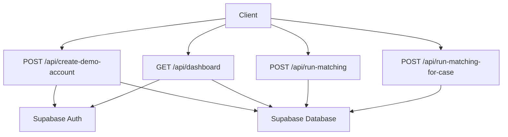
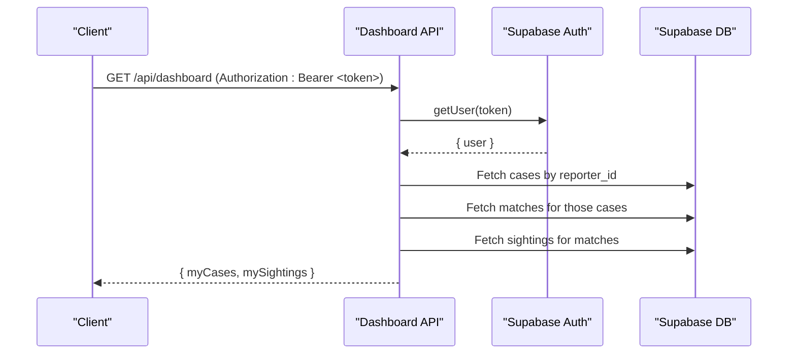
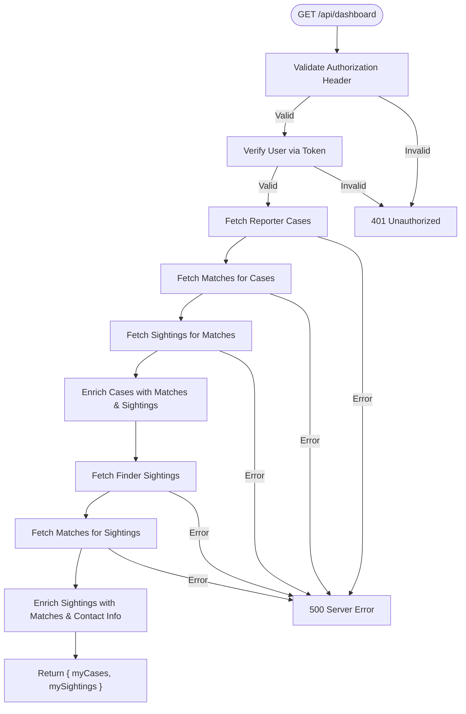
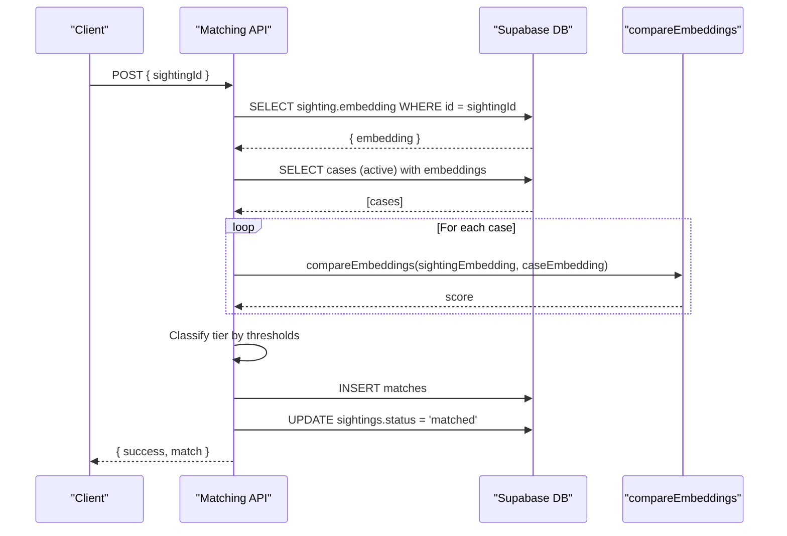
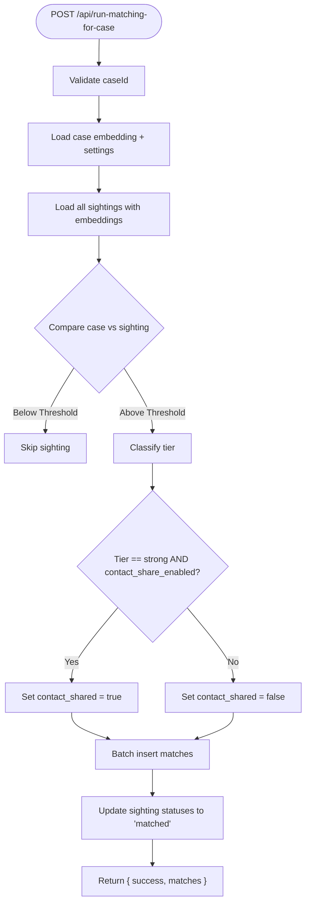
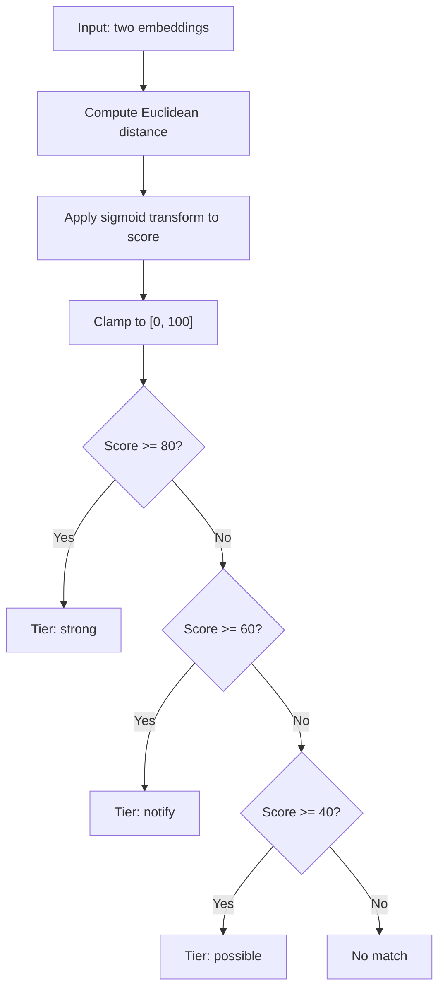
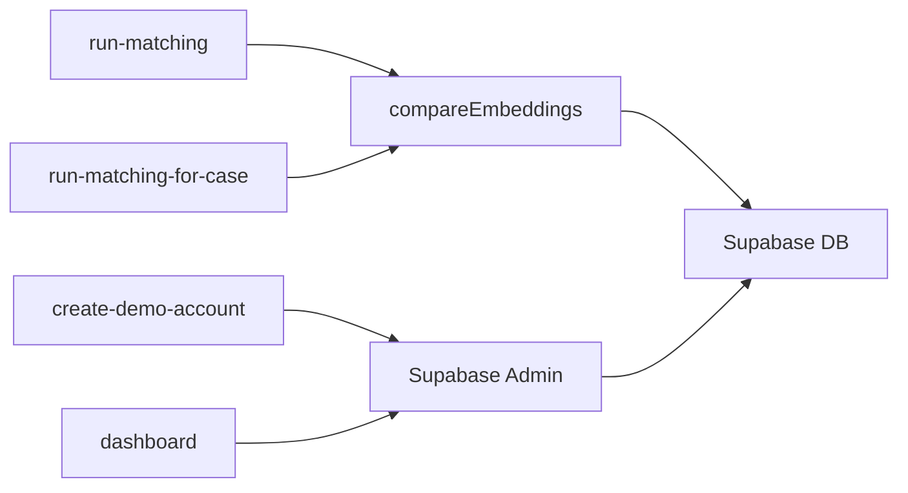

# API Reference

<cite>
**Referenced Files in This Document**
- [route.ts](file://app/api/create-demo-account/route.ts)
- [route.ts](file://app/api/dashboard/route.ts)
- [route.ts](file://app/api/run-matching/route.ts)
- [route.ts](file://app/api/run-matching-for-case/route.ts)
- [compare.ts](file://lib/ai-matching/compare.ts)
- [embeddings.ts](file://lib/ai-matching/embeddings.ts)
- [supabase-admin.ts](file://lib/db/supabase-admin.ts)
- [index.ts](file://lib/auth/index.ts)
- [session.ts](file://lib/auth/session.ts)
- [20260903_initial_schema.sql](file://supabase/migrations/20260903_initial_schema.sql)
- [index.ts](file://types/index.ts)
</cite>

## Table of Contents
1. Introduction
2. Project Structure
3. Core Components
4. Architecture Overview
5. Detailed Component Analysis
6. Dependency Analysis
7. Performance Considerations
8. Troubleshooting Guide
9. Conclusion
10. Appendices

## Introduction
This document provides comprehensive API documentation for the Findora-alt application’s RESTful endpoints. It covers HTTP methods, URL patterns, request/response schemas, authentication requirements, and error handling for:
- Create demo account
- Dashboard data retrieval (reporter and finder views)
- Face matching algorithms (forward and reverse matching)
- Case-specific matching

It also documents authentication using Supabase tokens and session management, security considerations, rate limiting notes, and best practices for client implementation.

## Project Structure
The API is implemented as Next.js App Router server routes under app/api. Each route encapsulates a specific business operation:
- POST /api/create-demo-account: Creates a demo user via Supabase Admin and ensures a profile row exists.
- GET /api/dashboard: Returns reporter-owned cases with matches and finder-owned sightings with matches and optional family contact info.
- POST /api/run-matching: Runs forward face matching for a sighting against active cases.
- POST /api/run-matching-for-case: Runs reverse face matching for a case against all existing sightings.

**Diagram sources**
- [route.ts:4-66](file://app/api/create-demo-account/route.ts#L4-L66)
- [route.ts:4-200](file://app/api/dashboard/route.ts#L4-L200)
- [route.ts:10-185](file://app/api/run-matching/route.ts#L10-L185)
- [route.ts:20-207](file://app/api/run-matching-for-case/route.ts#L20-L207)

**Section sources**
- [route.ts:4-66](file://app/api/create-demo-account/route.ts#L4-L66)
- [route.ts:4-200](file://app/api/dashboard/route.ts#L4-L200)
- [route.ts:10-185](file://app/api/run-matching/route.ts#L10-L185)
- [route.ts:20-207](file://app/api/run-matching-for-case/route.ts#L20-L207)

## Core Components
- Authentication and Session Management
  - Server-side admin client uses Supabase service role to bypass Row Level Security when necessary.
  - Client-side helpers provide current user and session utilities.
- AI Matching Engine
  - Embedding comparison function computes similarity scores and classifies tiers based on thresholds.
  - Client-side embedding generation runs entirely in-browser using face-api models.
- Data Layer
  - Database schema defines profiles, cases, sightings, and matches tables with RLS policies.

**Section sources**
- [supabase-admin.ts:1-23](file://lib/db/supabase-admin.ts#L1-L23)
- [index.ts:10-18](file://lib/auth/index.ts#L10-L18)
- [session.ts:12-34](file://lib/auth/session.ts#L12-L34)
- [compare.ts:1-72](file://lib/ai-matching/compare.ts#L1-L72)
- [embeddings.ts:20-103](file://lib/ai-matching/embeddings.ts#L20-L103)
- [20260903_initial_schema.sql:7-199](file://supabase/migrations/20260903_initial_schema.sql#L7-L199)

## Architecture Overview
The system separates concerns between API routes, authentication, database access, and AI matching:
- API routes validate inputs, authenticate requests where required, and orchestrate operations.
- Supabase Admin client performs privileged reads/writes bypassing RLS for internal processes.
- Matching logic compares embeddings and inserts match records with tier classification.
- Dashboard aggregates data for both reporter and finder roles.

**Diagram sources**
- [route.ts:4-200](file://app/api/dashboard/route.ts#L4-L200)

## Detailed Component Analysis

### Endpoint: Create Demo Account
- Method: POST
- URL: /api/create-demo-account
- Authentication: None (server-side admin creation)
- Request Body:
  - email: string (required)
  - password: string (required)
- Response:
  - success: boolean
  - userId: string
  - email: string
- Error Responses:
  - 400: Missing or invalid fields; Supabase creation errors
  - 500: Internal server error

Notes:
- Uses Supabase Admin to create users with email confirmation enabled.
- Upserts a profile row linked to the created user.

**Section sources**
- [route.ts:4-66](file://app/api/create-demo-account/route.ts#L4-L66)

### Endpoint: Dashboard Data Retrieval
- Method: GET
- URL: /api/dashboard
- Authentication: Required (Bearer token in Authorization header)
- Request Headers:
  - Authorization: Bearer <token>
- Response:
  - myCases: array of enriched case objects including prominentMatches and possibleMatches
    - Each match includes sighting details
  - mySightings: array of enriched sighting objects including matches and optional reporterContact when contact_shared is true
- Error Responses:
  - 401: Missing authorization header or unauthorized session
  - 500: Database errors or unexpected server errors

Behavior:
- Verifies user via token.
- Fetches reporter-owned cases and associated matches and sightings.
- Fetches finder-owned sightings and associated matches, optionally exposing reporter contact info if allowed.

**Diagram sources**
- [route.ts:4-200](file://app/api/dashboard/route.ts#L4-L200)

**Section sources**
- [route.ts:4-200](file://app/api/dashboard/route.ts#L4-L200)

### Endpoint: Run Matching (Forward Matching)
- Method: POST
- URL: /api/run-matching
- Authentication: Not enforced at route level (internal process)
- Request Body:
  - sightingId: string (required)
- Response:
  - success: boolean
  - match: object or null
  - highestScore: number (optional, when no match meets threshold)
  - message: string (when no match found)
- Error Responses:
  - 400: Invalid sightingId or parsing errors
  - 404: Sighting not found
  - 500: Database or unexpected errors

Algorithm:
- Retrieves sighting embedding.
- Retrieves all active cases with embeddings.
- Compares sighting embedding against each case embedding using compareEmbeddings.
- Classifies best match into tiers: strong, notify, possible based on thresholds.
- Inserts match record and updates sighting status to matched.

**Diagram sources**
- [route.ts:10-185](file://app/api/run-matching/route.ts#L10-L185)
- [compare.ts:19-29](file://lib/ai-matching/compare.ts#L19-L29)

**Section sources**
- [route.ts:10-185](file://app/api/run-matching/route.ts#L10-L185)
- [compare.ts:1-72](file://lib/ai-matching/compare.ts#L1-L72)

### Endpoint: Run Matching for Case (Reverse Matching)
- Method: POST
- URL: /api/run-matching-for-case
- Authentication: Not enforced at route level (internal process)
- Request Body:
  - caseId: string (required)
- Response:
  - success: boolean
  - matches: array of inserted match records
  - message: string (when no matches meet threshold)
- Error Responses:
  - 400: Invalid caseId or parsing errors
  - 404: Case not found
  - 500: Database or unexpected errors

Algorithm:
- Retrieves case embedding and contact_share_enabled flag.
- Retrieves all sightings with embeddings.
- Compares case embedding against each sighting embedding.
- Classifies matches into tiers and determines contact_shared based on tier and case setting.
- Batch-inserts qualifying matches and updates sighting statuses to matched.

**Diagram sources**
- [route.ts:20-207](file://app/api/run-matching-for-case/route.ts#L20-L207)
- [compare.ts:19-29](file://lib/ai-matching/compare.ts#L19-L29)

**Section sources**
- [route.ts:20-207](file://app/api/run-matching-for-case/route.ts#L20-L207)
- [compare.ts:1-72](file://lib/ai-matching/compare.ts#L1-L72)

### Face Matching Algorithms
- Similarity Computation:
  - Euclidean distance between embeddings transformed through a sigmoid-like function to produce a 0–100 score.
- Thresholds:
  - STRONG_THRESHOLD: 80
  - NOTIFY_THRESHOLD: 60
  - POSSIBLE_THRESHOLD: 40
- Classification:
  - Score >= 80 → strong
  - Score >= 60 → notify
  - Score >= 40 → possible
  - Below 40 → no match

**Diagram sources**
- [compare.ts:10-29](file://lib/ai-matching/compare.ts#L10-L29)

**Section sources**
- [compare.ts:1-72](file://lib/ai-matching/compare.ts#L1-L72)

### Authentication and Session Management
- Server-Side Admin Client:
  - Uses Supabase service role key to bypass RLS for internal operations.
- Client-Side Helpers:
  - getCurrentUser: retrieves current user from Supabase auth.
  - getCurrentSession: returns session details including userId and email.
  - getUserId: returns current user ID or null.

Usage Notes:
- Dashboard endpoint validates Authorization header and verifies user via token.
- Ensure environment variables are set for Supabase URL and service role key.

**Section sources**
- [supabase-admin.ts:1-23](file://lib/db/supabase-admin.ts#L1-L23)
- [index.ts:10-18](file://lib/auth/index.ts#L10-L18)
- [session.ts:12-34](file://lib/auth/session.ts#L12-L34)
- [route.ts:4-200](file://app/api/dashboard/route.ts#L4-L200)

### Data Validation Rules and Schema
- Profiles:
  - id (PK), contact_email (NOT NULL), contact_phone (nullable), created_at
- Cases:
  - id (PK), reporter_id (FK to profiles), name, age, description, last_seen_location, last_seen_date, photo_url, embedding (JSONB), contact_share_enabled (BOOLEAN), status (CHECK: active/resolved), created_at
- Sightings:
  - id (PK), finder_id (FK to profiles), photo_url, embedding (JSONB), location_lat, location_lng, notes, status (CHECK: pending/matched/expired), created_at
- Matches:
  - id (PK), case_id (FK to cases), sighting_id (FK to sightings), confidence_score, tier (CHECK: strong/notify/possible), contact_shared (BOOLEAN), family_action (CHECK: none/different_person/resolved), created_at, reviewed_at

Row-Level Security Policies enforce that:
- Users can only view/update their own profiles.
- Reporters can manage their own cases.
- Finders can manage their own sightings.
- Reporters can view/update matches for their cases; finders can view matches for their sightings.

**Section sources**
- [20260903_initial_schema.sql:7-199](file://supabase/migrations/20260903_initial_schema.sql#L7-L199)

## Dependency Analysis
- API Routes depend on:
  - Supabase Admin client for privileged DB operations
  - AI matching compare functions for scoring and tier classification
  - Database schema for data integrity and RLS enforcement
- Client-side embedding generation depends on face-api models loaded from public/models

**Diagram sources**
- [route.ts:4-66](file://app/api/create-demo-account/route.ts#L4-L66)
- [route.ts:4-200](file://app/api/dashboard/route.ts#L4-L200)
- [route.ts:10-185](file://app/api/run-matching/route.ts#L10-L185)
- [route.ts:20-207](file://app/api/run-matching-for-case/route.ts#L20-L207)
- [compare.ts:19-29](file://lib/ai-matching/compare.ts#L19-L29)

**Section sources**
- [supabase-admin.ts:1-23](file://lib/db/supabase-admin.ts#L1-L23)
- [compare.ts:1-72](file://lib/ai-matching/compare.ts#L1-L72)

## Performance Considerations
- Matching Complexity:
  - Forward matching compares one sighting against all active cases; complexity O(N) per run.
  - Reverse matching compares one case against all sightings; complexity O(M) per run.
- Optimization Opportunities:
  - Use vector indexes for embeddings if supported by your database configuration.
  - Batch operations reduce round-trips (already used in reverse matching).
  - Avoid unnecessary full scans by filtering on status and embedding presence.
- Client-Side Embedding Generation:
  - Models are cached per browser session to avoid repeated loads.
  - Ensure images are appropriately sized to minimize processing time.

[No sources needed since this section provides general guidance]

## Troubleshooting Guide
Common Errors and Resolutions:
- Missing Authorization Header:
  - Ensure Authorization: Bearer <token> is included for dashboard endpoints.
- Unauthorized Session:
  - Verify token validity and expiration; refresh session if needed.
- Sighting/Case Not Found:
  - Confirm IDs exist and have embeddings before calling matching endpoints.
- Parsing Errors:
  - Ensure embeddings are stored as JSON arrays or valid JSON strings.
- Database Errors:
  - Check RLS policies and permissions; use server-side admin client for privileged operations.

Best Practices:
- Implement retries with exponential backoff for transient network errors.
- Log detailed error messages on the server while sanitizing responses for clients.
- Validate input payloads strictly on the client side to reduce server load.

**Section sources**
- [route.ts:4-200](file://app/api/dashboard/route.ts#L4-L200)
- [route.ts:10-185](file://app/api/run-matching/route.ts#L10-L185)
- [route.ts:20-207](file://app/api/run-matching-for-case/route.ts#L20-L207)

## Conclusion
The Findora-alt API provides robust endpoints for creating demo accounts, retrieving dashboard data, and performing face matching in both forward and reverse directions. Authentication is enforced where appropriate, and data integrity is maintained through strict schema constraints and RLS policies. Clients should follow the documented request/response formats, handle errors gracefully, and adhere to best practices for performance and security.

[No sources needed since this section summarizes without analyzing specific files]

## Appendices

### Request/Response Examples
- Create Demo Account
  - Request:
    - POST /api/create-demo-account
    - Body: { "email": "user@example.com", "password": "securepassword" }
  - Response:
    - 200 OK: { "success": true, "userId": "...", "email": "user@example.com" }
    - 400 Bad Request: { "error": "Email and password are required." }
    - 500 Internal Server Error: { "error": "Internal server error during demo account creation." }

- Dashboard Data Retrieval
  - Request:
    - GET /api/dashboard
    - Headers: Authorization: Bearer <token>
  - Response:
    - 200 OK: { "myCases": [...], "mySightings": [...] }
    - 401 Unauthorized: { "error": "Missing authorization header" }
    - 500 Internal Server Error: { "error": "Server error" }

- Run Matching (Forward)
  - Request:
    - POST /api/run-matching
    - Body: { "sightingId": "uuid" }
  - Response:
    - 200 OK: { "success": true, "match": {...} }
    - 404 Not Found: { "error": "Sighting uuid not found." }
    - 500 Internal Server Error: { "error": "Failed to insert match record: ..." }

- Run Matching for Case (Reverse)
  - Request:
    - POST /api/run-matching-for-case
    - Body: { "caseId": "uuid" }
  - Response:
    - 200 OK: { "success": true, "matches": [...] }
    - 404 Not Found: { "error": "Case uuid not found." }
    - 500 Internal Server Error: { "error": "Failed to insert match records: ..." }

**Section sources**
- [route.ts:4-66](file://app/api/create-demo-account/route.ts#L4-L66)
- [route.ts:4-200](file://app/api/dashboard/route.ts#L4-L200)
- [route.ts:10-185](file://app/api/run-matching/route.ts#L10-L185)
- [route.ts:20-207](file://app/api/run-matching-for-case/route.ts#L20-L207)

### Security Considerations
- Authentication:
  - Dashboard requires valid Bearer token; verify user identity before granting access.
- Authorization:
  - RLS policies restrict access to rows based on user roles and ownership.
- Data Privacy:
  - Contact sharing is controlled by case settings and match tier; only strong matches may auto-share contact information.
- Environment Variables:
  - Protect Supabase service role key; never expose it to client-side code.

**Section sources**
- [20260903_initial_schema.sql:77-199](file://supabase/migrations/20260903_initial_schema.sql#L77-L199)
- [supabase-admin.ts:1-23](file://lib/db/supabase-admin.ts#L1-L23)

### Rate Limiting Considerations
- The current implementation does not include explicit rate limiting.
- Recommendations:
  - Implement middleware or gateway-level rate limiting to protect endpoints from abuse.
  - Monitor usage patterns and adjust limits based on operational needs.

[No sources needed since this section provides general guidance]