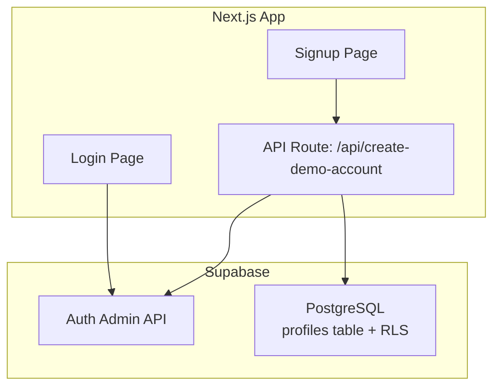
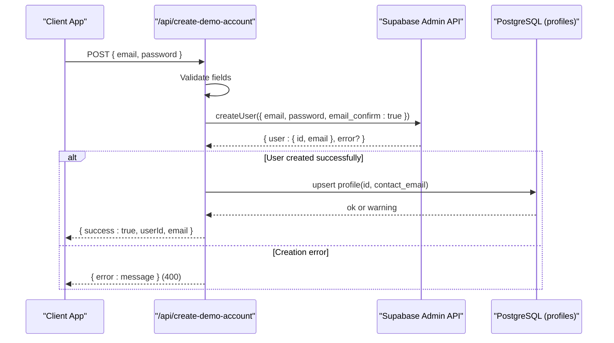
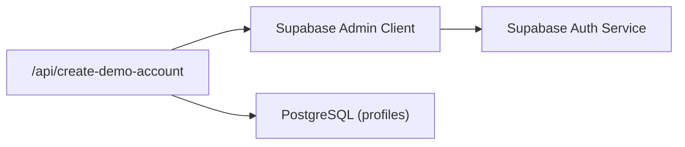

# Authentication APIs

<cite>
**Referenced Files in This Document**
- [route.ts](file://app/api/create-demo-account/route.ts)
- [supabase-admin.ts](file://lib/db/supabase-admin.ts)
- [supabase.ts](file://lib/db/supabase.ts)
- [initial_schema.sql](file://supabase/migrations/20260903_initial_schema.sql)
- [page.tsx (signup)](file://app/signup/page.tsx)
- [page.tsx (login)](file://app/login/page.tsx)
</cite>

## Table of Contents
1. Introduction
2. Project Structure
3. Core Components
4. Architecture Overview
5. Detailed Component Analysis
6. Dependency Analysis
7. Performance Considerations
8. Troubleshooting Guide
9. Conclusion

## Introduction
This document provides detailed API documentation for the authentication endpoints in the Findora-alt application, with a focus on the create-demo-account endpoint. It explains how the endpoint creates users via the Supabase Admin API to bypass email confirmation and rate limits, documents request/response schemas, error handling patterns, security considerations, and when to use this endpoint versus standard authentication flows.

## Project Structure
The authentication-related code is organized as follows:
- Server-side API route that handles demo account creation using the Supabase Admin client
- Client pages for signup and login that interact with Supabase Auth
- Database schema defining profiles and RLS policies
- Supabase client configurations for both admin and anon usage

**Diagram sources**
- [route.ts:4-66](file://app/api/create-demo-account/route.ts#L4-L66)
- [supabase-admin.ts:9-22](file://lib/db/supabase-admin.ts#L9-L22)
- [initial_schema.sql:7-12](file://supabase/migrations/20260903_initial_schema.sql#L7-L12)
- [page.tsx (signup):62-108](file://app/signup/page.tsx#L62-L108)
- [page.tsx (login):17-42](file://app/login/page.tsx#L17-L42)

**Section sources**
- [route.ts:4-66](file://app/api/create-demo-account/route.ts#L4-L66)
- [supabase-admin.ts:9-22](file://lib/db/supabase-admin.ts#L9-L22)
- [initial_schema.sql:7-12](file://supabase/migrations/20260903_initial_schema.sql#L7-L12)
- [page.tsx (signup):62-108](file://app/signup/page.tsx#L62-L108)
- [page.tsx (login):17-42](file://app/login/page.tsx#L17-L42)

## Core Components
- Create Demo Account API: A Next.js server route that accepts POST requests to create a user without requiring email confirmation and bypassing client-side rate limits by using the Supabase Admin API.
- Supabase Admin Client: A server-only client configured with the service role key to perform privileged operations like creating users and upserting profile rows.
- Database Schema: Defines the public.profiles table linked to auth.users, along with Row Level Security policies to restrict access to user data.
- Client Pages: The signup page orchestrates a three-step flow (email input, mock OTP verification, password setup) and calls the create-demo-account endpoint; the login page uses standard password-based sign-in.

Key responsibilities:
- Validate inputs and return structured errors
- Create users via Supabase Admin API with email confirmation enabled
- Ensure a corresponding profile row exists
- Return consistent success responses with user identifiers

**Section sources**
- [route.ts:4-66](file://app/api/create-demo-account/route.ts#L4-L66)
- [supabase-admin.ts:9-22](file://lib/db/supabase-admin.ts#L9-L22)
- [initial_schema.sql:7-12](file://supabase/migrations/20260903_initial_schema.sql#L7-L12)
- [page.tsx (signup):62-108](file://app/signup/page.tsx#L62-L108)
- [page.tsx (login):17-42](file://app/login/page.tsx#L17-L42)

## Architecture Overview
The create-demo-account endpoint integrates with Supabase’s Auth Admin API to create users immediately, skipping email verification and avoiding client-side rate limits. After user creation, it ensures a profile record exists in the database.

**Diagram sources**
- [route.ts:4-66](file://app/api/create-demo-account/route.ts#L4-L66)
- [supabase-admin.ts:9-22](file://lib/db/supabase-admin.ts#L9-L22)
- [initial_schema.sql:7-12](file://supabase/migrations/20260903_initial_schema.sql#L7-L12)

## Detailed Component Analysis

### Endpoint: POST /api/create-demo-account
Purpose:
- Create a new user account without requiring email confirmation and bypassing client-side rate limits by using the Supabase Admin API.

Request:
- Method: POST
- Content-Type: application/json
- Body schema:
  - email: string (required)
  - password: string (required)

Response:
- Success (200):
  - success: boolean
  - userId: string
  - email: string
- Validation failure (400):
  - error: string
- Duplicate user or other creation error (400):
  - error: string
- Server error (500):
  - error: string

Behavior:
- Validates presence of email and password
- Creates user via Supabase Admin API with email confirmation enabled
- Upserts a profile row in public.profiles with id and contact_email
- Returns user ID and email on success

Error handling patterns:
- Missing fields: returns 400 with a descriptive error message
- Supabase creation error: returns 400 with the underlying error message
- Missing user object after creation: returns 500 indicating failure
- Profile upsert warnings are logged but do not block success
- Unhandled exceptions return 500 with a generic error message

Security considerations:
- Uses server-only Supabase Admin client with service role key; never expose this client to the browser
- Avoids exposing sensitive keys in environment variables to clients
- Rate limiting bypass is intentional for demo flows; production should enforce additional controls

Usage guidance:
- Use this endpoint for demo or internal flows where immediate account creation without email confirmation is required
- For production user registration, prefer standard flows that send confirmation emails and enforce rate limits

Concrete examples:
- Request payload example:
  - { "email": "user@example.com", "password": "securePassword123" }
- Success response example:
  - { "success": true, "userId": "uuid-here", "email": "user@example.com" }
- Validation error example:
  - { "error": "Email and password are required." }
- Duplicate user error example:
  - { "error": "<Supabase duplicate user message>" }
- Server error example:
  - { "error": "Internal server error during demo account creation." }

**Section sources**
- [route.ts:4-66](file://app/api/create-demo-account/route.ts#L4-L66)

### Supabase Admin Integration
Details:
- The endpoint uses getSupabaseAdmin() to obtain a server-only client configured with the service role key
- The client disables token refresh and session persistence since it is used only on the server
- Environment variables required: NEXT_PUBLIC_SUPABASE_URL and SUPABASE_SERVICE_ROLE_KEY

Configuration notes:
- Ensure environment variables are set correctly on the server
- Do not import or use the admin client in client components

**Section sources**
- [supabase-admin.ts:1-22](file://lib/db/supabase-admin.ts#L1-L22)

### Database Schema and Profiles
Details:
- public.profiles table stores user profile data and references auth.users
- Row Level Security policies ensure users can only access their own profile
- A trigger automatically creates a profile entry upon user creation via auth.users

Implications:
- The endpoint upserts a profile row to guarantee profile existence even when created via Admin API
- RLS protects profile data from unauthorized access

**Section sources**
- [initial_schema.sql:7-12](file://supabase/migrations/20260903_initial_schema.sql#L7-L12)
- [initial_schema.sql:14-34](file://supabase/migrations/20260903_initial_schema.sql#L14-L34)
- [initial_schema.sql:36-55](file://supabase/migrations/20260903_initial_schema.sql#L36-L55)

### Client Flows: Signup and Login
Signup flow:
- Collects email, verifies via an on-screen mock OTP (demo mode), then calls /api/create-demo-account
- After successful account creation, signs in using standard password authentication and navigates to dashboard

Login flow:
- Uses standard password-based sign-in via Supabase Auth

Notes:
- The signup flow demonstrates how the create-demo-account endpoint fits into a user journey
- Production signup may replace mock OTP with real email verification while still leveraging the endpoint for immediate account creation

**Section sources**
- [page.tsx (signup):62-108](file://app/signup/page.tsx#L62-L108)
- [page.tsx (login):17-42](file://app/login/page.tsx#L17-L42)

## Dependency Analysis
The create-demo-account endpoint depends on:
- Next.js server routing for HTTP handling
- Supabase Admin client for privileged user creation
- PostgreSQL database for profile management and RLS enforcement

**Diagram sources**
- [route.ts:4-66](file://app/api/create-demo-account/route.ts#L4-L66)
- [supabase-admin.ts:9-22](file://lib/db/supabase-admin.ts#L9-L22)
- [initial_schema.sql:7-12](file://supabase/migrations/20260903_initial_schema.sql#L7-L12)

**Section sources**
- [route.ts:4-66](file://app/api/create-demo-account/route.ts#L4-L66)
- [supabase-admin.ts:9-22](file://lib/db/supabase-admin.ts#L9-L22)
- [initial_schema.sql:7-12](file://supabase/migrations/20260903_initial_schema.sql#L7-L12)

## Performance Considerations
- Using the Admin API avoids client-side rate limits, enabling faster demo account creation
- Upserting the profile row ensures consistency without blocking on missing triggers
- Keep environment variables cached at module load time to avoid repeated checks
- Consider adding server-side rate limiting or allowlists if exposing this endpoint broadly

[No sources needed since this section provides general guidance]

## Troubleshooting Guide
Common issues and resolutions:
- Missing environment variables:
  - Symptom: Error thrown when initializing admin client
  - Resolution: Set NEXT_PUBLIC_SUPABASE_URL and SUPABASE_SERVICE_ROLE_KEY on the server
- Validation failures:
  - Symptom: 400 response with error message
  - Resolution: Ensure both email and password are provided in the request body
- Duplicate user:
  - Symptom: 400 response with Supabase error message
  - Resolution: Check for existing accounts with the same email before creating
- Profile creation warnings:
  - Symptom: Warning logged but endpoint succeeds
  - Resolution: Verify RLS policies and trigger configuration; non-fatal for user creation
- Server errors:
  - Symptom: 500 response with generic error
  - Resolution: Inspect server logs for unhandled exceptions and stack traces

**Section sources**
- [supabase-admin.ts:9-14](file://lib/db/supabase-admin.ts#L9-L14)
- [route.ts:8-13](file://app/api/create-demo-account/route.ts#L8-L13)
- [route.ts:24-29](file://app/api/create-demo-account/route.ts#L24-L29)
- [route.ts:51-53](file://app/api/create-demo-account/route.ts#L51-L53)
- [route.ts:60-65](file://app/api/create-demo-account/route.ts#L60-L65)

## Conclusion
The create-demo-account endpoint provides a streamlined way to create user accounts without email confirmation and without hitting client-side rate limits by leveraging the Supabase Admin API. It validates inputs, creates users, ensures profile records exist, and returns consistent responses. Use this endpoint for demo or controlled environments; for production, consider standard authentication flows with email confirmation and robust rate limiting. Always secure the Admin client on the server and protect sensitive environment variables.

[No sources needed since this section summarizes without analyzing specific files]