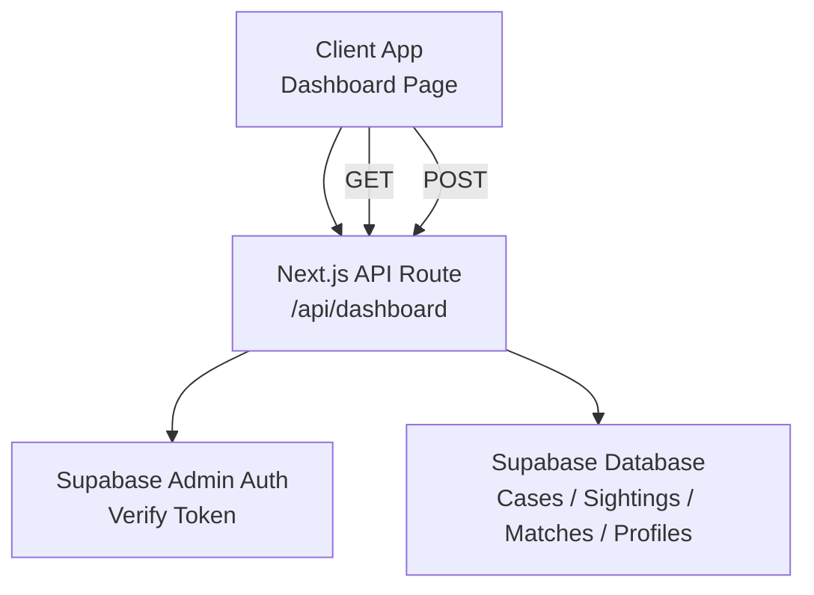
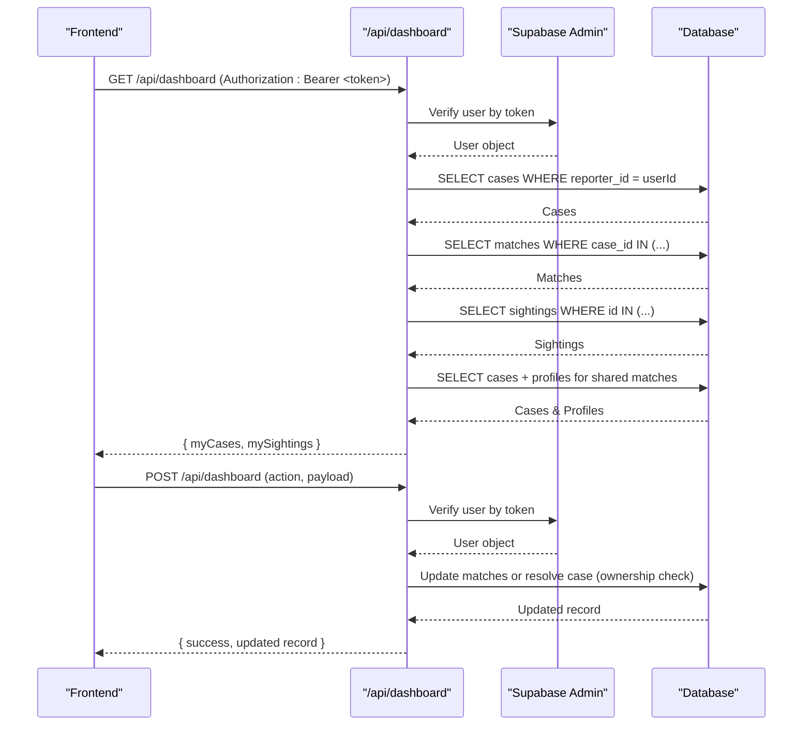
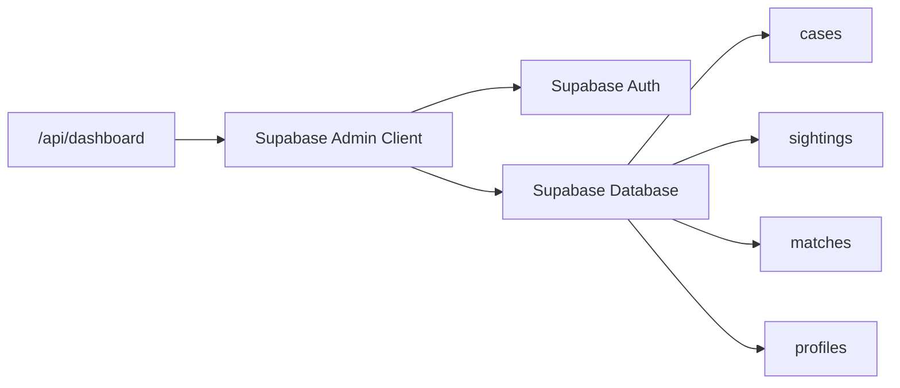

# Dashboard APIs

<cite>
**Referenced Files in This Document**
- [route.ts](file://app/api/dashboard/route.ts)
- [page.tsx](file://app/dashboard/page.tsx)
- [initial_schema.sql](file://supabase/migrations/20260903_initial_schema.sql)
- [index.ts](file://types/index.ts)
- [supabase-admin.ts](file://lib/db/supabase-admin.ts)
- [supabase.ts](file://lib/db/supabase.ts)
</cite>

## Table of Contents
1. [Introduction](#introduction)
2. [Project Structure](#project-structure)
3. [Core Components](#core-components)
4. [Architecture Overview](#architecture-overview)
5. [Detailed Component Analysis](#detailed-component-analysis)
6. [Dependency Analysis](#dependency-analysis)
7. [Performance Considerations](#performance-considerations)
8. [Troubleshooting Guide](#troubleshooting-guide)
9. [Conclusion](#conclusion)

## Introduction
This document provides comprehensive API documentation for the dashboard data retrieval and management endpoints. It covers authentication using Supabase tokens, supported HTTP methods for fetching user-specific data (cases, sightings, matches), response schemas, role-based access control for reporters and finders, request/response examples, error handling, and performance considerations for large datasets and pagination strategies.

## Project Structure
The dashboard functionality is implemented as a Next.js App Router API route that serves both GET (read) and POST (write) operations. The frontend dashboard page consumes these endpoints to display reporter and finder views.

**Diagram sources**
- [route.ts:4-23](file://app/api/dashboard/route.ts#L4-L23)
- [route.ts:193-200](file://app/api/dashboard/route.ts#L193-L200)
- [route.ts:206-315](file://app/api/dashboard/route.ts#L206-L315)
- [supabase-admin.ts:9-22](file://lib/db/supabase-admin.ts#L9-L22)

**Section sources**
- [route.ts:4-23](file://app/api/dashboard/route.ts#L4-L23)
- [page.tsx:97-133](file://app/dashboard/page.tsx#L97-L133)

## Core Components
- API Endpoint: /api/dashboard
  - GET: Retrieves user’s reported cases and submitted sightings with enriched match details.
  - POST: Performs actions such as updating match status or resolving a case.
- Authentication: Bearer token via Authorization header; validated against Supabase auth.
- Data Models: Cases, Sightings, Matches, and optional Reporter Profile fields for contact sharing.

Key responsibilities:
- Validate authorization and extract user ID.
- Fetch reporter’s cases and enrich with matches and sighting details.
- Fetch finder’s sightings and enrich with matching cases and reporter contact info when allowed.
- Enforce ownership checks on write operations.

**Section sources**
- [route.ts:4-23](file://app/api/dashboard/route.ts#L4-L23)
- [route.ts:29-97](file://app/api/dashboard/route.ts#L29-L97)
- [route.ts:102-191](file://app/api/dashboard/route.ts#L102-L191)
- [route.ts:206-315](file://app/api/dashboard/route.ts#L206-L315)

## Architecture Overview
The dashboard API uses a server-side Supabase admin client to bypass Row Level Security constraints while enforcing explicit ownership checks in code. The frontend obtains a session token from Supabase and passes it in the Authorization header.

**Diagram sources**
- [route.ts:4-23](file://app/api/dashboard/route.ts#L4-L23)
- [route.ts:29-97](file://app/api/dashboard/route.ts#L29-L97)
- [route.ts:102-191](file://app/api/dashboard/route.ts#L102-L191)
- [route.ts:206-315](file://app/api/dashboard/route.ts#L206-L315)

## Detailed Component Analysis

### GET /api/dashboard
Purpose: Retrieve user-specific dashboard data combining reporter and finder perspectives.

Authentication:
- Requires Authorization header with Bearer token.
- Token verified via Supabase admin auth.getUser(token).

Request:
- Method: GET
- Headers: Authorization: Bearer <access_token>

Response schema:
- myCases: Array of case objects with nested prominentMatches and possibleMatches.
  - Each match includes sighting details when available.
- mySightings: Array of sighting objects with nested matches.
  - When contact_shared is true, each match may include reporterContact (email, phone).

Data enrichment logic:
- For reporter view:
  - Fetch cases by reporter_id.
  - Fetch matches for those cases, ordered by confidence_score descending.
  - Fetch sighting details for matched sightings.
  - Split matches into prominentMatches (strong/notify) and possibleMatches (possible).
- For finder view:
  - Fetch sightings by finder_id.
  - Fetch matches for those sightings.
  - Identify matches where contact_shared is true and fetch associated cases and reporter profiles to expose contact info.

Error handling:
- Missing Authorization header: 401 Unauthorized.
- Invalid token or no user: 401 Unauthorized.
- Database errors: 500 Internal Server Error with error message.

Example usage (conceptual):
- Frontend calls GET with Authorization header containing Supabase access token.
- On success, UI renders reporter cases with matches and finder sightings with matches and optional family contact info.

**Section sources**
- [route.ts:4-23](file://app/api/dashboard/route.ts#L4-L23)
- [route.ts:29-97](file://app/api/dashboard/route.ts#L29-L97)
- [route.ts:102-191](file://app/api/dashboard/route.ts#L102-L191)
- [page.tsx:97-133](file://app/dashboard/page.tsx#L97-L133)

### POST /api/dashboard
Purpose: Perform actions related to matches and cases. Supports two actions:
- update_match: Update match-level fields such as family_action and contact_shared.
- resolve_case: Mark a case as resolved.

Authentication:
- Same as GET: Authorization header with Bearer token.

Request body:
- action: "update_match" | "resolve_case"
- For update_match:
  - matchId: string (required)
  - family_action?: "none" | "different_person" | "resolved"
  - contact_shared?: boolean
- For resolve_case:
  - caseId: string (required)

Ownership validation:
- For update_match:
  - Fetch match and its case_id.
  - Fetch case and verify reporter_id equals current user.id.
  - If not owner, return 403 Forbidden.
- For resolve_case:
  - Fetch case and verify reporter_id equals current user.id.
  - If not owner, return 403 Forbidden.

Response schema:
- update_match: { success: true, match: updatedMatch }
- resolve_case: { success: true, case: updatedCase }

Error handling:
- Missing Authorization header: 401 Unauthorized.
- Invalid token or no user: 401 Unauthorized.
- Missing required fields: 400 Bad Request.
- Record not found: 404 Not Found.
- Unauthorized ownership: 403 Forbidden.
- Database errors: 500 Internal Server Error.

Example flows:
- Share contact info:
  - POST { action: "update_match", matchId: "...", contact_shared: true }
  - Returns updated match with contact_shared set to true.
- Mark different person:
  - POST { action: "update_match", matchId: "...", family_action: "different_person" }
  - Returns updated match with family_action set accordingly.
- Resolve case:
  - POST { action: "resolve_case", caseId: "..." }
  - Returns updated case with status set to "resolved".

**Section sources**
- [route.ts:206-315](file://app/api/dashboard/route.ts#L206-L315)

### Role-Based Access Control (RBAC)
Roles:
- Reporter: Family member who reports missing persons. Can manage their own cases and matches linked to their cases.
- Finder: Public user who submits sightings. Can view their own sightings and matches linked to their sightings.

Access enforcement:
- GET:
  - Reporter data filtered by reporter_id.
  - Finder data filtered by finder_id.
  - Contact sharing only exposed when match.contact_shared is true and reporter profile exists.
- POST:
  - Ownership checks ensure only the case reporter can update matches or resolve cases.

Database policies:
- RLS policies restrict direct client access to tables based on roles and ownership.
- The API uses a service role client to perform server-side queries and enforce additional business logic beyond RLS.

**Section sources**
- [initial_schema.sql:61-103](file://supabase/migrations/20260903_initial_schema.sql#L61-L103)
- [initial_schema.sql:109-135](file://supabase/migrations/20260903_initial_schema.sql#L109-L135)
- [initial_schema.sql:141-199](file://supabase/migrations/20260903_initial_schema.sql#L141-L199)
- [route.ts:234-256](file://app/api/dashboard/route.ts#L234-L256)
- [route.ts:283-294](file://app/api/dashboard/route.ts#L283-L294)

### Data Models and Schemas
Types used across the application:
- UserRole: 'reporter' | 'finder'
- CaseStatus: 'active' | 'resolved'
- SightingStatus: 'pending' | 'matched' | 'expired'
- MatchTier: 'strong' | 'notify' | 'possible' | 'discarded'
- FamilyAction: 'none' | 'different_person' | 'resolved'

Database tables:
- profiles: id, contact_email, contact_phone, created_at
- cases: id, reporter_id, name, age, description, last_seen_location, last_seen_date, photo_url, embedding, contact_share_enabled, status, created_at
- sightings: id, finder_id, photo_url, embedding, location_lat, location_lng, notes, status, created_at
- matches: id, case_id, sighting_id, confidence_score, tier, contact_shared, family_action, created_at, reviewed_at

Relationships:
- cases.reporter_id -> profiles.id
- sightings.finder_id -> profiles.id
- matches.case_id -> cases.id
- matches.sighting_id -> sightings.id

**Section sources**
- [index.ts:1-56](file://types/index.ts#L1-L56)
- [initial_schema.sql:7-12](file://supabase/migrations/20260903_initial_schema.sql#L7-L12)
- [initial_schema.sql:61-74](file://supabase/migrations/20260903_initial_schema.sql#L61-L74)
- [initial_schema.sql:109-119](file://supabase/migrations/20260903_initial_schema.sql#L109-L119)
- [initial_schema.sql:141-151](file://supabase/migrations/20260903_initial_schema.sql#L141-L151)

## Dependency Analysis
The dashboard API depends on:
- Supabase Admin client for authenticated server-side database access.
- Supabase Auth to validate user tokens.
- Database tables: cases, sightings, matches, profiles.

**Diagram sources**
- [route.ts:1-3](file://app/api/dashboard/route.ts#L1-L3)
- [supabase-admin.ts:9-22](file://lib/db/supabase-admin.ts#L9-L22)
- [initial_schema.sql:61-199](file://supabase/migrations/20260903_initial_schema.sql#L61-L199)

**Section sources**
- [route.ts:1-3](file://app/api/dashboard/route.ts#L1-L3)
- [supabase-admin.ts:9-22](file://lib/db/supabase-admin.ts#L9-L22)
- [initial_schema.sql:61-199](file://supabase/migrations/20260903_initial_schema.sql#L61-L199)

## Performance Considerations
Current implementation performs multiple sequential queries per user context:
- Fetch cases for reporter.
- Fetch matches for those cases.
- Fetch sightings for matched sightings.
- Fetch cases and profiles for shared matches.

Optimization recommendations:
- Batch queries:
  - Use IN clauses to reduce round trips (already used for matches and sightings).
  - Consider using Supabase RPC or Postgres joins to combine lookups where appropriate.
- Pagination:
  - Add limit and offset parameters to GET requests for large datasets.
  - Implement cursor-based pagination for stable ordering on large lists.
- Caching:
  - Cache dashboard responses at the edge or application layer for short-lived sessions.
  - Invalidate cache on updates (match/case changes).
- Indexing:
  - Ensure indexes on reporter_id, finder_id, case_id, sighting_id, and created_at for faster filtering and sorting.
- Selective field projection:
  - Only select necessary columns to reduce payload size.

[No sources needed since this section provides general guidance]

## Troubleshooting Guide
Common errors and resolutions:
- 401 Unauthorized:
  - Missing Authorization header.
  - Invalid or expired token.
  - Resolution: Ensure the client sends a valid Supabase access token in the Authorization header.
- 403 Forbidden:
  - Attempted to update a match or resolve a case without ownership.
  - Resolution: Verify the user is the reporter of the target case.
- 404 Not Found:
  - Match or case record does not exist.
  - Resolution: Check IDs and ensure records exist before performing updates.
- 500 Internal Server Error:
  - Database query failures or unexpected exceptions.
  - Resolution: Inspect server logs and database connectivity; validate environment variables for Supabase admin credentials.

Operational checks:
- Confirm environment variables are set:
  - NEXT_PUBLIC_SUPABASE_URL
  - SUPABASE_SERVICE_ROLE_KEY
  - NEXT_PUBLIC_SUPABASE_ANON_KEY (for client-side)
- Verify RLS policies are enabled and correct.

**Section sources**
- [route.ts:6-22](file://app/api/dashboard/route.ts#L6-L22)
- [route.ts:234-256](file://app/api/dashboard/route.ts#L234-L256)
- [route.ts:283-294](file://app/api/dashboard/route.ts#L283-L294)
- [supabase-admin.ts:9-14](file://lib/db/supabase-admin.ts#L9-L14)
- [supabase.ts:6-10](file://lib/db/supabase.ts#L6-L10)

## Conclusion
The dashboard API provides a unified endpoint for retrieving and managing user-specific data across reporter and finder roles. It enforces strict authentication and ownership checks, returns enriched data for efficient UI rendering, and supports key actions like updating match statuses and resolving cases. For production use, implement pagination, caching, and indexing to handle large datasets efficiently.

[No sources needed since this section summarizes without analyzing specific files]