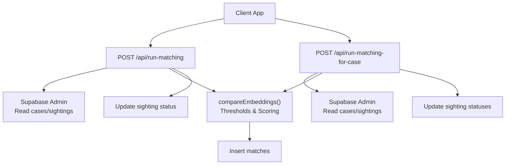
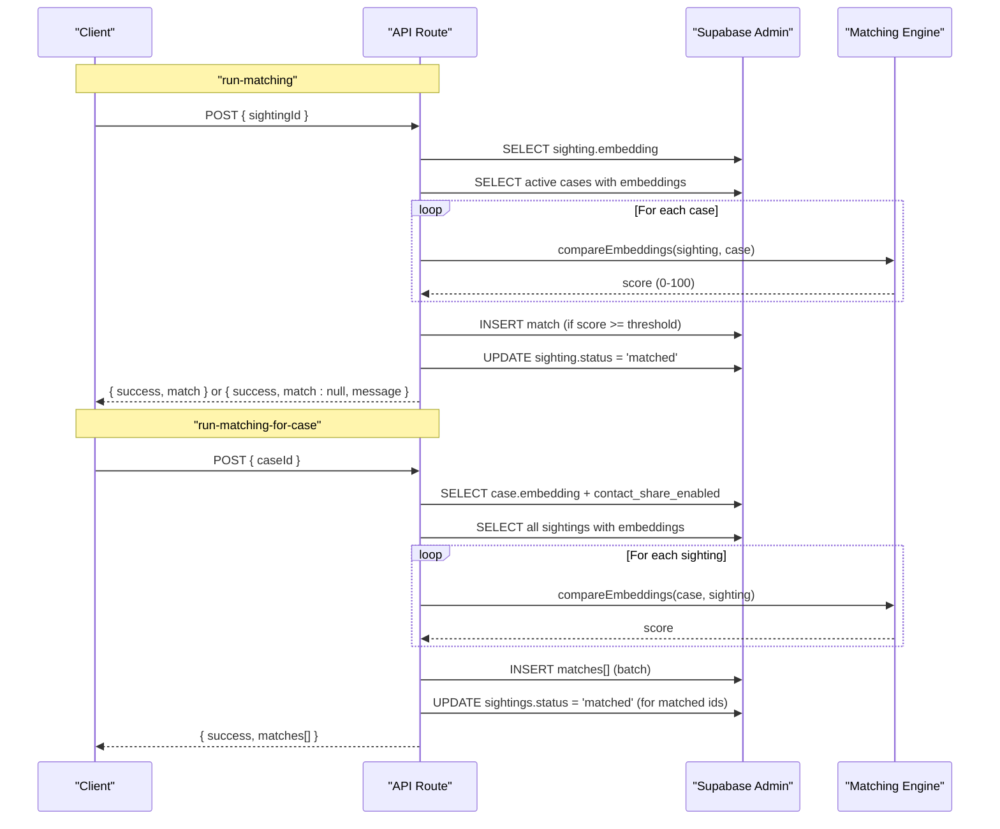
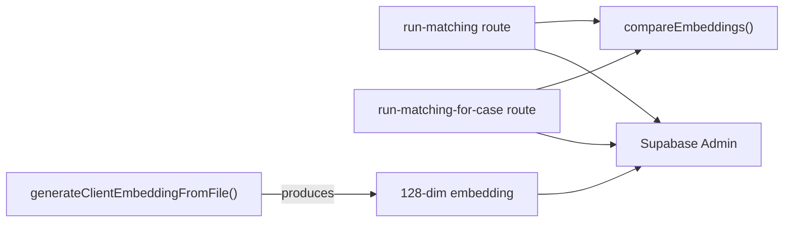

# Face Matching APIs

<cite>
**Referenced Files in This Document**
- [route.ts](file://app/api/run-matching/route.ts)
- [route.ts](file://app/api/run-matching-for-case/route.ts)
- [compare.ts](file://lib/ai-matching/compare.ts)
- [embeddings.ts](file://lib/ai-matching/embeddings.ts)
- [index.ts](file://lib/ai-matching/index.ts)
- [initial_schema.sql](file://supabase/migrations/20260903_initial_schema.sql)
- [index.ts](file://types/index.ts)
</cite>

## Table of Contents
1. Introduction
2. Project Structure
3. Core Components
4. Architecture Overview
5. Detailed Component Analysis
6. Dependency Analysis
7. Performance Considerations
8. Troubleshooting Guide
9. Conclusion

## Introduction
This document provides detailed API documentation for the face recognition and matching endpoints:
- POST /api/run-matching: Batch-style matching that evaluates a new sighting against all active cases and creates at most one match record per sighting.
- POST /api/run-matching-for-case: Reverse matching that evaluates a newly created case against all existing sightings, potentially creating multiple matches (one per qualifying sighting).

It covers request/response schemas, embedding handling, tier classification (strong/notify/possible), AI algorithm integration, thresholds, performance expectations, error conditions, and best practices for client-side face detection.

## Project Structure
The face matching system is implemented as Next.js API routes backed by Supabase tables and an in-browser face embedding generator.

**Diagram sources**
- [route.ts:10-185](file://app/api/run-matching/route.ts#L10-L185)
- [route.ts:20-207](file://app/api/run-matching-for-case/route.ts#L20-L207)
- [compare.ts:10-29](file://lib/ai-matching/compare.ts#L10-L29)
- [initial_schema.sql:59-151](file://supabase/migrations/20260903_initial_schema.sql#L59-L151)

**Section sources**
- [route.ts:10-185](file://app/api/run-matching/route.ts#L10-L185)
- [route.ts:20-207](file://app/api/run-matching-for-case/route.ts#L20-L207)
- [compare.ts:1-72](file://lib/ai-matching/compare.ts#L1-L72)
- [initial_schema.sql:59-151](file://supabase/migrations/20260903_initial_schema.sql#L59-L151)

## Core Components
- API Routes:
  - run-matching: Processes a sighting against active cases; inserts one match if above threshold; updates sighting status to matched.
  - run-matching-for-case: Processes a case against all sightings; batch-inserts all qualifying matches; updates affected sighting statuses.
- AI Matching Engine:
  - compareEmbeddings: Computes similarity score from embeddings using Euclidean distance transformed via a sigmoid function into a 0–100 confidence score.
  - Thresholds: STRONG_THRESHOLD, NOTIFY_THRESHOLD, POSSIBLE_THRESHOLD define tiers.
- Client Embedding Generator:
  - generateClientEmbeddingFromFile: Runs entirely in the browser using @vladmandic/face-api to detect faces and produce a 128-dimensional float embedding array.

Key data models:
- Cases: id, embedding (JSONB), contact_share_enabled, status.
- Sightings: id, embedding (JSONB), status.
- Matches: id, case_id, sighting_id, confidence_score, tier, contact_shared, family_action, reviewed_at.

**Section sources**
- [route.ts:10-185](file://app/api/run-matching/route.ts#L10-L185)
- [route.ts:20-207](file://app/api/run-matching-for-case/route.ts#L20-L207)
- [compare.ts:1-72](file://lib/ai-matching/compare.ts#L1-L72)
- [embeddings.ts:20-102](file://lib/ai-matching/embeddings.ts#L20-L102)
- [initial_schema.sql:59-151](file://supabase/migrations/20260903_initial_schema.sql#L59-L151)

## Architecture Overview
End-to-end flow for both endpoints:

**Diagram sources**
- [route.ts:10-185](file://app/api/run-matching/route.ts#L10-L185)
- [route.ts:20-207](file://app/api/run-matching-for-case/route.ts#L20-L207)
- [compare.ts:19-29](file://lib/ai-matching/compare.ts#L19-L29)

## Detailed Component Analysis

### Endpoint: POST /api/run-matching
Purpose:
- Evaluate a single sighting against all active cases.
- Create at most one match record per sighting when the highest score meets the minimum threshold.
- Auto-share contact only for strong-tier matches when the case has contact sharing enabled.

Request:
- Method: POST
- Content-Type: application/json
- Body schema:
  - sightingId: string (required)

Processing highlights:
- Fetches sighting embedding (supports JSONB array or stringified array).
- Fetches all active cases with non-null embeddings.
- Compares sighting embedding to each case embedding using compareEmbeddings.
- Classifies the highest score into tiers based on thresholds.
- Inserts a match row with confidence_score, tier, and contact_shared flag.
- Updates the sighting status to matched.

Response:
- On success with no match:
  - { success: true, match: null, highestScore: number, message: string }
- On success with match:
  - { success: true, match: object } where object includes fields such as id, case_id, sighting_id, confidence_score, tier, contact_shared.
- On errors:
  - 400: Invalid input or parsing failure.
  - 404: Sighting not found.
  - 500: Database or unexpected server error.

Tier classification logic:
- If highestScore < POSSIBLE_THRESHOLD: no match inserted.
- Else:
  - strong: highestScore >= STRONG_THRESHOLD
  - notify: highestScore >= NOTIFY_THRESHOLD
  - possible: otherwise

Contact sharing rule:
- contact_shared is true only when tier is strong and the case’s contact_share_enabled is true.

Example responses:
- No match due to low score:
  - { success: true, match: null, highestScore: 35, message: "No match meeting minimum confidence threshold." }
- Strong match with contact shared:
  - { success: true, match: { id: "...", case_id: "...", sighting_id: "...", confidence_score: 92, tier: "strong", contact_shared: true } }
- Notify match without auto-sharing:
  - { success: true, match: { ..., tier: "notify", contact_shared: false } }

Error examples:
- Missing sightingId:
  - { error: "sightingId is required and must be a string." } (400)
- Sighting not found:
  - { error: "Sighting ... not found." } (404)
- Database insert error:
  - { error: "Failed to insert match record: ..." } (500)

**Section sources**
- [route.ts:10-185](file://app/api/run-matching/route.ts#L10-L185)
- [compare.ts:1-29](file://lib/ai-matching/compare.ts#L1-L29)
- [initial_schema.sql:59-151](file://supabase/migrations/20260903_initial_schema.sql#L59-L151)

### Endpoint: POST /api/run-matching-for-case
Purpose:
- Reverse matching: evaluate a newly created case against all existing sightings (regardless of status).
- Potentially create multiple match records (one per qualifying sighting).
- Auto-share contact only for strong-tier matches when the case has contact sharing enabled.

Request:
- Method: POST
- Content-Type: application/json
- Body schema:
  - caseId: string (required)

Processing highlights:
- Fetches case embedding and contact_share_enabled.
- Fetches all sightings with non-null embeddings.
- Compares case embedding to each sighting embedding.
- Filters scores below POSSIBLE_THRESHOLD.
- Classifies each qualifying score into tiers.
- Batch-inserts all qualifying matches.
- Updates statuses of matched sightings to matched.

Response:
- On success with matches:
  - { success: true, matches: [ ... ] } where each element includes id, case_id, sighting_id, confidence_score, tier, contact_shared.
- On success with no matches:
  - { success: true, matches: [], message: "No sightings met the minimum confidence threshold." }
- On errors:
  - 400: Invalid input or parsing failure.
  - 404: Case not found.
  - 500: Database or unexpected server error.

Example responses:
- Multiple matches:
  - { success: true, matches: [ { confidence_score: 90, tier: "strong", contact_shared: true }, { confidence_score: 72, tier: "notify", contact_shared: false } ] }
- No matches:
  - { success: true, matches: [], message: "No sightings met the minimum confidence threshold." }

Error examples:
- Missing caseId:
  - { error: "caseId is required and must be a string." } (400)
- Case not found:
  - { error: "Case ... not found." } (404)
- Database insert error:
  - { error: "Failed to insert match records: ..." } (500)

**Section sources**
- [route.ts:20-207](file://app/api/run-matching-for-case/route.ts#L20-L207)
- [compare.ts:1-29](file://lib/ai-matching/compare.ts#L1-L29)
- [initial_schema.sql:59-151](file://supabase/migrations/20260903_initial_schema.sql#L59-L151)

### AI Matching Algorithm Integration
- Embedding generation:
  - Client-side: generateClientEmbeddingFromFile uses @vladmandic/face-api to detect a face and extract a 128-dimensional descriptor (float array). Models are loaded from /public/models and cached per session.
- Similarity scoring:
  - compareEmbeddings computes Euclidean distance between two embeddings and maps it to a 0–100 confidence score using a sigmoid transformation with configurable midpoint and steepness.
- Thresholds:
  - STRONG_THRESHOLD, NOTIFY_THRESHOLD, POSSIBLE_THRESHOLD define tier boundaries used by both endpoints.

Notes:
- The index module also defines a classifyMatchScore helper aligned with PRD tiers (strong/notify/possible/discarded) and flags for notifications and contact sharing. While the endpoints use their own threshold constants, this helper can be used for consistent UI behavior.

**Section sources**
- [embeddings.ts:20-102](file://lib/ai-matching/embeddings.ts#L20-L102)
- [compare.ts:1-29](file://lib/ai-matching/compare.ts#L1-L29)
- [index.ts:1-58](file://lib/ai-matching/index.ts#L1-L58)

### Request Schemas: Photo Uploads and Embeddings
- Photos:
  - Clients upload photos to storage (e.g., Supabase Storage) and store photo URLs in cases/sightings.
- Embeddings:
  - Embeddings are stored as JSONB arrays in cases.embedding and sightings.embedding.
  - Endpoints accept either native JSONB arrays or stringified arrays and parse them safely.
- Matching parameters:
  - run-matching requires sightingId.
  - run-matching-for-case requires caseId.

Best practices for client-side face detection:
- Preload models once per session to reduce latency.
- Ensure images contain a clear, front-facing face for reliable embedding extraction.
- Handle warnings when no face is detected; submissions still proceed but matching may be limited.

**Section sources**
- [embeddings.ts:20-102](file://lib/ai-matching/embeddings.ts#L20-L102)
- [route.ts:39-61](file://app/api/run-matching/route.ts#L39-L61)
- [route.ts:51-72](file://app/api/run-matching-for-case/route.ts#L51-L72)

### Response Formats: Confidence Scores, Tiers, and Match Results
- Confidence scores:
  - Returned as numbers in 0–100 range.
- Tier classifications:
  - strong: high confidence; may auto-share contact if enabled.
  - notify: medium confidence; notifies but does not auto-share contact.
  - possible: lower confidence; recorded but no notification.
- Match results:
  - run-matching returns a single match object or null with highestScore and message.
  - run-matching-for-case returns an array of match objects or empty array with message.

**Section sources**
- [route.ts:118-177](file://app/api/run-matching/route.ts#L118-L177)
- [route.ts:131-199](file://app/api/run-matching-for-case/route.ts#L131-L199)
- [compare.ts:1-29](file://lib/ai-matching/compare.ts#L1-L29)

## Dependency Analysis
High-level dependencies between components:

**Diagram sources**
- [route.ts:10-185](file://app/api/run-matching/route.ts#L10-L185)
- [route.ts:20-207](file://app/api/run-matching-for-case/route.ts#L20-L207)
- [compare.ts:19-29](file://lib/ai-matching/compare.ts#L19-L29)
- [embeddings.ts:51-94](file://lib/ai-matching/embeddings.ts#L51-L94)

Coupling and cohesion:
- Routes depend on a small, focused matching engine (compareEmbeddings) and database access via Supabase Admin.
- Cohesion is high within each route for its specific workflow (forward vs reverse matching).
- External dependency: @vladmandic/face-api runs client-side to generate embeddings.

Potential circular dependencies:
- None observed; routes import the matching engine, which does not import routes.

External integrations:
- Supabase Admin for reading/writing cases, sightings, and matches.
- Browser-based face detection library for embedding generation.

**Section sources**
- [route.ts:10-185](file://app/api/run-matching/route.ts#L10-L185)
- [route.ts:20-207](file://app/api/run-matching-for-case/route.ts#L20-L207)
- [compare.ts:1-72](file://lib/ai-matching/compare.ts#L1-L72)
- [embeddings.ts:12-37](file://lib/ai-matching/embeddings.ts#L12-L37)

## Performance Considerations
- Complexity:
  - run-matching: O(N) comparisons against active cases.
  - run-matching-for-case: O(M) comparisons against all sightings.
- Latency drivers:
  - Number of embeddings to compare.
  - Network calls to Supabase (reads and writes).
  - Client-side model loading (first-time cost; cached per session).
- Throughput:
  - Both endpoints perform synchronous loops in Node; consider batching reads and writes already implemented in reverse matching.
- Recommendations:
  - Cache frequently accessed embeddings where appropriate.
  - Use background jobs or queues for large-scale re-indexing if needed.
  - Monitor database query performance and indexes on status and embedding fields.

[No sources needed since this section provides general guidance]

## Troubleshooting Guide
Common issues and resolutions:
- Missing or invalid IDs:
  - Ensure sightingId or caseId is provided and is a string.
- No embedding found:
  - Verify that the photo was processed client-side and embedding stored in the database.
  - Check for warnings indicating no face detected.
- Parsing errors:
  - Confirm embeddings are stored as JSONB arrays or valid stringified arrays.
- Database errors:
  - Inspect error messages returned by Supabase operations.
  - Validate Row Level Security policies and service role usage.
- Unexpected errors:
  - Review server logs for stack traces and ensure environment variables for Supabase are configured correctly.

Operational tips:
- Log and monitor highestScore values to tune thresholds if necessary.
- Track error rates for 4xx vs 5xx responses to identify client vs server issues.

**Section sources**
- [route.ts:15-20](file://app/api/run-matching/route.ts#L15-L20)
- [route.ts:31-37](file://app/api/run-matching/route.ts#L31-L37)
- [route.ts:43-51](file://app/api/run-matching/route.ts#L43-L51)
- [route.ts:156-162](file://app/api/run-matching/route.ts#L156-L162)
- [route.ts:25-30](file://app/api/run-matching-for-case/route.ts#L25-L30)
- [route.ts:43-49](file://app/api/run-matching-for-case/route.ts#L43-L49)
- [route.ts:55-63](file://app/api/run-matching-for-case/route.ts#L55-L63)
- [route.ts:173-179](file://app/api/run-matching-for-case/route.ts#L173-L179)

## Conclusion
The face matching system provides two complementary endpoints:
- run-matching: forward matching for new sightings against active cases.
- run-matching-for-case: reverse matching for new cases against all sightings.

Both leverage a robust client-side embedding pipeline and a deterministic scoring algorithm with configurable thresholds. Responses include confidence scores and tier classifications to guide downstream actions such as notifications and contact sharing. Proper error handling and clear response formats facilitate reliable integration.

[No sources needed since this section summarizes without analyzing specific files]