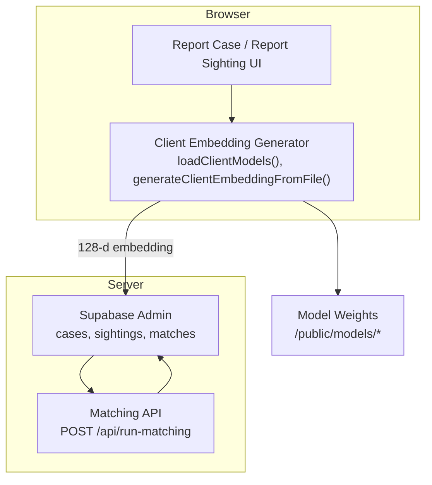
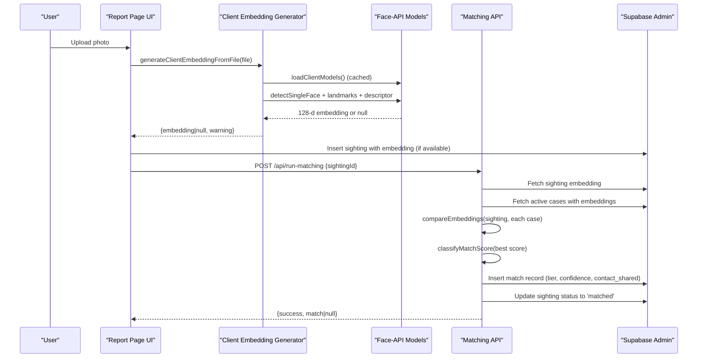
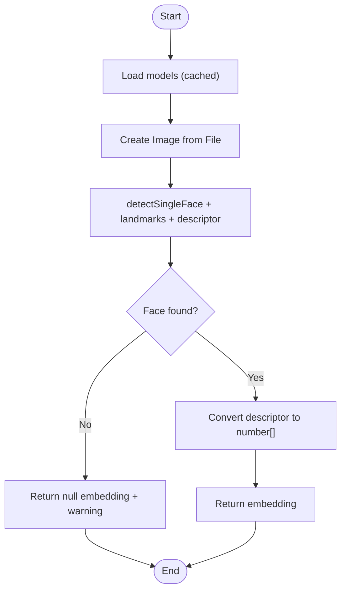
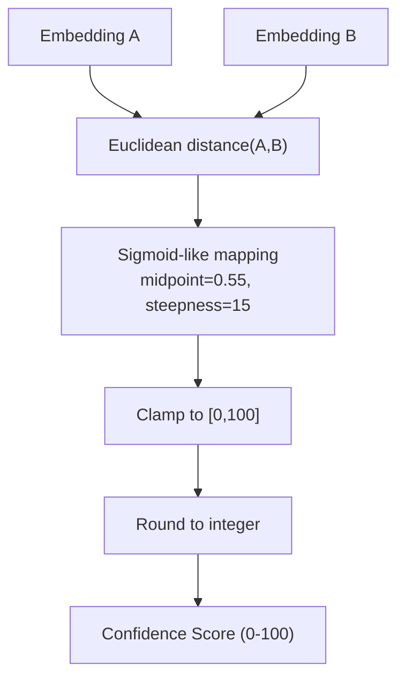
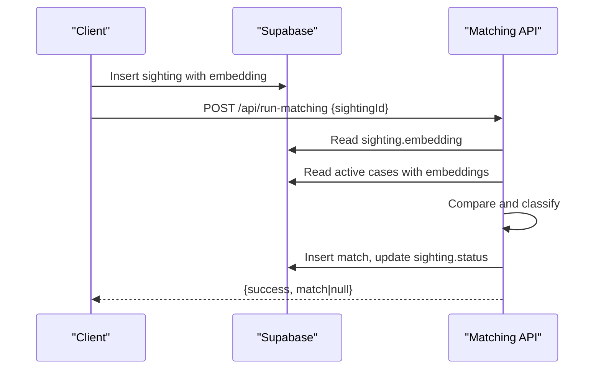
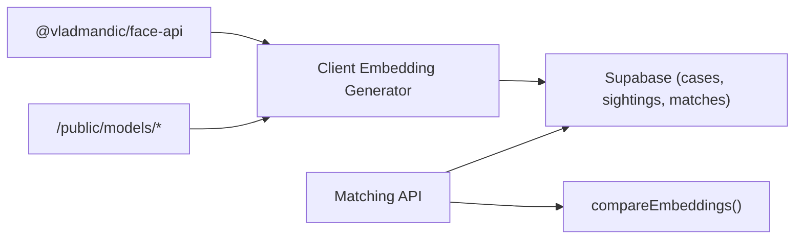

# AI & Machine Learning Integration

<cite>
**Referenced Files in This Document**
- [embeddings.ts](file://lib/ai-matching/embeddings.ts)
- [compare.ts](file://lib/ai-matching/compare.ts)
- [index.ts](file://lib/ai-matching/index.ts)
- [route.ts](file://app/api/run-matching/route.ts)
- [initial_schema.sql](file://supabase/migrations/20260903_initial_schema.sql)
- [package.json](file://package.json)
- [face_landmark_68_model-weights_manifest.json](file://public/models/face_landmark_68_model-weights_manifest.json)
</cite>

## Table of Contents
1. [Introduction](#introduction)
2. [Project Structure](#project-structure)
3. [Core Components](#core-components)
4. [Architecture Overview](#architecture-overview)
5. [Detailed Component Analysis](#detailed-component-analysis)
6. [Dependency Analysis](#dependency-analysis)
7. [Performance Considerations](#performance-considerations)
8. [Troubleshooting Guide](#troubleshooting-guide)
9. [Conclusion](#conclusion)

## Introduction
This document explains the AI-powered face recognition system built with @vladmandic/face-api. It covers client-side face detection and embedding generation, model loading and optimization strategies, similarity comparison algorithms, confidence scoring and tier classification (strong/notify/possible), and the integration between client-side processing and server-side matching APIs. It also includes performance considerations, browser compatibility notes, fallback mechanisms when face detection fails, and examples of how embeddings are generated, compared, and interpreted.

## Project Structure
The face recognition pipeline spans client and server:
- Client-side embedding generation runs entirely in the browser using WebGL/WASM via @vladmandic/face-api. Models are loaded from /public/models once per session and cached.
- Server-side matching compares a sighting’s embedding against active cases, classifies matches into tiers, and persists results to the database.

**Diagram sources**
- [embeddings.ts:20-37](file://lib/ai-matching/embeddings.ts#L20-L37)
- [embeddings.ts:51-102](file://lib/ai-matching/embeddings.ts#L51-L102)
- [route.ts:10-186](file://app/api/run-matching/route.ts#L10-L186)
- [initial_schema.sql:61-151](file://supabase/migrations/20260903_initial_schema.sql#L61-L151)

**Section sources**
- [embeddings.ts:1-102](file://lib/ai-matching/embeddings.ts#L1-L102)
- [route.ts:1-186](file://app/api/run-matching/route.ts#L1-L186)
- [initial_schema.sql:61-151](file://supabase/migrations/20260903_initial_schema.sql#L61-L151)

## Core Components
- Client embedding generator: Loads models once, detects faces, extracts landmarks, and produces a 128-dimensional embedding array. Returns warnings on failure.
- Similarity comparator: Computes Euclidean distance between embeddings and maps it to a 0–100 confidence score using a sigmoid-like function.
- Tier classifier: Maps confidence scores to tiers (strong/notify/possible/discarded) and determines notification and contact-sharing behavior.
- Matching API: Retrieves sighting and case embeddings, compares them, classifies the best match, inserts a match record, and updates sighting status.

**Section sources**
- [embeddings.ts:20-102](file://lib/ai-matching/embeddings.ts#L20-L102)
- [compare.ts:1-71](file://lib/ai-matching/compare.ts#L1-L71)
- [index.ts:1-58](file://lib/ai-matching/index.ts#L1-L58)
- [route.ts:10-186](file://app/api/run-matching/route.ts#L10-L186)

## Architecture Overview
End-to-end flow from image upload to match result:

**Diagram sources**
- [embeddings.ts:20-102](file://lib/ai-matching/embeddings.ts#L20-L102)
- [compare.ts:10-29](file://lib/ai-matching/compare.ts#L10-L29)
- [index.ts:20-56](file://lib/ai-matching/index.ts#L20-L56)
- [route.ts:24-177](file://app/api/run-matching/route.ts#L24-L177)

## Detailed Component Analysis

### Client-Side Face Detection and Embedding Generation
- Model loading:
  - Loads three models in parallel from /public/models: SSD MobileNet v1 for detection, 68-point landmark net, and recognition net.
  - Uses a module-level promise to cache model loading across calls within a browser session.
- Embedding extraction:
  - Creates an HTMLImageElement from the uploaded File, waits for load, then runs detection with landmarks and descriptor extraction.
  - Converts the Float32Array descriptor to a standard number array for storage and transmission.
- Fallback behavior:
  - If no face is detected or an error occurs, returns null embedding with a user-facing warning message.
  - On server execution context, returns a specific warning indicating client-side processing is unavailable.

**Diagram sources**
- [embeddings.ts:20-37](file://lib/ai-matching/embeddings.ts#L20-L37)
- [embeddings.ts:51-102](file://lib/ai-matching/embeddings.ts#L51-L102)

**Section sources**
- [embeddings.ts:20-102](file://lib/ai-matching/embeddings.ts#L20-L102)

### Similarity Comparison Algorithms
- Distance metric: Euclidean distance between two 128-dimensional vectors.
- Score mapping: A sigmoid-like function maps distance to a 0–100 confidence score using a midpoint and steepness parameter. Scores are clamped to [0, 100] and rounded.
- Input validation: Returns 0 if either vector is missing, empty, or mismatched in length.

**Diagram sources**
- [compare.ts:10-29](file://lib/ai-matching/compare.ts#L10-L29)

**Section sources**
- [compare.ts:10-29](file://lib/ai-matching/compare.ts#L10-L29)

### Confidence Scoring System and Tier Classification
- Threshold constants:
  - STRONG_THRESHOLD = 80
  - NOTIFY_THRESHOLD = 60
  - POSSIBLE_THRESHOLD = 40
- Server-side tiering:
  - If best score >= 80 → tier "strong"
  - Else if >= 60 → tier "notify"
  - Else if >= 40 → tier "possible"
  - Below 40 → no match record created
- Client-side classification helper:
  - Strong: >= 85% → notify immediately, auto-share contact if enabled
  - Notify: 70–84% → notify immediately, no auto-share
  - Possible: 40–69% → dashboard list quietly, no push
  - Discarded: < 40% → not stored/shown

Note: The server uses thresholds defined in compare.ts; the client helper uses slightly different boundaries for product logic. Both are documented here for clarity.

**Section sources**
- [compare.ts:1-8](file://lib/ai-matching/compare.ts#L1-L8)
- [route.ts:118-138](file://app/api/run-matching/route.ts#L118-L138)
- [index.ts:13-56](file://lib/ai-matching/index.ts#L13-L56)

### Matching Thresholds and Contact Sharing
- Minimum threshold: Matches below POSSIBLE_THRESHOLD do not create records.
- Contact sharing: For strong-tier matches, contact is shared only if the case has contact_share_enabled set to true.

**Section sources**
- [route.ts:118-141](file://app/api/run-matching/route.ts#L118-L141)
- [initial_schema.sql:61-74](file://supabase/migrations/20260903_initial_schema.sql#L61-L74)

### Integration Between Client and Server
- Client generates a 128-d embedding and stores it with the sighting record.
- Server retrieves the sighting embedding and all active case embeddings, compares them, classifies the best match, inserts a match record, and updates the sighting status to matched.

**Diagram sources**
- [route.ts:24-177](file://app/api/run-matching/route.ts#L24-L177)
- [initial_schema.sql:109-151](file://supabase/migrations/20260903_initial_schema.sql#L109-L151)

**Section sources**
- [route.ts:24-177](file://app/api/run-matching/route.ts#L24-L177)

### Examples and Usage Patterns
- Embedding generation:
  - Use the client embedding generator to produce a 128-d embedding from an uploaded image file. On success, store the resulting array with the sighting.
  - Reference: [generateClientEmbeddingFromFile:51-102](file://lib/ai-matching/embeddings.ts#L51-L102)
- Comparison function:
  - Use the comparator to compute a 0–100 confidence score between two embeddings.
  - Reference: [compareEmbeddings:19-29](file://lib/ai-matching/compare.ts#L19-L29)
- Result interpretation:
  - Apply the client-side classifier to determine tier and actions (notification, contact sharing).
  - Reference: [classifyMatchScore:20-56](file://lib/ai-matching/index.ts#L20-L56)

[No sources needed since this section references code paths without quoting content]

## Dependency Analysis
- External dependency:
  - @vladmandic/face-api provides in-browser face detection, landmarks, and descriptors via WebGL/WASM.
- Model assets:
  - Model weights are served statically from /public/models and include manifests and binaries for detection, landmarks, and recognition.
- Database schema:
  - Tables for cases, sightings, and matches store embeddings and match metadata. Row-Level Security policies restrict access by role.

**Diagram sources**
- [package.json:11-21](file://package.json#L11-L21)
- [embeddings.ts:20-37](file://lib/ai-matching/embeddings.ts#L20-L37)
- [route.ts:10-186](file://app/api/run-matching/route.ts#L10-L186)
- [initial_schema.sql:61-151](file://supabase/migrations/20260903_initial_schema.sql#L61-L151)

**Section sources**
- [package.json:11-21](file://package.json#L11-L21)
- [face_landmark_68_model-weights_manifest.json:45-60](file://public/models/face_landmark_68_model-weights_manifest.json#L45-L60)
- [initial_schema.sql:61-151](file://supabase/migrations/20260903_initial_schema.sql#L61-L151)

## Performance Considerations
- Model caching:
  - Models are loaded once per browser session using a cached promise to avoid repeated network requests and decoding overhead.
- Parallel model loading:
  - Three models are loaded concurrently to reduce initial latency.
- In-browser computation:
  - Face detection and descriptor extraction run on the client using WebGL/WASM backends, reducing server load and improving privacy.
- Efficient comparisons:
  - Server iterates over active cases with embeddings and computes distances; ensure indexing or filtering on active cases to keep queries efficient.
- Memory management:
  - Object URLs used for images are revoked after processing to free memory.

[No sources needed since this section provides general guidance based on analyzed code]

## Troubleshooting Guide
- No face detected:
  - The client returns a null embedding with a user-friendly warning. Users can still submit entries; matching may be limited without an embedding.
- Client-side processing unavailable:
  - When running on the server, the generator returns a specific warning indicating client-side processing cannot run there.
- Parsing errors:
  - If embeddings are stored as strings, the server attempts JSON parsing; failures return a clear error response.
- Network or model load failures:
  - Errors during model loading or image processing are caught and logged; the client returns a safe fallback state.

**Section sources**
- [embeddings.ts:55-102](file://lib/ai-matching/embeddings.ts#L55-L102)
- [route.ts:40-61](file://app/api/run-matching/route.ts#L40-L61)

## Conclusion
The system performs robust, privacy-preserving face recognition by generating embeddings directly in the browser and comparing them server-side. Model loading is optimized through caching and parallelization. The similarity engine converts Euclidean distances into interpretable confidence scores, which are mapped to actionable tiers. The server enforces business rules around minimum thresholds and contact sharing before persisting matches. Fallbacks ensure graceful degradation when detection fails or environments lack client-side capabilities.