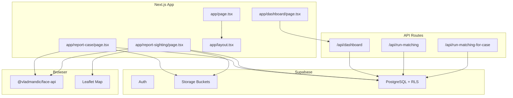
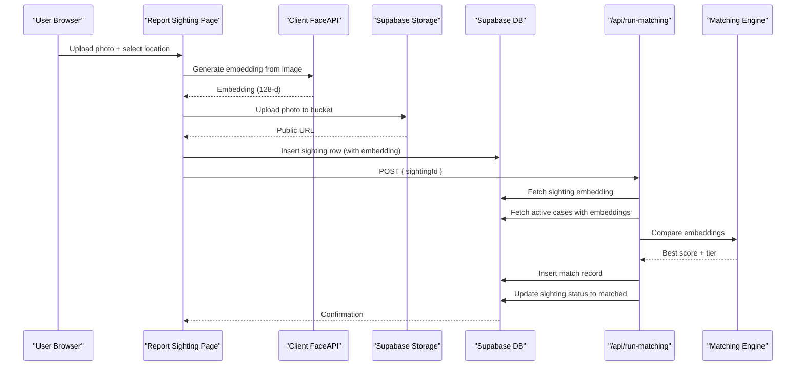
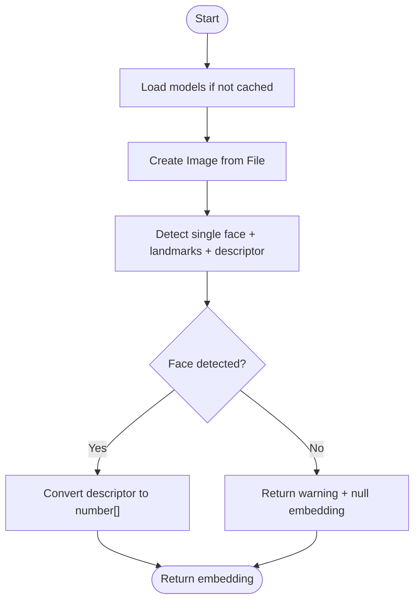
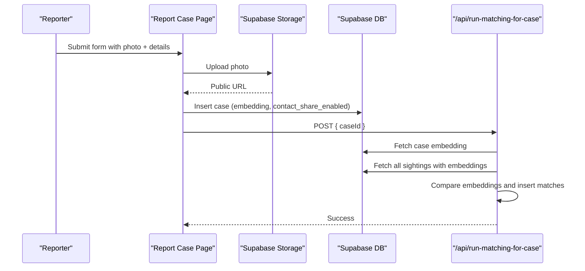
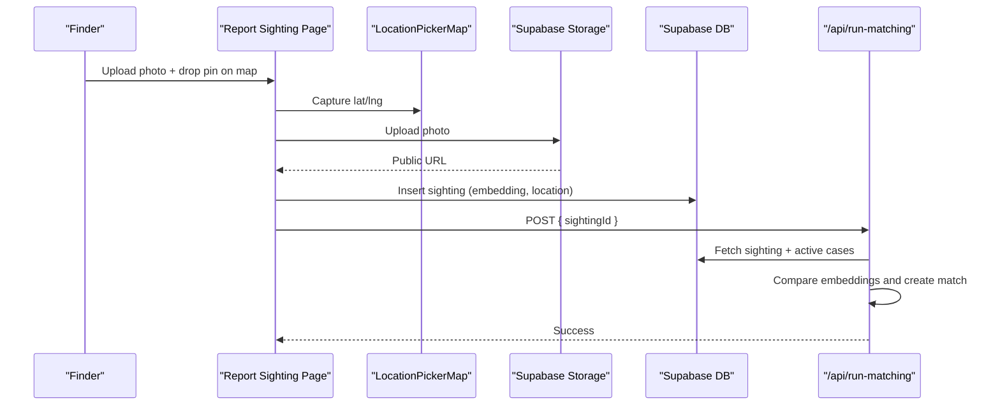
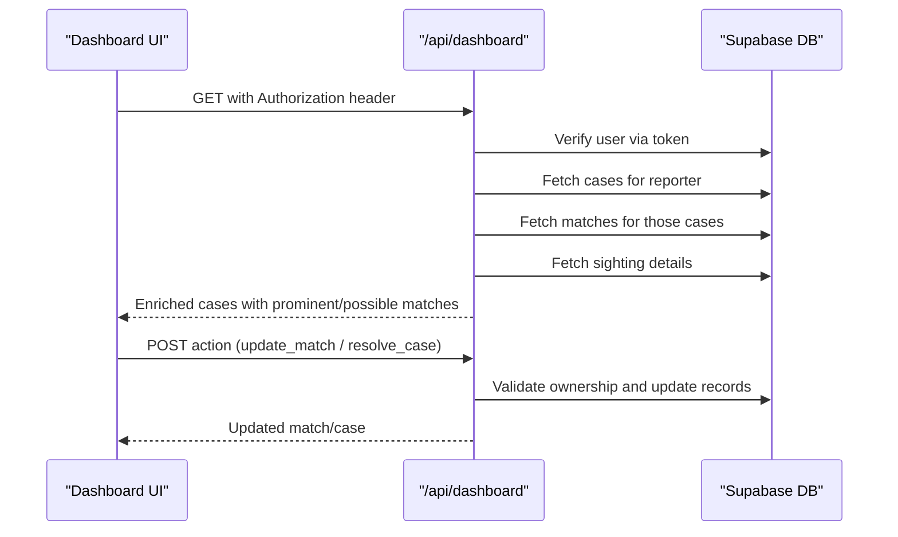
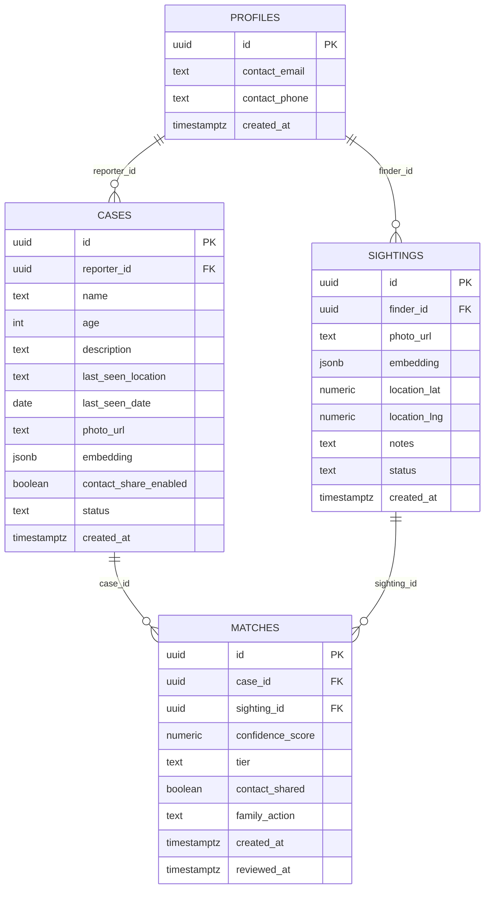
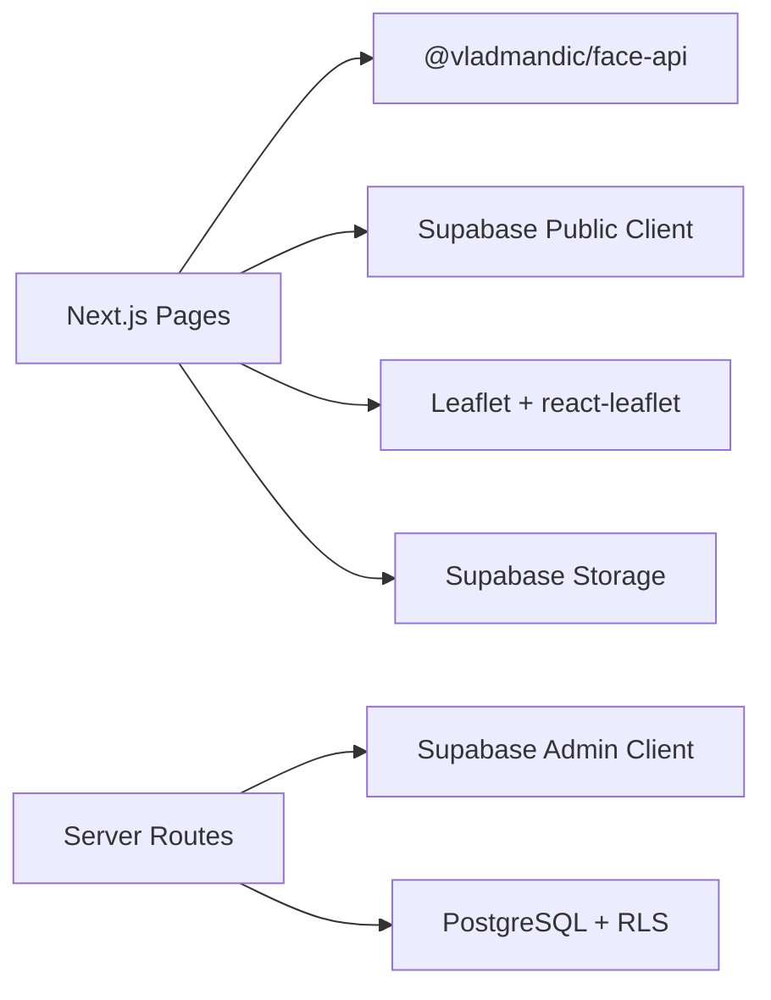

# Architecture & Technology Stack

<cite>
**Referenced Files in This Document**
- [README.md](file://README.md)
- [package.json](file://package.json)
- [app/layout.tsx](file://app/layout.tsx)
- [app/page.tsx](file://app/page.tsx)
- [app/report-case/page.tsx](file://app/report-case/page.tsx)
- [app/report-sighting/page.tsx](file://app/report-sighting/page.tsx)
- [components/Header.tsx](file://components/Header.tsx)
- [components/LocationPickerMap.tsx](file://components/LocationPickerMap.tsx)
- [lib/ai-matching/embeddings.ts](file://lib/ai-matching/embeddings.ts)
- [lib/db/supabase-admin.ts](file://lib/db/supabase-admin.ts)
- [lib/db/supabase.ts](file://lib/db/supabase.ts)
- [app/api/run-matching/route.ts](file://app/api/run-matching/route.ts)
- [app/api/run-matching-for-case/route.ts](file://app/api/run-matching-for-case/route.ts)
- [app/api/dashboard/route.ts](file://app/api/dashboard/route.ts)
- [supabase/migrations/20260903_initial_schema.sql](file://supabase/migrations/20260903_initial_schema.sql)
</cite>

## Table of Contents
1. Introduction
2. Project Structure
3. Core Components
4. Architecture Overview
5. Detailed Component Analysis
6. Dependency Analysis
7. Performance Considerations
8. Troubleshooting Guide
9. Conclusion
10. Appendices

## Introduction
Findora is a privacy-first, AI-assisted missing persons reunification system built with Next.js App Router for frontend routing and server routes, Supabase for authentication, storage, and database services, and client-side face recognition using @vladmandic/face-api to compute 128-dimensional face embeddings directly in the browser. The system supports two primary user roles: reporters (family or guardians reporting missing persons) and finders (public users submitting sightings). It performs bidirectional matching: forward matching when a sighting is submitted and reverse matching when a new case is created. Tailwind CSS provides utility-first styling across the UI.

Key design goals:
- Privacy: Photos are stored privately; embeddings are computed in-browser to avoid sending raw images to servers for processing.
- Real-time capabilities: Supabase enables real-time updates and secure access via Row Level Security (RLS).
- Scalability: Serverless API routes handle matching logic and batch operations; database RLS ensures data isolation at scale.

**Section sources**
- [README.md:1-37](file://README.md#L1-L37)
- [package.json:11-30](file://package.json#L11-L30)
- [app/layout.tsx:16-19](file://app/layout.tsx#L16-L19)

## Project Structure
The application follows Next.js App Router conventions:
- app/: Pages and API routes organized by feature
  - app/api/: Serverless API endpoints for matching and dashboard
  - app/dashboard/, app/login/, app/signup/, app/report-case/, app/report-sighting/: Feature pages
- components/: Reusable UI components (Header, LocationPickerMap)
- lib/: Shared libraries for AI matching and Supabase clients
- supabase/migrations/: Database schema and RLS policies
- public/models/: Face recognition model weights loaded by the browser

**Diagram sources**
- [app/page.tsx:1-107](file://app/page.tsx#L1-L107)
- [app/report-case/page.tsx:1-414](file://app/report-case/page.tsx#L1-L414)
- [app/report-sighting/page.tsx:1-356](file://app/report-sighting/page.tsx#L1-L356)
- [app/api/run-matching/route.ts:1-186](file://app/api/run-matching/route.ts#L1-L186)
- [app/api/run-matching-for-case/route.ts:1-208](file://app/api/run-matching-for-case/route.ts#L1-L208)
- [app/api/dashboard/route.ts:1-316](file://app/api/dashboard/route.ts#L1-L316)
- [lib/ai-matching/embeddings.ts:1-103](file://lib/ai-matching/embeddings.ts#L1-L103)
- [components/LocationPickerMap.tsx:1-267](file://components/LocationPickerMap.tsx#L1-L267)

**Section sources**
- [app/layout.tsx:1-34](file://app/layout.tsx#L1-L34)
- [package.json:11-30](file://package.json#L11-L30)

## Core Components
- Client-Side Face Recognition: Uses @vladmandic/face-api to detect faces, extract landmarks, and generate 128-d embeddings in the browser. Models are preloaded from /public/models to minimize latency.
- Supabase Clients:
  - Public client for authenticated user actions (storage uploads, inserts)
  - Admin client for server-side operations bypassing RLS where necessary (matching engine, dashboard aggregation)
- API Routes:
  - Forward matching: Compares a new sighting against active cases and creates match records with tiered confidence.
  - Reverse matching: Compares a new case against all existing sightings to capture prior sightings.
  - Dashboard: Aggregates reporter’s cases and finder’s sightings with enriched match details and optional family contact sharing.
- UI Components:
  - Header: Manages auth state and navigation
  - LocationPickerMap: Interactive map with geocoding and pin placement for precise sighting locations

Technical decisions:
- @vladmandic/face-api chosen for robust browser-based face detection and descriptor extraction without server dependencies.
- Supabase selected for integrated Auth, Storage, and PostgreSQL with RLS, enabling secure, scalable data access and real-time features.
- Tailwind CSS used for rapid, consistent styling with dark theme and responsive layouts.

**Section sources**
- [lib/ai-matching/embeddings.ts:14-37](file://lib/ai-matching/embeddings.ts#L14-L37)
- [lib/ai-matching/embeddings.ts:51-103](file://lib/ai-matching/embeddings.ts#L51-L103)
- [lib/db/supabase.ts:1-13](file://lib/db/supabase.ts#L1-L13)
- [lib/db/supabase-admin.ts:1-23](file://lib/db/supabase-admin.ts#L1-L23)
- [app/api/run-matching/route.ts:10-186](file://app/api/run-matching/route.ts#L10-L186)
- [app/api/run-matching-for-case/route.ts:20-208](file://app/api/run-matching-for-case/route.ts#L20-L208)
- [app/api/dashboard/route.ts:4-316](file://app/api/dashboard/route.ts#L4-L316)
- [components/Header.tsx:8-88](file://components/Header.tsx#L8-L88)
- [components/LocationPickerMap.tsx:69-267](file://components/LocationPickerMap.tsx#L69-L267)

## Architecture Overview
The system integrates client-side AI with server-side orchestration and database services:

**Diagram sources**
- [app/report-sighting/page.tsx:69-172](file://app/report-sighting/page.tsx#L69-L172)
- [lib/ai-matching/embeddings.ts:51-103](file://lib/ai-matching/embeddings.ts#L51-L103)
- [app/api/run-matching/route.ts:22-186](file://app/api/run-matching/route.ts#L22-L186)
- [supabase/migrations/20260903_initial_schema.sql:109-136](file://supabase/migrations/20260903_initial_schema.sql#L109-L136)

## Detailed Component Analysis

### Client-Side Face Recognition
- Model Loading: Preloads SSD MobileNet v1, 68-point landmarks, and recognition nets from /public/models once per session.
- Embedding Generation: Converts uploaded image to HTMLImageElement, runs detection + landmarks + descriptor extraction, returns a JS number array of 128 floats.
- Error Handling: Gracefully handles no-face scenarios and network errors, returning warnings to guide users.

**Diagram sources**
- [lib/ai-matching/embeddings.ts:20-37](file://lib/ai-matching/embeddings.ts#L20-L37)
- [lib/ai-matching/embeddings.ts:51-103](file://lib/ai-matching/embeddings.ts#L51-L103)

**Section sources**
- [lib/ai-matching/embeddings.ts:14-37](file://lib/ai-matching/embeddings.ts#L14-L37)
- [lib/ai-matching/embeddings.ts:51-103](file://lib/ai-matching/embeddings.ts#L51-L103)

### Report Case Flow
- Authentication Guard: Ensures user is signed in before allowing submission.
- Photo Upload: Stores image in Supabase Storage under a user-scoped path; retrieves public URL.
- Embedding Submission: Inserts case row including browser-computed embedding and optional contact share flag.
- Reverse Matching Trigger: Calls /api/run-matching-for-case to compare against existing sightings.

**Diagram sources**
- [app/report-case/page.tsx:79-157](file://app/report-case/page.tsx#L79-L157)
- [app/api/run-matching-for-case/route.ts:20-208](file://app/api/run-matching-for-case/route.ts#L20-L208)

**Section sources**
- [app/report-case/page.tsx:20-157](file://app/report-case/page.tsx#L20-L157)
- [app/api/run-matching-for-case/route.ts:20-208](file://app/api/run-matching-for-case/route.ts#L20-L208)

### Report Sighting Flow
- Authentication Guard: Validates user session.
- Photo Upload and Location Selection: Uses dynamic Leaflet map component for precise coordinates; stores photo in Supabase Storage.
- Sighting Insertion: Inserts sighting row with embedding and status pending.
- Forward Matching Trigger: Calls /api/run-matching to evaluate against active cases.

**Diagram sources**
- [app/report-sighting/page.tsx:69-172](file://app/report-sighting/page.tsx#L69-L172)
- [components/LocationPickerMap.tsx:69-267](file://components/LocationPickerMap.tsx#L69-L267)
- [app/api/run-matching/route.ts:22-186](file://app/api/run-matching/route.ts#L22-L186)

**Section sources**
- [app/report-sighting/page.tsx:31-172](file://app/report-sighting/page.tsx#L31-L172)
- [components/LocationPickerMap.tsx:69-267](file://components/LocationPickerMap.tsx#L69-L267)
- [app/api/run-matching/route.ts:22-186](file://app/api/run-matching/route.ts#L22-L186)

### Dashboard and Match Management
- GET /api/dashboard: Authenticates via token, fetches reporter’s cases and finder’s sightings, enriches with matches and optional family contact info based on RLS and business rules.
- POST /api/dashboard: Handles family actions such as marking matches as different_person/resolved and updating contact sharing flags.

**Diagram sources**
- [app/api/dashboard/route.ts:4-316](file://app/api/dashboard/route.ts#L4-L316)

**Section sources**
- [app/api/dashboard/route.ts:4-316](file://app/api/dashboard/route.ts#L4-L316)

### Database Schema and Security
- Tables: profiles, cases, sightings, matches with JSONB embeddings and enumerated statuses/tiers.
- Row Level Security: Policies restrict access to own resources; admin routes use service role key for privileged operations.
- Triggers: Auto-create profile entries upon user signup.

**Diagram sources**
- [supabase/migrations/20260903_initial_schema.sql:7-199](file://supabase/migrations/20260903_initial_schema.sql#L7-L199)

**Section sources**
- [supabase/migrations/20260903_initial_schema.sql:7-199](file://supabase/migrations/20260903_initial_schema.sql#L7-L199)

## Dependency Analysis
- Frontend Dependencies: React, Next.js, Leaflet/react-leaflet for maps, @vercel/analytics for analytics.
- AI Processing: @vladmandic/face-api for client-side face detection and descriptors.
- Backend Services: Supabase JS SDK for both public and admin clients; environment variables configure URLs and keys.
- Styling: Tailwind CSS v4 with PostCSS integration.

**Diagram sources**
- [package.json:11-30](file://package.json#L11-L30)
- [lib/db/supabase.ts:1-13](file://lib/db/supabase.ts#L1-L13)
- [lib/db/supabase-admin.ts:1-23](file://lib/db/supabase-admin.ts#L1-L23)
- [lib/ai-matching/embeddings.ts:12-37](file://lib/ai-matching/embeddings.ts#L12-L37)
- [components/LocationPickerMap.tsx:1-267](file://components/LocationPickerMap.tsx#L1-L267)

**Section sources**
- [package.json:11-30](file://package.json#L11-L30)
- [lib/db/supabase.ts:1-13](file://lib/db/supabase.ts#L1-L13)
- [lib/db/supabase-admin.ts:1-23](file://lib/db/supabase-admin.ts#L1-L23)

## Performance Considerations
- Client-Side Processing: Face embeddings computed in-browser reduce server load and improve privacy; models are cached per session to avoid repeated downloads.
- Batch Operations: Reverse matching batches match insertions to minimize database round-trips.
- Dynamic Rendering: Home page sets revalidate=0 to reflect real-time resolved counts; consider caching strategies for high traffic.
- Storage Optimization: Images uploaded with short cache control; ensure CDN configuration for efficient delivery.
- Map Geocoding: Debounced search reduces external API calls to Nominatim.

[No sources needed since this section provides general guidance]

## Troubleshooting Guide
- Missing Environment Variables: Admin client throws error if Supabase URL or service role key are absent; verify deployment secrets.
- No Face Detected: Client returns warning; advise users to upload clearer photos with good lighting and frontal views.
- Unauthorized Access: Dashboard routes validate tokens; ensure proper Authorization headers and valid sessions.
- Database Errors: API routes return detailed error messages; check RLS policies and schema constraints.

**Section sources**
- [lib/db/supabase-admin.ts:9-14](file://lib/db/supabase-admin.ts#L9-L14)
- [lib/ai-matching/embeddings.ts:81-103](file://lib/ai-matching/embeddings.ts#L81-L103)
- [app/api/dashboard/route.ts:6-22](file://app/api/dashboard/route.ts#L6-L22)
- [app/api/run-matching/route.ts:150-186](file://app/api/run-matching/route.ts#L150-L186)

## Conclusion
Findora combines client-side AI with serverless orchestration and secure database services to enable private, efficient missing persons reunification. The architecture leverages Next.js App Router for modular routing and API endpoints, Supabase for robust backend capabilities, and Tailwind CSS for modern UI development. Bidirectional matching ensures comprehensive coverage of potential matches while maintaining strict data privacy through RLS and minimal data exposure. The system is designed for scalability and maintainability, with clear separation of concerns and extensible components.

[No sources needed since this section summarizes without analyzing specific files]

## Appendices
- Deployment Topology: Host Next.js on Vercel or compatible platform; configure Supabase project with environment variables for anon/service role keys; ensure public/models are accessible via static assets.
- Infrastructure Requirements: Node.js runtime, Supabase project with Auth, Storage, and PostgreSQL enabled; environment variables configured for both public and admin clients.
- Security Best Practices: Use service role key only in server routes; enforce RLS policies; validate inputs and sanitize outputs; limit exposure of sensitive fields.

[No sources needed since this section provides general guidance]