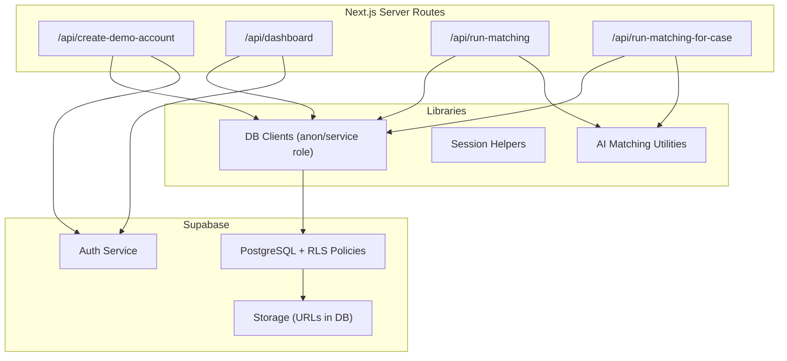
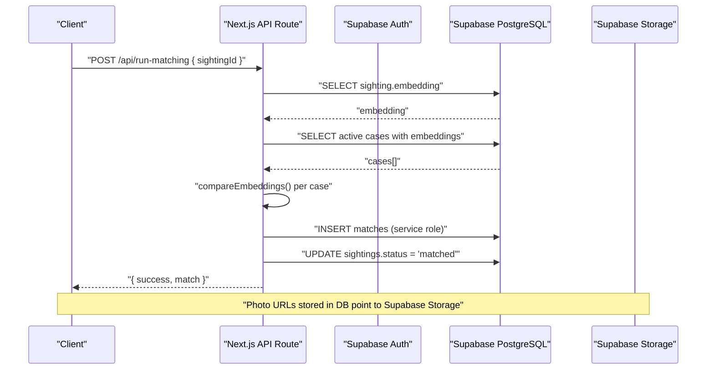
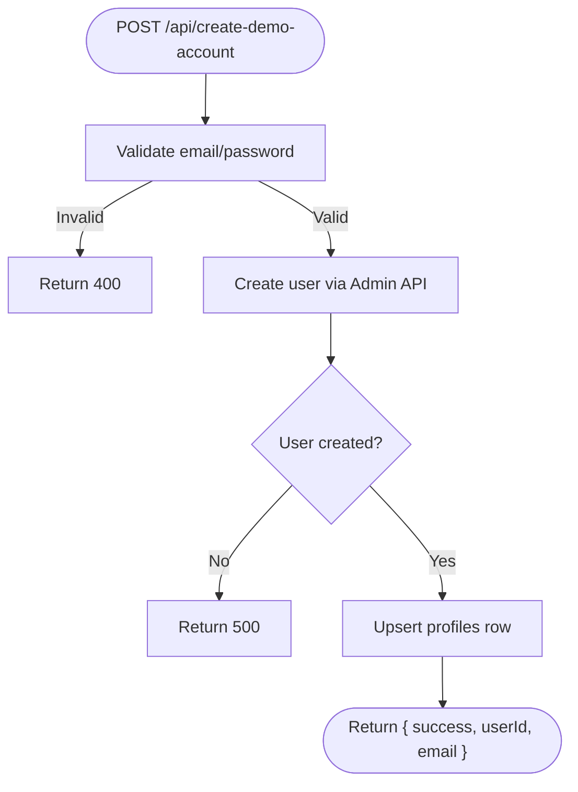
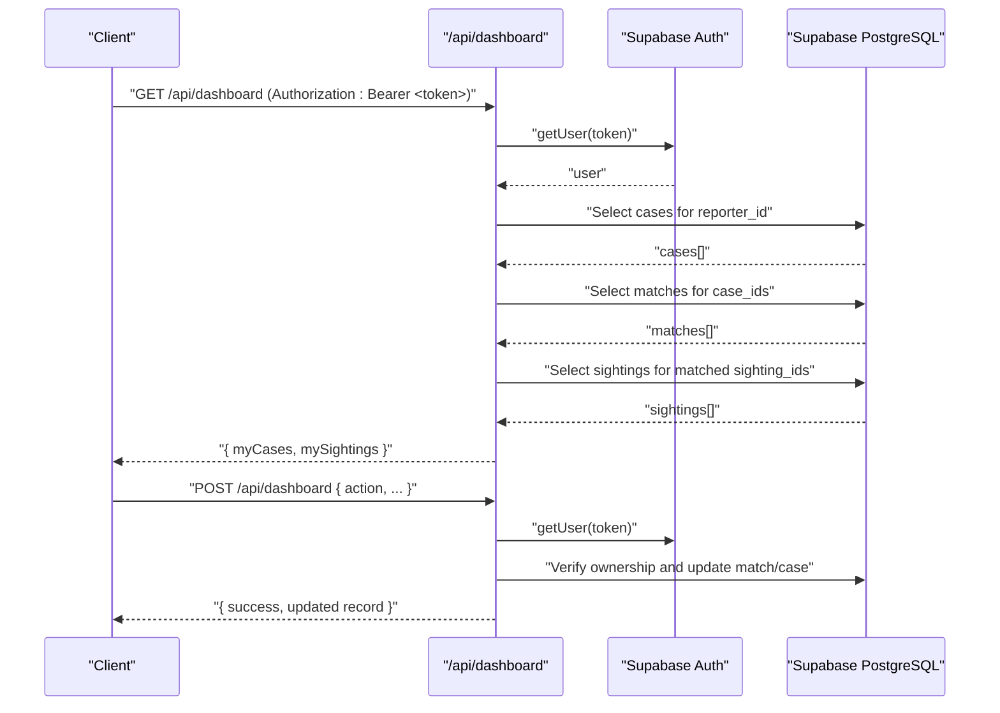
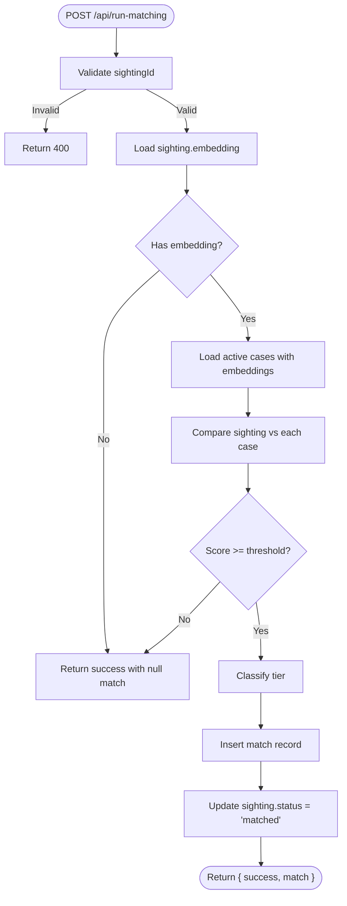
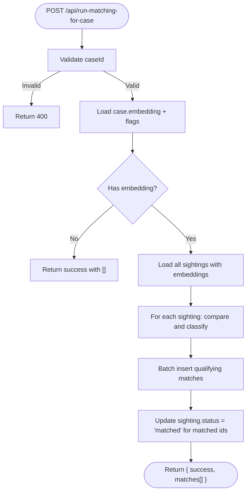
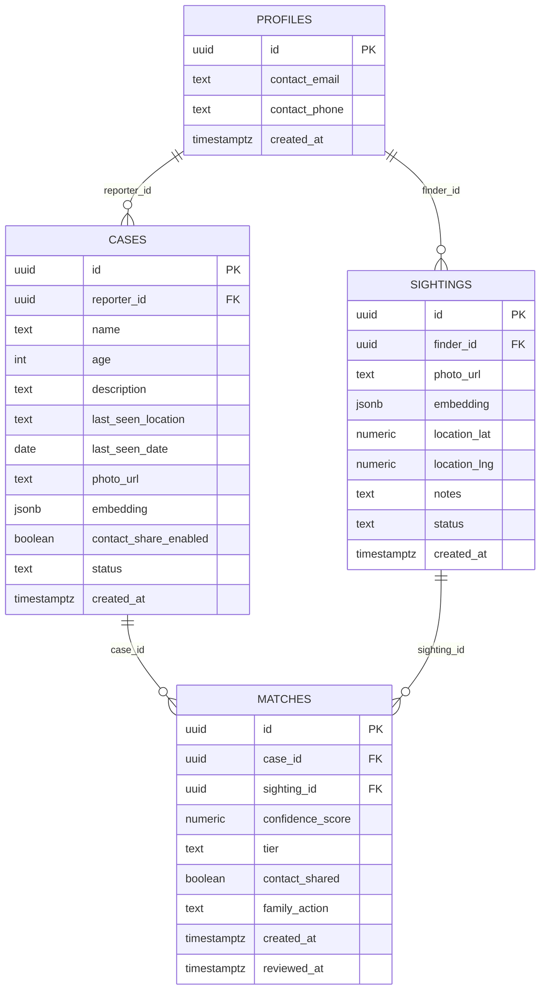
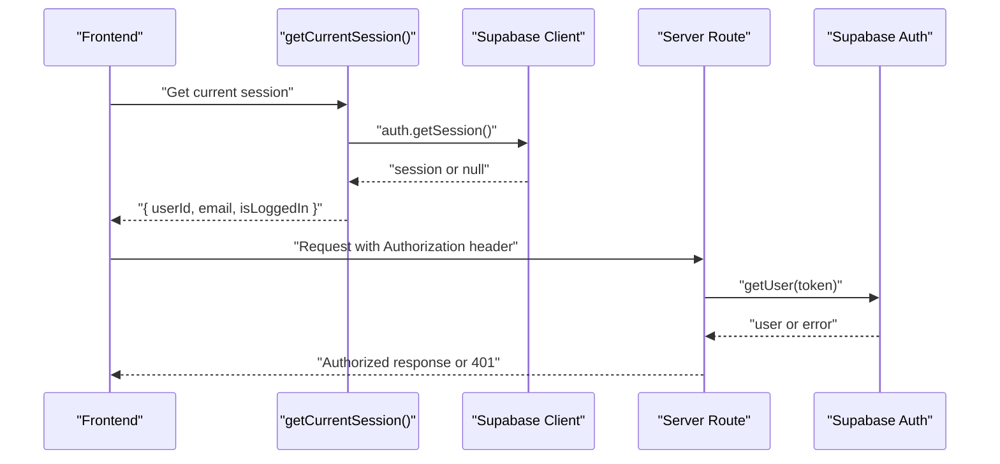
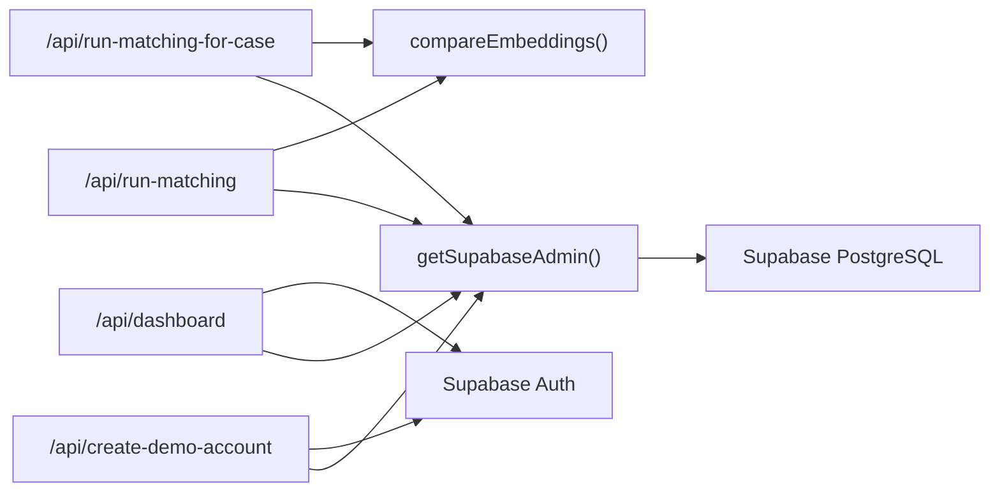

# Backend Services & API Layer

<cite>
**Referenced Files in This Document**
- [route.ts](file://app/api/create-demo-account/route.ts)
- [route.ts](file://app/api/dashboard/route.ts)
- [route.ts](file://app/api/run-matching/route.ts)
- [route.ts](file://app/api/run-matching-for-case/route.ts)
- [supabase-admin.ts](file://lib/db/supabase-admin.ts)
- [supabase.ts](file://lib/db/supabase.ts)
- [session.ts](file://lib/auth/session.ts)
- [compare.ts](file://lib/ai-matching/compare.ts)
- [20260903_initial_schema.sql](file://supabase/migrations/20260903_initial_schema.sql)
- [index.ts](file://types/index.ts)
- [package.json](file://package.json)
</cite>

## Table of Contents
1. Introduction
2. Project Structure
3. Core Components
4. Architecture Overview
5. Detailed Component Analysis
6. Dependency Analysis
7. Performance Considerations
8. Troubleshooting Guide
9. Conclusion

## Introduction
This document explains the backend services and API layer built on Supabase using Next.js App Router server routes. It covers the serverless API route structure, database client configuration, authentication flow, RESTful design patterns, request/response handling, error management, and integration with Supabase for data operations. It also documents the AI face matching pipeline, real-time readiness via RLS policies, and file storage considerations through Supabase Storage URLs. Security, scalability, and performance optimization techniques are included to guide robust production usage.

## Project Structure
The backend is implemented as a set of Next.js server routes under app/api, each exposing a focused REST endpoint:
- Create demo account: admin user creation and profile upsert
- Dashboard: authenticated read/write for cases and sightings with match enrichment
- Run matching: forward matching from sighting to active cases
- Reverse matching: backfill matches when a new case arrives

Database schema and Row Level Security (RLS) policies are defined in the Supabase migration. Shared libraries provide:
- Supabase clients (anon and service role)
- Session helpers for client-side auth state
- AI matching utilities and thresholds

**Diagram sources**
- [route.ts:1-67](file://app/api/create-demo-account/route.ts#L1-L67)
- [route.ts:1-316](file://app/api/dashboard/route.ts#L1-L316)
- [route.ts:1-186](file://app/api/run-matching/route.ts#L1-L186)
- [route.ts:1-208](file://app/api/run-matching-for-case/route.ts#L1-L208)
- [supabase-admin.ts:1-23](file://lib/db/supabase-admin.ts#L1-L23)
- [supabase.ts:1-13](file://lib/db/supabase.ts#L1-L13)
- [session.ts:1-35](file://lib/auth/session.ts#L1-L35)
- [compare.ts:1-72](file://lib/ai-matching/compare.ts#L1-L72)
- [20260903_initial_schema.sql:1-199](file://supabase/migrations/20260903_initial_schema.sql#L1-L199)

**Section sources**
- [route.ts:1-67](file://app/api/create-demo-account/route.ts#L1-L67)
- [route.ts:1-316](file://app/api/dashboard/route.ts#L1-L316)
- [route.ts:1-186](file://app/api/run-matching/route.ts#L1-L186)
- [route.ts:1-208](file://app/api/run-matching-for-case/route.ts#L1-L208)
- [supabase-admin.ts:1-23](file://lib/db/supabase-admin.ts#L1-L23)
- [supabase.ts:1-13](file://lib/db/supabase.ts#L1-L13)
- [session.ts:1-35](file://lib/auth/session.ts#L1-L35)
- [compare.ts:1-72](file://lib/ai-matching/compare.ts#L1-L72)
- [20260903_initial_schema.sql:1-199](file://supabase/migrations/20260903_initial_schema.sql#L1-L199)

## Core Components
- Serverless API routes: Each route encapsulates a single responsibility, validates inputs, enforces authorization, performs database operations, and returns structured JSON responses with appropriate HTTP status codes.
- Database clients:
  - Anon client for client-side or policy-enforced server calls
  - Service role client for privileged operations that bypass RLS (e.g., matching engine reads all active cases)
- Authentication:
  - Client session helpers to read current session and user ID
  - Route-level token verification using Supabase Auth getUser(token)
- AI matching:
  - Threshold-based scoring and tier classification
  - Forward and reverse matching endpoints to create match records and update statuses

Key responsibilities by component:
- /api/create-demo-account: Admin user creation and profile initialization
- /api/dashboard: Authenticated queries for reporter/finder dashboards; actions to update matches and resolve cases
- /api/run-matching: Compare a sighting embedding against active cases and insert matches
- /api/run-matching-for-case: Backfill matches by comparing a new case embedding against all sightings
- lib/db/*: Supabase client configuration
- lib/auth/session.ts: Session utilities
- lib/ai-matching/compare.ts: Scoring, thresholds, and helper to call matching route

**Section sources**
- [route.ts:1-67](file://app/api/create-demo-account/route.ts#L1-L67)
- [route.ts:1-316](file://app/api/dashboard/route.ts#L1-L316)
- [route.ts:1-186](file://app/api/run-matching/route.ts#L1-L186)
- [route.ts:1-208](file://app/api/run-matching-for-case/route.ts#L1-L208)
- [supabase-admin.ts:1-23](file://lib/db/supabase-admin.ts#L1-L23)
- [supabase.ts:1-13](file://lib/db/supabase.ts#L1-L13)
- [session.ts:1-35](file://lib/auth/session.ts#L1-L35)
- [compare.ts:1-72](file://lib/ai-matching/compare.ts#L1-L72)

## Architecture Overview
The system uses Next.js server routes as a thin API layer over Supabase. Authorization is enforced at the route level for sensitive operations, while RLS protects direct client access to tables. The matching engine runs server-side to avoid RLS restrictions and to perform bulk comparisons efficiently.

**Diagram sources**
- [route.ts:1-186](file://app/api/run-matching/route.ts#L1-L186)
- [compare.ts:1-72](file://lib/ai-matching/compare.ts#L1-L72)
- [20260903_initial_schema.sql:58-119](file://supabase/migrations/20260903_initial_schema.sql#L58-L119)

## Detailed Component Analysis

### API: Create Demo Account
- Purpose: Create a user via Supabase Admin and ensure a corresponding profile row exists.
- Input validation: Requires email and password; returns 400 if missing.
- Authorization: Uses service role client to bypass RLS and rate limits during demo setup.
- Data operations:
  - Creates user with email confirmation enabled
  - Upserts profile row with id and contact_email
- Response: Returns success flag, userId, and email on success; errors return descriptive messages with appropriate status codes.

**Diagram sources**
- [route.ts:1-67](file://app/api/create-demo-account/route.ts#L1-L67)

**Section sources**
- [route.ts:1-67](file://app/api/create-demo-account/route.ts#L1-L67)
- [supabase-admin.ts:1-23](file://lib/db/supabase-admin.ts#L1-L23)
- [20260903_initial_schema.sql:1-56](file://supabase/migrations/20260903_initial_schema.sql#L1-L56)

### API: Dashboard
- Purpose: Provide a unified view for reporters (my cases with matches) and finders (my sightings with matches). Also supports family actions to update matches and resolve cases.
- Authentication: Requires Authorization header with bearer token; verifies user via Supabase Auth.
- Read flow:
  - Fetches reporter’s cases and enriches with matches and sighting details
  - Fetches finder’s sightings and enriches with matches and optional reporter contact info when allowed
- Write flow:
  - Validates ownership of case before allowing updates
  - Updates match fields (family_action, contact_shared, reviewed_at)
  - Resolves case by updating status
- Error handling: Logs errors and returns structured JSON with status codes (401, 403, 404, 500).

**Diagram sources**
- [route.ts:1-316](file://app/api/dashboard/route.ts#L1-L316)

**Section sources**
- [route.ts:1-316](file://app/api/dashboard/route.ts#L1-L316)
- [20260903_initial_schema.sql:58-199](file://supabase/migrations/20260903_initial_schema.sql#L58-L199)

### API: Run Matching (Forward)
- Purpose: Given a sighting, compare its embedding against all active cases and create a match if above threshold.
- Input validation: Ensures sightingId is present and a string; returns 400 otherwise.
- Data operations:
  - Retrieves sighting embedding (array or JSON string)
  - Retrieves all active cases with embeddings
  - Compares embeddings and classifies tier based on thresholds
  - Inserts match record and updates sighting status to matched
- Response: Returns success and match object or message indicating no match found.

**Diagram sources**
- [route.ts:1-186](file://app/api/run-matching/route.ts#L1-L186)
- [compare.ts:1-72](file://lib/ai-matching/compare.ts#L1-L72)

**Section sources**
- [route.ts:1-186](file://app/api/run-matching/route.ts#L1-L186)
- [compare.ts:1-72](file://lib/ai-matching/compare.ts#L1-L72)

### API: Reverse Matching (For Case)
- Purpose: When a new case is created, backfill matches by comparing its embedding against all existing sightings.
- Input validation: Ensures caseId is present and a string; returns 400 otherwise.
- Data operations:
  - Loads case embedding and contact_share_enabled flag
  - Loads all sightings with embeddings
  - Compares and classifies tiers; inserts multiple match rows if thresholds met
  - Updates statuses of newly matched sightings
- Response: Returns success and list of inserted matches or empty list if none qualify.

**Diagram sources**
- [route.ts:1-208](file://app/api/run-matching-for-case/route.ts#L1-L208)
- [compare.ts:1-72](file://lib/ai-matching/compare.ts#L1-L72)

**Section sources**
- [route.ts:1-208](file://app/api/run-matching-for-case/route.ts#L1-L208)
- [compare.ts:1-72](file://lib/ai-matching/compare.ts#L1-L72)

### Database Schema and RLS
- Tables:
  - profiles: Extends auth.users with contact info
  - cases: Missing person reports with embedding and contact sharing flag
  - sightings: Public submissions with location and embedding
  - matches: Link between cases and sightings with confidence score, tier, and flags
- RLS policies enforce:
  - Users can only access their own profiles
  - Reporters manage their own cases
  - Finders manage their own sightings
  - Access to matches is scoped to owners of related cases or sightings
- Triggers:
  - Auto-create profile on user creation

**Diagram sources**
- [20260903_initial_schema.sql:1-199](file://supabase/migrations/20260903_initial_schema.sql#L1-L199)

**Section sources**
- [20260903_initial_schema.sql:1-199](file://supabase/migrations/20260903_initial_schema.sql#L1-L199)

### Authentication Flow
- Client-side session helpers retrieve current session and user ID for UI state.
- Server routes verify tokens via Supabase Auth to authorize sensitive operations.
- Service role client is used for privileged operations that must bypass RLS (e.g., matching engine reading all active cases).

**Diagram sources**
- [session.ts:1-35](file://lib/auth/session.ts#L1-L35)
- [route.ts:1-316](file://app/api/dashboard/route.ts#L1-L316)

**Section sources**
- [session.ts:1-35](file://lib/auth/session.ts#L1-L35)
- [route.ts:1-316](file://app/api/dashboard/route.ts#L1-L316)

### Data Validation Patterns
- Input validation:
  - Required fields checked early; return 400 with descriptive messages
  - Type checks (e.g., sightingId must be string)
- Ownership validation:
  - Verify user owns related resources before updates (e.g., match/case ownership)
- Policy enforcement:
  - RLS ensures safe client access; service role used only where necessary

Examples:
- Validating required fields in create demo account and matching routes
- Verifying reporter ownership in dashboard write actions

**Section sources**
- [route.ts:1-67](file://app/api/create-demo-account/route.ts#L1-L67)
- [route.ts:1-316](file://app/api/dashboard/route.ts#L1-L316)
- [route.ts:1-186](file://app/api/run-matching/route.ts#L1-L186)

### Security Considerations
- Use service role client only in server routes; never expose it to client components
- Enforce RLS policies for all client-facing table access
- Validate and sanitize inputs at every API boundary
- Avoid logging sensitive data; log only identifiers and non-sensitive context
- Ensure environment variables for Supabase keys are properly secured

**Section sources**
- [supabase-admin.ts:1-23](file://lib/db/supabase-admin.ts#L1-L23)
- [20260903_initial_schema.sql:14-35](file://supabase/migrations/20260903_initial_schema.sql#L14-L35)
- [20260903_initial_schema.sql:76-103](file://supabase/migrations/20260903_initial_schema.sql#L76-L103)
- [20260903_initial_schema.sql:121-135](file://supabase/migrations/20260903_initial_schema.sql#L121-L135)
- [20260903_initial_schema.sql:153-199](file://supabase/migrations/20260903_initial_schema.sql#L153-L199)

### Integration with Supabase
- Database: All CRUD operations use Supabase JS client; service role for privileged reads/writes
- Real-time: RLS policies enable safe real-time subscriptions on client side for owned data
- File storage: Photo URLs stored in DB; actual files managed via Supabase Storage (not directly accessed in these routes)

**Section sources**
- [supabase.ts:1-13](file://lib/db/supabase.ts#L1-L13)
- [supabase-admin.ts:1-23](file://lib/db/supabase-admin.ts#L1-L23)
- [20260903_initial_schema.sql:58-119](file://supabase/migrations/20260903_initial_schema.sql#L58-L119)

## Dependency Analysis
- Routes depend on:
  - Supabase clients (anon/service role)
  - Auth service for token verification
  - AI matching utilities for scoring and thresholds
- Libraries:
  - db/*: Encapsulate client configuration and environment validation
  - auth/session.ts: Provides session helpers
  - ai-matching/compare.ts: Defines thresholds and comparison logic

**Diagram sources**
- [route.ts:1-67](file://app/api/create-demo-account/route.ts#L1-L67)
- [route.ts:1-316](file://app/api/dashboard/route.ts#L1-L316)
- [route.ts:1-186](file://app/api/run-matching/route.ts#L1-L186)
- [route.ts:1-208](file://app/api/run-matching-for-case/route.ts#L1-L208)
- [supabase-admin.ts:1-23](file://lib/db/supabase-admin.ts#L1-L23)
- [compare.ts:1-72](file://lib/ai-matching/compare.ts#L1-L72)

**Section sources**
- [route.ts:1-67](file://app/api/create-demo-account/route.ts#L1-L67)
- [route.ts:1-316](file://app/api/dashboard/route.ts#L1-L316)
- [route.ts:1-186](file://app/api/run-matching/route.ts#L1-L186)
- [route.ts:1-208](file://app/api/run-matching-for-case/route.ts#L1-L208)
- [supabase-admin.ts:1-23](file://lib/db/supabase-admin.ts#L1-L23)
- [compare.ts:1-72](file://lib/ai-matching/compare.ts#L1-L72)

## Performance Considerations
- Minimize N+1 queries:
  - Dashboard batches lookups for matches and sightings by IDs
  - Precompute maps to attach related data efficiently
- Use service role selectively:
  - Only for operations requiring bypassing RLS (matching engine)
- Optimize matching:
  - Filter to active cases and embeddings-only rows
  - Batch insert matches and update statuses in single operations
- Indexing recommendations:
  - Add indexes on foreign keys (reporter_id, finder_id, case_id, sighting_id)
  - Consider partial indexes on status columns for frequent filters
- Concurrency:
  - Use transactions for multi-step writes where consistency matters (e.g., match insert + status update)
- Caching:
  - Cache frequently read data (e.g., active cases) at the edge or application layer if appropriate

[No sources needed since this section provides general guidance]

## Troubleshooting Guide
Common issues and resolutions:
- Missing environment variables:
  - Ensure NEXT_PUBLIC_SUPABASE_URL, NEXT_PUBLIC_SUPABASE_ANON_KEY, and SUPABASE_SERVICE_ROLE_KEY are set
  - Errors thrown when admin client is initialized without required variables
- Unauthorized requests:
  - Verify Authorization header format and token validity
  - Check RLS policies if client-side access fails
- Matching failures:
  - Confirm sighting/case embeddings exist and are valid arrays
  - Review thresholds and logs for scores below minimum
- Dashboard errors:
  - Inspect console logs for query errors and ensure correct ownership checks

**Section sources**
- [supabase-admin.ts:1-23](file://lib/db/supabase-admin.ts#L1-L23)
- [route.ts:1-316](file://app/api/dashboard/route.ts#L1-L316)
- [route.ts:1-186](file://app/api/run-matching/route.ts#L1-L186)
- [route.ts:1-208](file://app/api/run-matching-for-case/route.ts#L1-L208)

## Conclusion
This backend leverages Next.js serverless routes to provide a secure, scalable API layer over Supabase. It combines strict input validation, robust authentication, and RLS-backed data protection with efficient server-side matching logic. By following the outlined patterns—batched queries, selective service role usage, and clear error handling—the system remains maintainable and performant as it scales. For further enhancements, consider adding caching, transactional writes, and comprehensive monitoring to support production workloads.