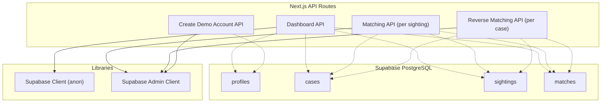
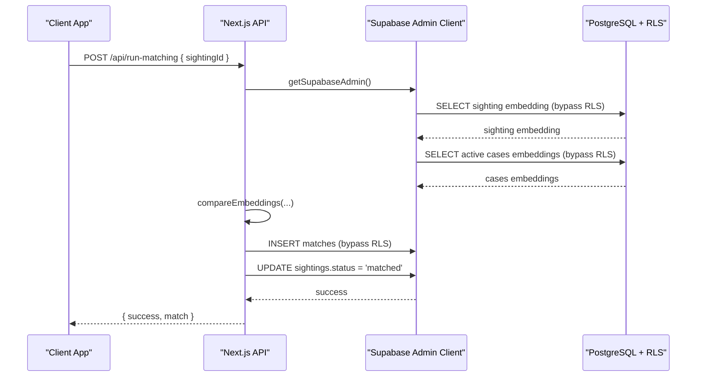
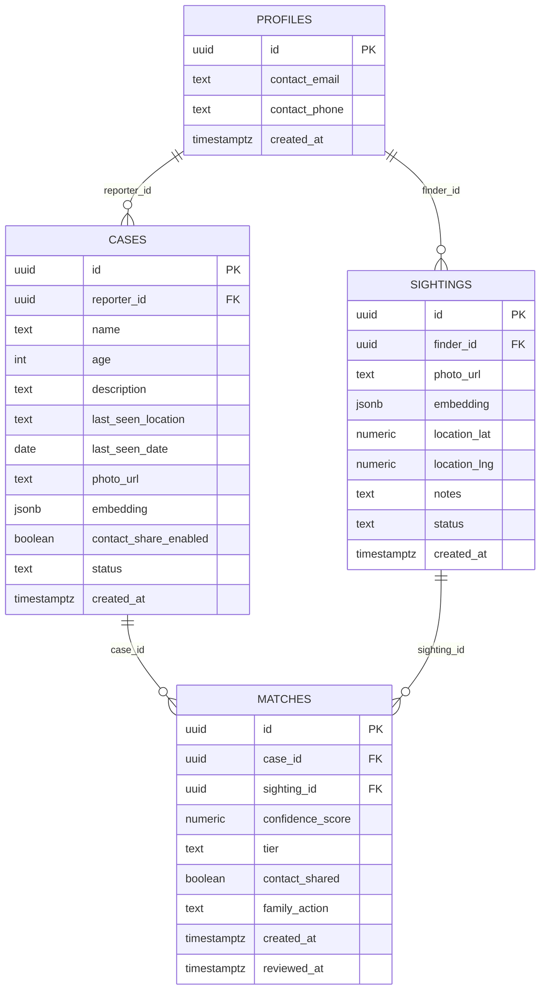
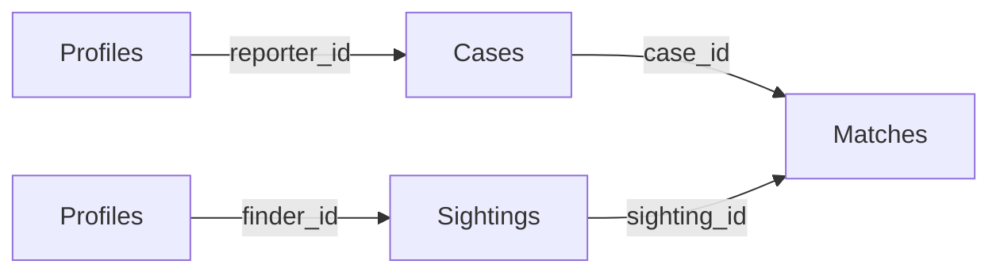
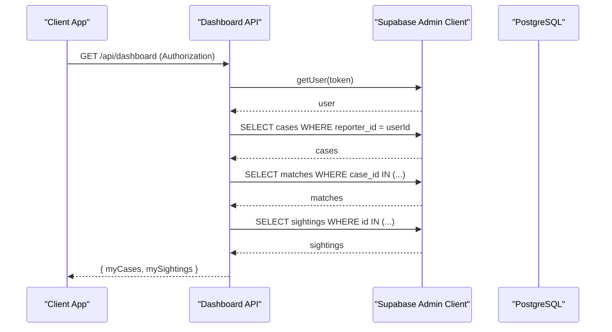
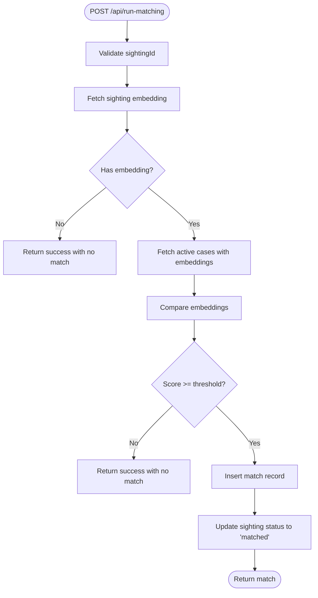

# Database Design & Schema

<cite>
**Referenced Files in This Document**
- [20260903_initial_schema.sql](file://supabase/migrations/20260903_initial_schema.sql)
- [route.ts (Dashboard)](file://app/api/dashboard/route.ts)
- [route.ts (Run Matching)](file://app/api/run-matching/route.ts)
- [route.ts (Run Matching for Case)](file://app/api/run-matching-for-case/route.ts)
- [route.ts (Create Demo Account)](file://app/api/create-demo-account/route.ts)
- [supabase.ts](file://lib/db/supabase.ts)
- [supabase-admin.ts](file://lib/db/supabase-admin.ts)
- [session.ts](file://lib/auth/session.ts)
</cite>

## Table of Contents
1. Introduction
2. Project Structure
3. Core Components
4. Architecture Overview
5. Detailed Component Analysis
6. Dependency Analysis
7. Performance Considerations
8. Troubleshooting Guide
9. Conclusion
10. Appendices

## Introduction
This document describes the PostgreSQL database schema designed with Row Level Security (RLS) for a missing-persons matching application. It details entity relationships among cases, sightings, matches, and profiles; field definitions, data types, constraints, and indexing strategies; RLS policies that enforce privacy and access control; migration management and versioning; common queries and data access patterns; performance considerations; data lifecycle management; backup strategies; and scaling considerations.

## Project Structure
The database schema is defined as a single SQL migration file under the Supabase migrations directory. The Next.js API routes implement server-side operations using both anonymous and admin clients to interact with the database while respecting RLS where appropriate.

**Diagram sources**
- [20260903_initial_schema.sql:1-199](file://supabase/migrations/20260903_initial_schema.sql#L1-L199)
- [route.ts (Dashboard):1-316](file://app/api/dashboard/route.ts#L1-L316)
- [route.ts (Run Matching):1-186](file://app/api/run-matching/route.ts#L1-L186)
- [route.ts (Run Matching for Case):1-208](file://app/api/run-matching-for-case/route.ts#L1-L208)
- [route.ts (Create Demo Account):1-67](file://app/api/create-demo-account/route.ts#L1-L67)
- [supabase.ts:1-12](file://lib/db/supabase.ts#L1-L12)
- [supabase-admin.ts:1-22](file://lib/db/supabase-admin.ts#L1-L22)

**Section sources**
- [20260903_initial_schema.sql:1-199](file://supabase/migrations/20260903_initial_schema.sql#L1-L199)
- [route.ts (Dashboard):1-316](file://app/api/dashboard/route.ts#L1-L316)
- [route.ts (Run Matching):1-186](file://app/api/run-matching/route.ts#L1-L186)
- [route.ts (Run Matching for Case):1-208](file://app/api/run-matching-for-case/route.ts#L1-L208)
- [route.ts (Create Demo Account):1-67](file://app/api/create-demo-account/route.ts#L1-L67)
- [supabase.ts:1-12](file://lib/db/supabase.ts#L1-L12)
- [supabase-admin.ts:1-22](file://lib/db/supabase-admin.ts#L1-L22)

## Core Components
- Profiles: Extends Supabase auth.users to store user contact information and identity linkage.
- Cases: Missing person reports created by reporters (family/reporters).
- Sightings: Public submissions containing photo and location metadata.
- Matches: AI-driven face match results linking a case to a sighting with confidence score, tier, and optional contact sharing.

Key relationships:
- profiles.id -> cases.reporter_id (one reporter can have many cases)
- profiles.id -> sightings.finder_id (one finder can submit many sightings)
- cases.id -> matches.case_id (one case can have many matches)
- sightings.id -> matches.sighting_id (one sighting can be matched to multiple cases)

Data types and constraints overview:
- UUID primary keys for all tables.
- JSONB fields for embeddings to support vector-like comparisons on the application side.
- CHECK constraints for status and tier enums.
- ON DELETE CASCADE to maintain referential integrity.

RLS highlights:
- All tables enable RLS.
- Policies restrict client-side access to only rows owned by the authenticated user.
- Server-side admin client bypasses RLS for background processing and cross-entity reads required by matching logic.

**Section sources**
- [20260903_initial_schema.sql:7-12](file://supabase/migrations/20260903_initial_schema.sql#L7-L12)
- [20260903_initial_schema.sql:61-74](file://supabase/migrations/20260903_initial_schema.sql#L61-L74)
- [20260903_initial_schema.sql:109-119](file://supabase/migrations/20260903_initial_schema.sql#L109-L119)
- [20260903_initial_schema.sql:141-151](file://supabase/migrations/20260903_initial_schema.sql#L141-L151)
- [20260903_initial_schema.sql:14-34](file://supabase/migrations/20260903_initial_schema.sql#L14-L34)
- [20260903_initial_schema.sql:76-103](file://supabase/migrations/20260903_initial_schema.sql#L76-L103)
- [20260903_initial_schema.sql:121-135](file://supabase/migrations/20260903_initial_schema.sql#L121-L135)
- [20260903_initial_schema.sql:153-198](file://supabase/migrations/20260903_initial_schema.sql#L153-L198)

## Architecture Overview
The system uses Supabase PostgreSQL with RLS to secure data at the row level. Application code runs on Next.js API routes:
- Anonymous client (via supabase.ts) is used for user-facing operations subject to RLS.
- Admin client (via supabase-admin.ts) is used for privileged operations such as matching and dashboard aggregation, bypassing RLS intentionally.

**Diagram sources**
- [route.ts (Run Matching):10-186](file://app/api/run-matching/route.ts#L10-L186)
- [supabase-admin.ts:1-22](file://lib/db/supabase-admin.ts#L1-L22)
- [20260903_initial_schema.sql:109-119](file://supabase/migrations/20260903_initial_schema.sql#L109-L119)
- [20260903_initial_schema.sql:61-74](file://supabase/migrations/20260903_initial_schema.sql#L61-L74)
- [20260903_initial_schema.sql:141-151](file://supabase/migrations/20260903_initial_schema.sql#L141-L151)

## Detailed Component Analysis

### Entity Relationship Model

**Diagram sources**
- [20260903_initial_schema.sql:7-12](file://supabase/migrations/20260903_initial_schema.sql#L7-L12)
- [20260903_initial_schema.sql:61-74](file://supabase/migrations/20260903_initial_schema.sql#L61-L74)
- [20260903_initial_schema.sql:109-119](file://supabase/migrations/20260903_initial_schema.sql#L109-L119)
- [20260903_initial_schema.sql:141-151](file://supabase/migrations/20260903_initial_schema.sql#L141-L151)

### Row Level Security (RLS) Policies
- Profiles: Users can read, insert, and update only their own profile row.
- Cases: Reporters can select, insert, update, and delete only their own cases.
- Sightings: Finders can select and insert only their own sightings.
- Matches: 
  - Reporters can view and update matches linked to their cases.
  - Finders can view matches linked to their sightings.

These policies ensure that client-side queries are scoped to the current user’s data. Server-side admin operations bypass RLS for necessary background tasks like matching and dashboard aggregation.

**Section sources**
- [20260903_initial_schema.sql:14-34](file://supabase/migrations/20260903_initial_schema.sql#L14-L34)
- [20260903_initial_schema.sql:76-103](file://supabase/migrations/20260903_initial_schema.sql#L76-L103)
- [20260903_initial_schema.sql:121-135](file://supabase/migrations/20260903_initial_schema.sql#L121-L135)
- [20260903_initial_schema.sql:153-198](file://supabase/migrations/20260903_initial_schema.sql#L153-L198)

### Data Access Patterns and Common Queries
- Dashboard (Reporter view): Fetches reporter’s cases, then fetches matches and sighting details to enrich results. Uses admin client to aggregate across entities efficiently.
- Dashboard (Finder view): Fetches finder’s sightings, then matches and enriched case/profile info when contact is shared.
- Matching per sighting: Retrieves sighting embedding, compares against all active cases’ embeddings, inserts a match if above threshold, updates sighting status.
- Reverse matching per case: Compares new case embedding against all existing sightings with embeddings, batch-inserts qualifying matches, updates statuses.

Example query patterns (described, not shown):
- Select cases by reporter_id ordered by creation time.
- Select matches by case_id or sighting_id with ordering by confidence_score.
- Select sightings by finder_id ordered by creation time.
- Update sighting status to 'matched' after successful matching.
- Upsert profile row during demo account creation.

**Section sources**
- [route.ts (Dashboard):24-196](file://app/api/dashboard/route.ts#L24-L196)
- [route.ts (Run Matching):22-186](file://app/api/run-matching/route.ts#L22-L186)
- [route.ts (Run Matching for Case):32-208](file://app/api/run-matching-for-case/route.ts#L32-L208)
- [route.ts (Create Demo Account):15-59](file://app/api/create-demo-account/route.ts#L15-L59)

### Migration Management and Version Control
- Single migration file defines the initial schema and RLS policies.
- Migrations are stored under supabase/migrations with timestamped filenames, enabling versioned evolution of the database.
- Triggers and functions are included in the same migration to automate profile creation upon user signup.

Best practices:
- Keep each migration focused and idempotent where possible.
- Use descriptive comments and section headers within migrations.
- Test migrations in a staging environment before applying to production.

**Section sources**
- [20260903_initial_schema.sql:1-55](file://supabase/migrations/20260903_initial_schema.sql#L1-L55)

### Indexing Strategy
Current state:
- No explicit indexes beyond primary keys are defined in the migration.

Recommended indexes based on usage:
- cases(reporter_id) to optimize reporter-scoped queries.
- cases(status) to filter active cases quickly.
- matches(case_id), matches(sighting_id) to speed up joins and lookups.
- sightings(findercase_id) is not applicable; use sightings(finder_id) for finder-scoped queries.
- Optional: partial index on cases(status = 'active') for matching workflows.

Rationale:
- Improves query performance for frequent filters and joins.
- Reduces full table scans as datasets grow.

[No sources needed since this section provides general guidance]

### Performance Considerations
- Embedding comparisons are performed in application code; consider moving to vector search extensions (e.g., pgvector) for large-scale similarity searches.
- Batch operations: reverse matching inserts multiple matches in one call to reduce round-trips.
- Minimize N+1 queries by fetching related data in bulk (as done in dashboard aggregation).
- Use admin client selectively to avoid unnecessary privilege escalation.

[No sources needed since this section provides general guidance]

### Data Lifecycle Management
- Profile lifecycle: Created automatically via trigger on user signup; updated by users through RLS policies.
- Case lifecycle: Created by reporters; status transitions from 'active' to 'resolved'.
- Sighting lifecycle: Created by finders; status transitions from 'pending' to 'matched' or 'expired' (future).
- Match lifecycle: Created by matching APIs; optionally reviewed and updated by reporters (family_action, reviewed_at).

Operational notes:
- Enforce status constraints via CHECK constraints.
- Use cascading deletes to maintain referential integrity.

**Section sources**
- [20260903_initial_schema.sql:36-55](file://supabase/migrations/20260903_initial_schema.sql#L36-L55)
- [20260903_initial_schema.sql:61-74](file://supabase/migrations/20260903_initial_schema.sql#L61-L74)
- [20260903_initial_schema.sql:109-119](file://supabase/migrations/20260903_initial_schema.sql#L109-L119)
- [20260903_initial_schema.sql:141-151](file://supabase/migrations/20260903_initial_schema.sql#L141-L151)

### Backup Strategies
- Use Supabase native backups and point-in-time recovery features.
- Schedule regular logical dumps for critical datasets (cases, sightings, matches).
- Validate restore procedures periodically.

[No sources needed since this section provides general guidance]

### Scaling Considerations
- Horizontal scaling: Stateless Next.js API routes scale horizontally; database scaling via Supabase managed services.
- Vertical scaling: Increase database resources for heavy matching workloads.
- Query optimization: Add recommended indexes; consider materialized views for dashboard aggregations if needed.
- Vector search: Migrate to pgvector or similar to offload similarity computations to the database layer.

[No sources needed since this section provides general guidance]

## Dependency Analysis

**Diagram sources**
- [20260903_initial_schema.sql:7-12](file://supabase/migrations/20260903_initial_schema.sql#L7-L12)
- [20260903_initial_schema.sql:61-74](file://supabase/migrations/20260903_initial_schema.sql#L61-L74)
- [20260903_initial_schema.sql:109-119](file://supabase/migrations/20260903_initial_schema.sql#L109-L119)
- [20260903_initial_schema.sql:141-151](file://supabase/migrations/20260903_initial_schema.sql#L141-L151)

**Section sources**
- [20260903_initial_schema.sql:7-12](file://supabase/migrations/20260903_initial_schema.sql#L7-L12)
- [20260903_initial_schema.sql:61-74](file://supabase/migrations/20260903_initial_schema.sql#L61-L74)
- [20260903_initial_schema.sql:109-119](file://supabase/migrations/20260903_initial_schema.sql#L109-L119)
- [20260903_initial_schema.sql:141-151](file://supabase/migrations/20260903_initial_schema.sql#L141-L151)

## Performance Considerations
- Prefer indexed columns for frequent filters (reporter_id, finder_id, status).
- Batch inserts for matches to reduce network overhead.
- Avoid selecting unnecessary columns in dashboard queries.
- Consider caching frequently accessed aggregated data if read-heavy.

[No sources needed since this section provides general guidance]

## Troubleshooting Guide
Common issues and resolutions:
- Missing environment variables: Ensure NEXT_PUBLIC_SUPABASE_URL, NEXT_PUBLIC_SUPABASE_ANON_KEY, and SUPABASE_SERVICE_ROLE_KEY are set.
- Unauthorized errors: Verify Authorization header and token validity in dashboard endpoints.
- RLS denials: Confirm client-side queries align with RLS policies; use admin client only for server-side operations.
- Matching failures: Check presence and format of embeddings; validate thresholds and parsing logic.

Relevant checks:
- Environment configuration in client and admin modules.
- Session validation in dashboard endpoints.
- Error handling and logging in API routes.

**Section sources**
- [supabase.ts:1-12](file://lib/db/supabase.ts#L1-L12)
- [supabase-admin.ts:1-22](file://lib/db/supabase-admin.ts#L1-L22)
- [route.ts (Dashboard):4-23](file://app/api/dashboard/route.ts#L4-L23)
- [route.ts (Run Matching):10-61](file://app/api/run-matching/route.ts#L10-L61)
- [route.ts (Run Matching for Case):20-73](file://app/api/run-matching-for-case/route.ts#L20-L73)

## Conclusion
The schema enforces strong data isolation and privacy through RLS while enabling powerful matching capabilities via server-side admin operations. With careful indexing, batching, and potential migration to vector search, the system can scale effectively. Clear migration practices and robust error handling support maintainability and reliability.

[No sources needed since this section summarizes without analyzing specific files]

## Appendices

### Field Definitions Summary
- Profiles: id (UUID, PK), contact_email (TEXT NOT NULL), contact_phone (TEXT), created_at (TIMESTAMPTZ DEFAULT NOW).
- Cases: id (UUID PK), reporter_id (UUID FK), name (TEXT NOT NULL), age (INT NOT NULL), description (TEXT NOT NULL), last_seen_location (TEXT NOT NULL), last_seen_date (DATE NOT NULL), photo_url (TEXT NOT NULL), embedding (JSONB), contact_share_enabled (BOOLEAN DEFAULT FALSE), status (TEXT CHECK IN ('active','resolved')), created_at (TIMESTAMPTZ DEFAULT NOW).
- Sightings: id (UUID PK), finder_id (UUID FK), photo_url (TEXT NOT NULL), embedding (JSONB), location_lat (NUMERIC NOT NULL), location_lng (NUMERIC NOT NULL), notes (TEXT), status (TEXT CHECK IN ('pending','matched','expired')), created_at (TIMESTAMPTZ DEFAULT NOW).
- Matches: id (UUID PK), case_id (UUID FK), sighting_id (UUID FK), confidence_score (NUMERIC NOT NULL), tier (TEXT CHECK IN ('strong','notify','possible')), contact_shared (BOOLEAN DEFAULT FALSE), family_action (TEXT DEFAULT 'none' CHECK IN ('none','different_person','resolved')), created_at (TIMESTAMPTZ DEFAULT NOW), reviewed_at (TIMESTAMPTZ).

**Section sources**
- [20260903_initial_schema.sql:7-12](file://supabase/migrations/20260903_initial_schema.sql#L7-L12)
- [20260903_initial_schema.sql:61-74](file://supabase/migrations/20260903_initial_schema.sql#L61-L74)
- [20260903_initial_schema.sql:109-119](file://supabase/migrations/20260903_initial_schema.sql#L109-L119)
- [20260903_initial_schema.sql:141-151](file://supabase/migrations/20260903_initial_schema.sql#L141-L151)

### RLS Policy Summary
- Profiles: Read/Insert/Update restricted to owner.
- Cases: CRUD restricted to reporter.
- Sightings: Read/Insert restricted to finder.
- Matches: Read/Update restricted to owners via case/sighting ownership checks.

**Section sources**
- [20260903_initial_schema.sql:14-34](file://supabase/migrations/20260903_initial_schema.sql#L14-L34)
- [20260903_initial_schema.sql:76-103](file://supabase/migrations/20260903_initial_schema.sql#L76-L103)
- [20260903_initial_schema.sql:121-135](file://supabase/migrations/20260903_initial_schema.sql#L121-L135)
- [20260903_initial_schema.sql:153-198](file://supabase/migrations/20260903_initial_schema.sql#L153-L198)

### API Flow Diagrams

#### Dashboard GET Flow

**Diagram sources**
- [route.ts (Dashboard):4-196](file://app/api/dashboard/route.ts#L4-L196)
- [supabase-admin.ts:1-22](file://lib/db/supabase-admin.ts#L1-L22)

#### Matching POST Flow

**Diagram sources**
- [route.ts (Run Matching):10-186](file://app/api/run-matching/route.ts#L10-L186)