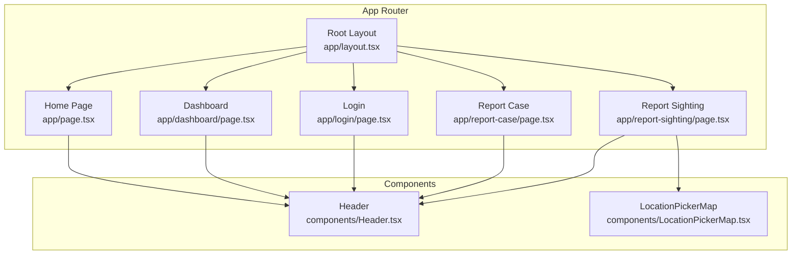
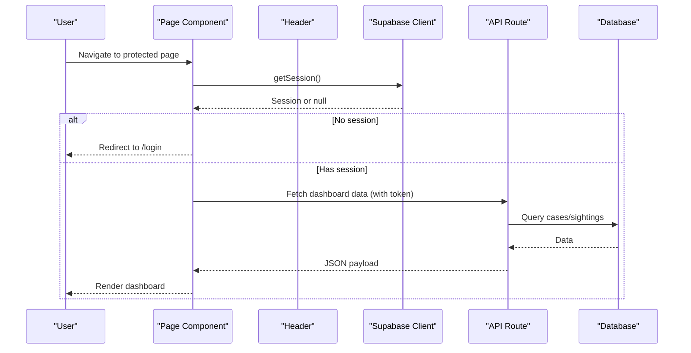
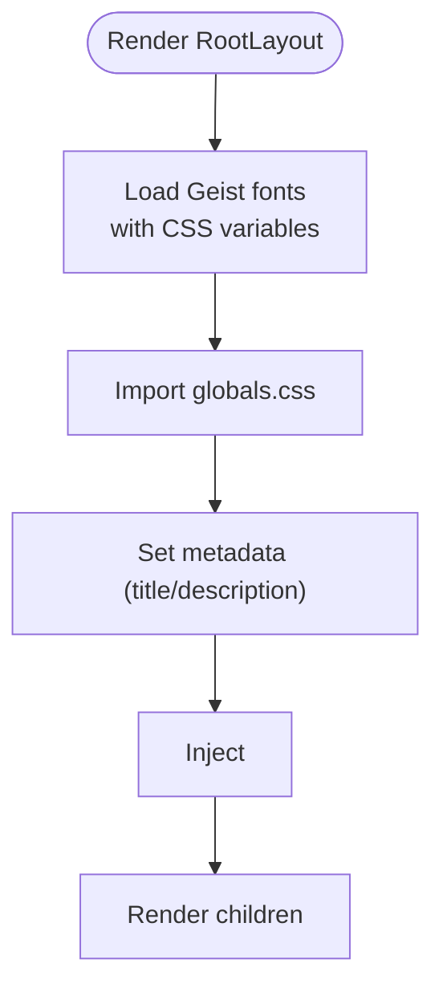
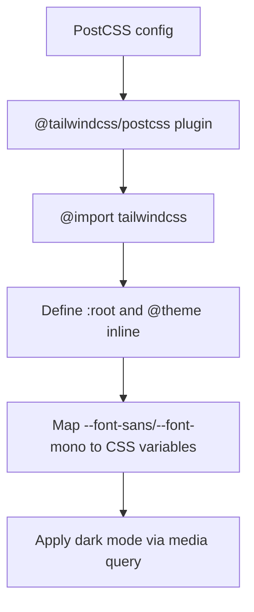
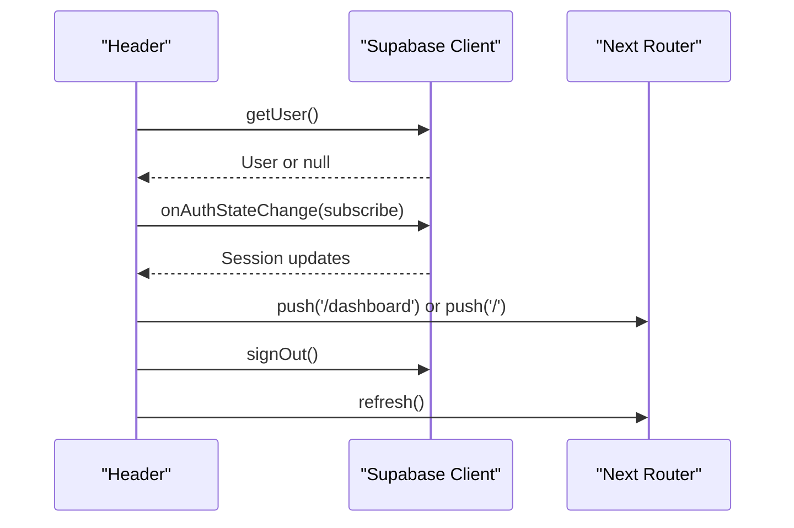
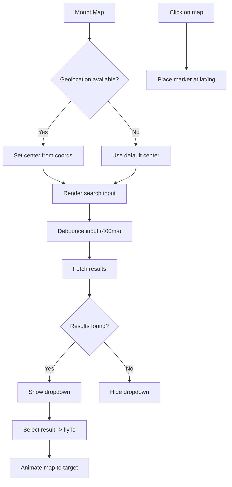
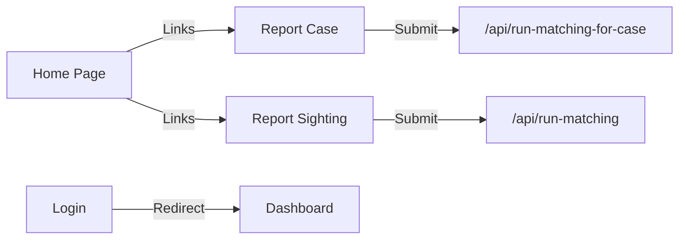
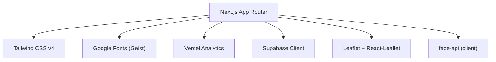

# Frontend Architecture

<cite>
**Referenced Files in This Document**
- [layout.tsx](file://app/layout.tsx)
- [page.tsx](file://app/page.tsx)
- [globals.css](file://app/globals.css)
- [Header.tsx](file://components/Header.tsx)
- [LocationPickerMap.tsx](file://components/LocationPickerMap.tsx)
- [dashboard/page.tsx](file://app/dashboard/page.tsx)
- [login/page.tsx](file://app/login/page.tsx)
- [report-case/page.tsx](file://app/report-case/page.tsx)
- [report-sighting/page.tsx](file://app/report-sighting/page.tsx)
- [next.config.ts](file://next.config.ts)
- [postcss.config.mjs](file://postcss.config.mjs)
- [package.json](file://package.json)
</cite>

## Table of Contents
1. Introduction
2. Project Structure
3. Core Components
4. Architecture Overview
5. Detailed Component Analysis
6. Dependency Analysis
7. Performance Considerations
8. Troubleshooting Guide
9. Conclusion

## Introduction
This document explains the frontend architecture built with Next.js App Router. It covers routing, layout composition, metadata management, global CSS organization, state management patterns, and integrations including Tailwind CSS v4, Google Fonts (Geist), and Vercel Analytics. It also documents page components, reusable UI components, client-side interactions, and performance optimizations such as font loading strategies and code splitting.

## Project Structure
The application follows the Next.js App Router conventions:
- app directory defines routes via file-based routing (e.g., /, /dashboard, /login, /report-case, /report-sighting).
- A root layout provides shared HTML structure, fonts, analytics, and global styles.
- Shared UI lives under components (Header, LocationPickerMap).
- Client-only pages use 'use client' to enable interactivity and browser APIs.
- API routes are defined under app/api for server endpoints.

**Diagram sources**
- [layout.tsx:1-34](file://app/layout.tsx#L1-L34)
- [page.tsx:1-107](file://app/page.tsx#L1-L107)
- [Header.tsx:1-88](file://components/Header.tsx#L1-L88)
- [LocationPickerMap.tsx:1-267](file://components/LocationPickerMap.tsx#L1-L267)
- [dashboard/page.tsx:1-664](file://app/dashboard/page.tsx#L1-L664)
- [login/page.tsx:1-106](file://app/login/page.tsx#L1-L106)
- [report-case/page.tsx:1-414](file://app/report-case/page.tsx#L1-L414)
- [report-sighting/page.tsx:1-356](file://app/report-sighting/page.tsx#L1-L356)

**Section sources**
- [layout.tsx:1-34](file://app/layout.tsx#L1-L34)
- [page.tsx:1-107](file://app/page.tsx#L1-L107)
- [Header.tsx:1-88](file://components/Header.tsx#L1-L88)
- [LocationPickerMap.tsx:1-267](file://components/LocationPickerMap.tsx#L1-L267)
- [dashboard/page.tsx:1-664](file://app/dashboard/page.tsx#L1-L664)
- [login/page.tsx:1-106](file://app/login/page.tsx#L1-L106)
- [report-case/page.tsx:1-414](file://app/report-case/page.tsx#L1-L414)
- [report-sighting/page.tsx:1-356](file://app/report-sighting/page.tsx#L1-L356)

## Core Components
- RootLayout: Sets language, applies Geist font variables, includes global CSS, and renders Vercel Analytics.
- Header: Client component that manages auth state, shows user email when logged in, and provides navigation to dashboard or sign-in/sign-up.
- LocationPickerMap: Client-only map component using Leaflet and React-Leaflet; supports geolocation, search via Nominatim, click-to-pin, and fly-to animations.

Key responsibilities:
- Global layout and metadata: title and description set at the root level.
- Authentication-aware header: uses Supabase client to read session and listen for changes.
- Interactive map: encapsulates map lifecycle, event handling, and external API calls.

**Section sources**
- [layout.tsx:1-34](file://app/layout.tsx#L1-L34)
- [Header.tsx:1-88](file://components/Header.tsx#L1-L88)
- [LocationPickerMap.tsx:1-267](file://components/LocationPickerMap.tsx#L1-L267)

## Architecture Overview
The frontend is a client-heavy application with selective server rendering:
- Pages like the home page fetch data on the server and can force dynamic revalidation.
- Authenticated pages guard access by checking sessions and redirecting to login when needed.
- Client components handle user interactions, map rendering, and real-time updates.

**Diagram sources**
- [dashboard/page.tsx:97-133](file://app/dashboard/page.tsx#L97-L133)
- [login/page.tsx:17-42](file://app/login/page.tsx#L17-L42)

**Section sources**
- [dashboard/page.tsx:1-664](file://app/dashboard/page.tsx#L1-L664)
- [login/page.tsx:1-106](file://app/login/page.tsx#L1-L106)

## Detailed Component Analysis

### Root Layout and Metadata
- Defines global metadata (title, description).
- Loads Geist Sans and Mono from Google Fonts with CSS variables for theme integration.
- Injects Vercel Analytics into the body.
- Applies global CSS and base classes for full-height layout and antialiased text.

**Diagram sources**
- [layout.tsx:1-34](file://app/layout.tsx#L1-L34)
- [globals.css:1-27](file://app/globals.css#L1-L27)

**Section sources**
- [layout.tsx:1-34](file://app/layout.tsx#L1-L34)
- [globals.css:1-27](file://app/globals.css#L1-L27)

### Global CSS and Tailwind CSS v4 Integration
- Uses Tailwind CSS v4 via PostCSS plugin.
- Imports Tailwind through @import "tailwindcss".
- Declares theme tokens inline for background/foreground and maps font families to CSS variables provided by the root layout.
- Supports dark mode via prefers-color-scheme.

**Diagram sources**
- [postcss.config.mjs:1-8](file://postcss.config.mjs#L1-L8)
- [globals.css:1-27](file://app/globals.css#L1-L27)

**Section sources**
- [postcss.config.mjs:1-8](file://postcss.config.mjs#L1-L8)
- [globals.css:1-27](file://app/globals.css#L1-L27)
- [package.json:22-30](file://package.json#L22-L30)

### Header Component (Client-Side Auth State)
- Subscribes to Supabase auth state changes and reads current user.
- Displays user email and navigates to dashboard when authenticated; otherwise shows Sign In/Sign Up links.
- Provides logout functionality that signs out and refreshes the router.

**Diagram sources**
- [Header.tsx:13-34](file://components/Header.tsx#L13-L34)

**Section sources**
- [Header.tsx:1-88](file://components/Header.tsx#L1-L88)

### LocationPickerMap (Client-Only Map)
- Dynamically imported where needed to avoid SSR issues with window-dependent libraries.
- Uses Leaflet tiles and React-Leaflet hooks for events and map control.
- Implements:
  - Geolocation fallback to a default center.
  - Debounced search against Nominatim with results dropdown.
  - Click-to-place marker and smooth fly-to animation.
  - Custom marker icon styling.

**Diagram sources**
- [LocationPickerMap.tsx:91-107](file://components/LocationPickerMap.tsx#L91-L107)
- [LocationPickerMap.tsx:120-154](file://components/LocationPickerMap.tsx#L120-L154)
- [LocationPickerMap.tsx:171-179](file://components/LocationPickerMap.tsx#L171-L179)
- [LocationPickerMap.tsx:238-253](file://components/LocationPickerMap.tsx#L238-L253)

**Section sources**
- [LocationPickerMap.tsx:1-267](file://components/LocationPickerMap.tsx#L1-L267)

### Page Components and Routing
- Home page: Server component that fetches resolved case count and forces dynamic revalidation for live stats.
- Dashboard: Client component that guards auth, fetches user-specific data via API route, and renders cases and sightings with actions.
- Login: Client component that authenticates via Supabase and redirects to dashboard.
- Report Case/Sighting: Client components that upload photos, compute face embeddings in-browser, persist data, and trigger matching workflows.

**Diagram sources**
- [page.tsx:1-107](file://app/page.tsx#L1-L107)
- [dashboard/page.tsx:97-133](file://app/dashboard/page.tsx#L97-L133)
- [login/page.tsx:17-42](file://app/login/page.tsx#L17-L42)
- [report-case/page.tsx:118-149](file://app/report-case/page.tsx#L118-L149)
- [report-sighting/page.tsx:136-164](file://app/report-sighting/page.tsx#L136-L164)

**Section sources**
- [page.tsx:1-107](file://app/page.tsx#L1-L107)
- [dashboard/page.tsx:1-664](file://app/dashboard/page.tsx#L1-L664)
- [login/page.tsx:1-106](file://app/login/page.tsx#L1-L106)
- [report-case/page.tsx:1-414](file://app/report-case/page.tsx#L1-L414)
- [report-sighting/page.tsx:1-356](file://app/report-sighting/page.tsx#L1-L356)

### State Management Patterns
- Local component state: useState for form fields, UI toggles, and transient flags (loading, errors).
- Client-side subscriptions: Supabase auth listeners update Header and protected pages reactively.
- Server-client boundary: Server components fetch initial data; client components handle user interactions and call API routes for mutations.
- Router-driven flows: next/navigation used for programmatic navigation and refreshing after mutations.

**Section sources**
- [Header.tsx:13-34](file://components/Header.tsx#L13-L34)
- [dashboard/page.tsx:97-161](file://app/dashboard/page.tsx#L97-L161)
- [report-case/page.tsx:61-157](file://app/report-case/page.tsx#L61-L157)
- [report-sighting/page.tsx:69-172](file://app/report-sighting/page.tsx#L69-L172)

## Dependency Analysis
Key runtime dependencies and their roles:
- Next.js App Router: file-based routing, layouts, metadata, and server/client boundaries.
- Tailwind CSS v4 + PostCSS: utility-first styling with modern configuration.
- Google Fonts (Geist): optimized font loading via next/font with CSS variables.
- Vercel Analytics: privacy-friendly analytics injection in root layout.
- Supabase JS client: authentication, storage, and database operations.
- Leaflet and React-Leaflet: interactive mapping with client-side rendering.
- Face API (client-side): in-browser face embedding generation for AI matching.

**Diagram sources**
- [package.json:11-21](file://package.json#L11-L21)
- [layout.tsx:1-34](file://app/layout.tsx#L1-L34)
- [postcss.config.mjs:1-8](file://postcss.config.mjs#L1-L8)

**Section sources**
- [package.json:11-21](file://package.json#L11-L21)
- [layout.tsx:1-34](file://app/layout.tsx#L1-L34)
- [postcss.config.mjs:1-8](file://postcss.config.mjs#L1-L8)

## Performance Considerations
- Font loading strategy:
  - Use next/font to preload and subset Geist fonts, exposing CSS variables for theme mapping.
  - Avoid blocking render by leveraging font-display defaults and variable injection.
- Code splitting and lazy loading:
  - Dynamic import of LocationPickerMap with ssr:false to prevent SSR overhead and reduce bundle size for non-critical features.
  - Client-only components are isolated to pages that need interactivity.
- Rendering strategy:
  - Home page sets revalidate=0 to ensure fresh counts without caching delays.
  - Protected pages check sessions early and redirect to minimize unnecessary work.
- Network efficiency:
  - Debounced geocoding requests to limit API calls.
  - Storage uploads with cache-control headers for images.
- Styling:
  - Tailwind v4 reduces unused CSS and improves build times.
  - Inline theme tokens centralize design system values.

[No sources needed since this section provides general guidance]

## Troubleshooting Guide
Common issues and resolutions:
- Map not rendering on first load:
  - Ensure dynamic import with ssr:false for Leaflet-based components to avoid window access during SSR.
- Auth state not updating:
  - Verify Supabase client initialization and subscription cleanup in useEffect.
  - Confirm router.refresh() is called after sign-out to reflect state changes.
- Face embedding failures:
  - Check browser model preloading and network availability for model assets.
  - Validate image format and presence of detectable faces.
- API errors:
  - Inspect error responses from /api/dashboard and matching endpoints; ensure Authorization header includes valid Bearer token.

**Section sources**
- [report-sighting/page.tsx:21-29](file://app/report-sighting/page.tsx#L21-L29)
- [Header.tsx:13-34](file://components/Header.tsx#L13-L34)
- [dashboard/page.tsx:97-133](file://app/dashboard/page.tsx#L97-L133)
- [report-case/page.tsx:45-59](file://app/report-case/page.tsx#L45-L59)

## Conclusion
The frontend leverages Next.js App Router to deliver a secure, performant, and user-friendly experience. The root layout centralizes metadata, fonts, and analytics. Tailwind CSS v4 provides a scalable styling system with theme tokens. Client components manage rich interactions, while server components handle data fetching and security-sensitive logic. Integrations with Supabase, Leaflet, and in-browser face processing enable powerful workflows for reporting and matching missing persons. The architecture balances SSR and CSR effectively, optimizing both performance and user experience.