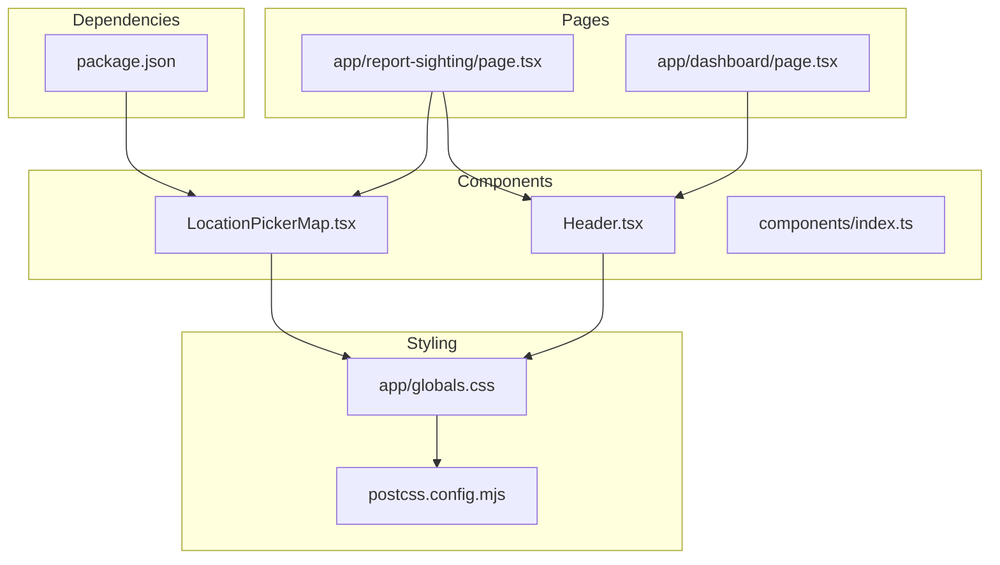
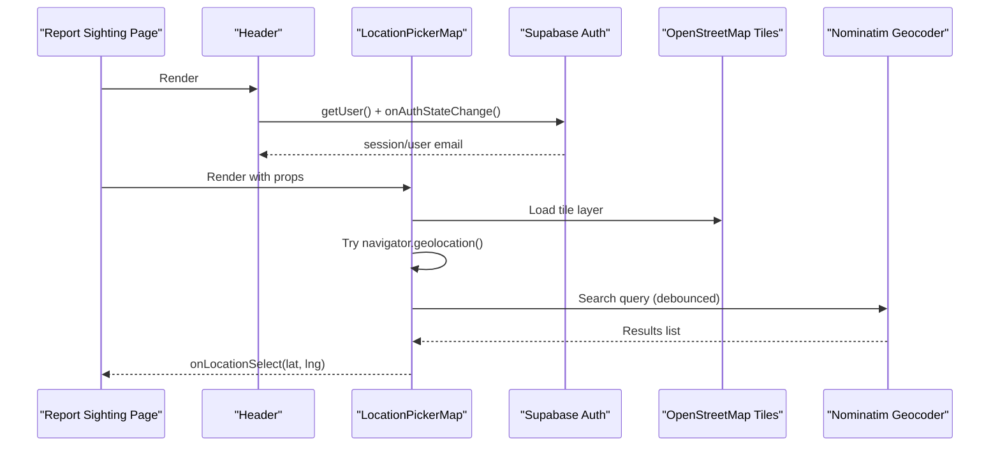
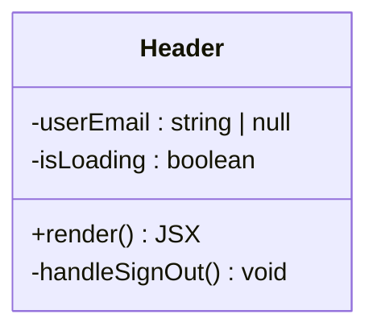
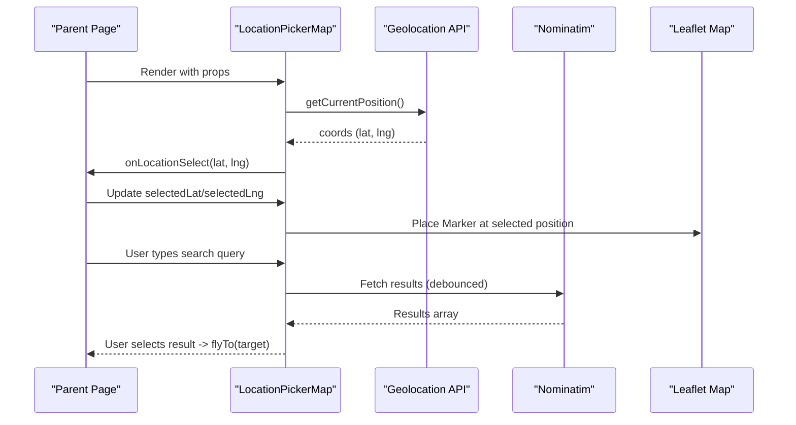
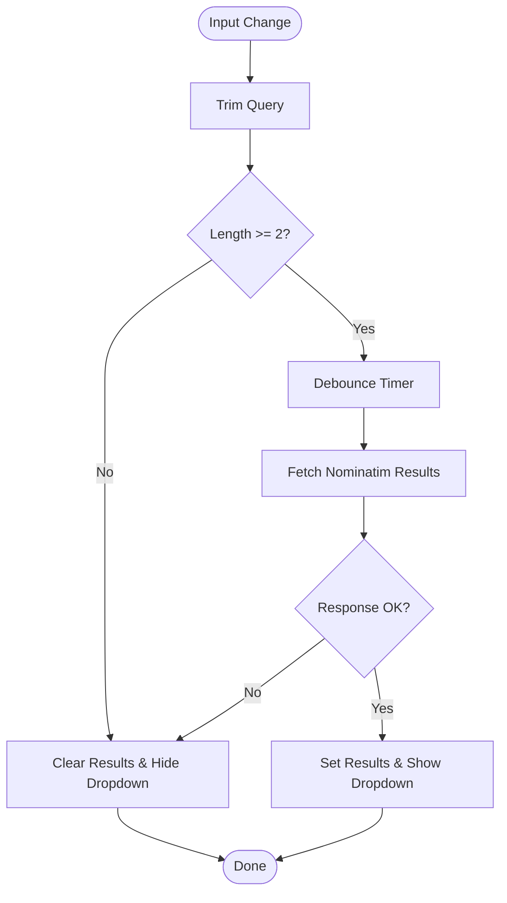
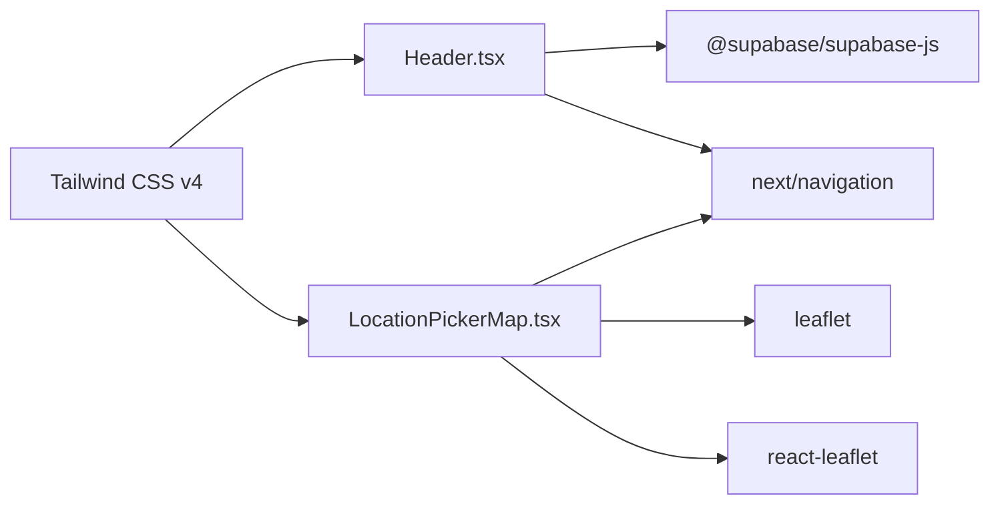

# Components Library

<cite>
**Referenced Files in This Document**
- [Header.tsx](file://components/Header.tsx)
- [LocationPickerMap.tsx](file://components/LocationPickerMap.tsx)
- [index.ts](file://components/index.ts)
- [types/index.ts](file://types/index.ts)
- [package.json](file://package.json)
- [postcss.config.mjs](file://postcss.config.mjs)
- [app/layout.tsx](file://app/layout.tsx)
- [app/globals.css](file://app/globals.css)
- [app/report-sighting/page.tsx](file://app/report-sighting/page.tsx)
</cite>

## Table of Contents
1. [Introduction](#introduction)
2. [Project Structure](#project-structure)
3. [Core Components](#core-components)
4. [Architecture Overview](#architecture-overview)
5. [Detailed Component Analysis](#detailed-component-analysis)
6. [Dependency Analysis](#dependency-analysis)
7. [Performance Considerations](#performance-considerations)
8. [Troubleshooting Guide](#troubleshooting-guide)
9. [Conclusion](#conclusion)
10. [Appendices](#appendices)

## Introduction
This document provides comprehensive documentation for the reusable UI components in the Findora-alt component library, focusing on:
- Header: a responsive navigation header with authentication-aware actions and Tailwind-based styling.
- LocationPickerMap: an interactive map built with Leaflet and React-Leaflet that supports geolocation, search, click-to-pin, and smooth fly-to behavior.

It covers component interfaces, props, styling customization via Tailwind CSS, integration patterns, accessibility considerations, cross-browser compatibility notes, and performance techniques used in implementation.

## Project Structure
The components live under the components directory and are consumed by Next.js pages. The application uses Tailwind CSS v4 with PostCSS, and integrates Supabase for authentication and storage. Map functionality is provided by Leaflet and React-Leaflet.

**Diagram sources**
- [Header.tsx:1-88](file://components/Header.tsx#L1-L88)
- [LocationPickerMap.tsx:1-267](file://components/LocationPickerMap.tsx#L1-L267)
- [index.ts:1-3](file://components/index.ts#L1-L3)
- [app/report-sighting/page.tsx:1-356](file://app/report-sighting/page.tsx#L1-L356)
- [app/dashboard/page.tsx:179-194](file://app/dashboard/page.tsx#L179-L194)
- [app/globals.css:1-27](file://app/globals.css#L1-L27)
- [postcss.config.mjs:1-8](file://postcss.config.mjs#L1-L8)
- [package.json:1-33](file://package.json#L1-L33)

**Section sources**
- [Header.tsx:1-88](file://components/Header.tsx#L1-L88)
- [LocationPickerMap.tsx:1-267](file://components/LocationPickerMap.tsx#L1-L267)
- [app/report-sighting/page.tsx:1-356](file://app/report-sighting/page.tsx#L1-L356)
- [app/dashboard/page.tsx:179-194](file://app/dashboard/page.tsx#L179-L194)
- [app/globals.css:1-27](file://app/globals.css#L1-L27)
- [postcss.config.mjs:1-8](file://postcss.config.mjs#L1-L8)
- [package.json:1-33](file://package.json#L1-L33)

## Core Components
- Header: A client-side Next.js component that displays branding, navigation links, and sign-in/sign-up or dashboard/log-out actions based on authentication state. It uses Supabase auth to detect user sessions and listens for auth state changes.
- LocationPickerMap: A client-side map component using Leaflet and React-Leaflet. It supports geolocation, search via Nominatim, click-to-place pin, and smooth fly-to animations. It exposes a callback to propagate selected coordinates to parent components.

Key characteristics:
- Both components are marked as client components for browser APIs (navigation, geolocation, map).
- Styling is implemented with Tailwind utility classes; theme variables are defined in global CSS.
- Dependencies include Supabase JS SDK, Leaflet, and React-Leaflet.

**Section sources**
- [Header.tsx:1-88](file://components/Header.tsx#L1-L88)
- [LocationPickerMap.tsx:1-267](file://components/LocationPickerMap.tsx#L1-L267)
- [package.json:11-21](file://package.json#L11-L21)
- [app/globals.css:1-27](file://app/globals.css#L1-L27)

## Architecture Overview
The components integrate with Next.js routing and Supabase authentication. The map component integrates with external services (OpenStreetMap tiles and Nominatim geocoding) and uses Leaflet’s event system for interaction.

**Diagram sources**
- [app/report-sighting/page.tsx:15-29](file://app/report-sighting/page.tsx#L15-L29)
- [app/report-sighting/page.tsx:87-90](file://app/report-sighting/page.tsx#L87-L90)
- [Header.tsx:13-34](file://components/Header.tsx#L13-L34)
- [LocationPickerMap.tsx:91-107](file://components/LocationPickerMap.tsx#L91-L107)
- [LocationPickerMap.tsx:120-154](file://components/LocationPickerMap.tsx#L120-L154)
- [LocationPickerMap.tsx:236-253](file://components/LocationPickerMap.tsx#L236-L253)

## Detailed Component Analysis

### Header Component
Purpose:
- Provides top-level navigation and authentication-aware actions.
- Displays brand logo and name.
- Shows Sign In/Sign Up when unauthenticated, and Dashboard/Log out when authenticated.

Props:
- None (component manages its own auth state internally).

State and Behavior:
- Uses Supabase to check initial user session and listen for auth state changes.
- On sign out, clears local state, navigates to home, and refreshes router state.

Styling:
- Fully styled with Tailwind utilities: sticky positioning, backdrop blur, borders, gradients, hover transitions, and responsive visibility for user email display.

Accessibility:
- Semantic <header>, <nav>, and <button> elements.
- Links use semantic <Link> from Next.js.
- Focus states rely on default browser focus outlines; consider adding explicit focus styles if needed.

Responsive Behavior:
- User email is hidden on small screens and shown on medium+ screens.
- Navigation items stack horizontally with consistent spacing.

Integration:
- Consumed by pages such as dashboard and report sighting.

Usage example (conceptual):
- Import and render within page layout or page body. See usage references below.

**Section sources**
- [Header.tsx:1-88](file://components/Header.tsx#L1-L88)
- [app/dashboard/page.tsx:179-194](file://app/dashboard/page.tsx#L179-L194)
- [app/report-sighting/page.tsx:182-184](file://app/report-sighting/page.tsx#L182-L184)

#### Header Class Diagram

**Diagram sources**
- [Header.tsx:8-34](file://components/Header.tsx#L8-L34)
- [Header.tsx:36-87](file://components/Header.tsx#L36-L87)

### LocationPickerMap Component
Purpose:
- Interactive map for selecting precise locations.
- Supports geolocation fallback, search with debounced queries, click-to-pin, and smooth fly-to animations.

Props:
- onLocationSelect: Callback invoked with latitude and longitude when a location is selected.
- selectedLat: Current selected latitude (null if none).
- selectedLng: Current selected longitude (null if none).

Interfaces:
- LocationPickerProps defines the above props.
- NominatimResult describes search result shape from Nominatim.

Sub-components:
- MapClickHandler: Uses react-leaflet’s useMapEvents to capture map clicks and call onLocationSelect.
- MapFlyTo: Uses useMap to animate the map view to a target coordinate with a specified zoom.

Behavior:
- On mount, attempts browser geolocation to set center and select location if no pin exists yet.
- Debounces search input to reduce API calls; fetches results from Nominatim with a custom User-Agent header.
- Clicking outside the results dropdown closes it.
- Selecting a search result flies the map to that location without placing a pin.
- Places a marker when selectedLat and selectedLng are both non-null.

Styling:
- Tailwind classes style the container, search input, results dropdown, and map wrapper.
- Custom Leaflet marker icon is created via L.divIcon with inline styles.

Accessibility:
- Search form includes a submit button and accessible placeholder text.
- Results list uses buttons for selection; ensure keyboard navigation works as expected.
- Consider adding aria-live regions for dynamic results and loading indicators.

Cross-browser Compatibility:
- Uses standard Web APIs: navigator.geolocation, fetch, and Leaflet.
- SSR disabled for this component to avoid window/document access issues during server rendering.

Performance:
- Debounced search reduces network requests.
- Dynamic import with ssr: false avoids shipping Leaflet code to the server.
- Minimal re-renders by keeping map state local and only passing necessary props up.

Usage example (conceptual):
- Import dynamically in a page and pass props to manage selected coordinates. See usage references below.

**Section sources**
- [LocationPickerMap.tsx:31-42](file://components/LocationPickerMap.tsx#L31-L42)
- [LocationPickerMap.tsx:44-67](file://components/LocationPickerMap.tsx#L44-L67)
- [LocationPickerMap.tsx:69-107](file://components/LocationPickerMap.tsx#L69-L107)
- [LocationPickerMap.tsx:109-169](file://components/LocationPickerMap.tsx#L109-L169)
- [LocationPickerMap.tsx:171-184](file://components/LocationPickerMap.tsx#L171-L184)
- [LocationPickerMap.tsx:186-266](file://components/LocationPickerMap.tsx#L186-L266)
- [app/report-sighting/page.tsx:21-29](file://app/report-sighting/page.tsx#L21-L29)
- [app/report-sighting/page.tsx:87-90](file://app/report-sighting/page.tsx#L87-L90)
- [app/report-sighting/page.tsx:315-325](file://app/report-sighting/page.tsx#L315-L325)

#### LocationPickerMap Sequence Diagram

**Diagram sources**
- [LocationPickerMap.tsx:91-107](file://components/LocationPickerMap.tsx#L91-L107)
- [LocationPickerMap.tsx:120-154](file://components/LocationPickerMap.tsx#L120-L154)
- [LocationPickerMap.tsx:171-179](file://components/LocationPickerMap.tsx#L171-L179)
- [LocationPickerMap.tsx:236-253](file://components/LocationPickerMap.tsx#L236-L253)

#### LocationPickerMap Flowchart (Search Logic)

**Diagram sources**
- [LocationPickerMap.tsx:156-169](file://components/LocationPickerMap.tsx#L156-L169)
- [LocationPickerMap.tsx:120-154](file://components/LocationPickerMap.tsx#L120-L154)

## Dependency Analysis
External dependencies relevant to these components:
- Supabase JS SDK: Used by Header for authentication checks and sign out.
- Leaflet and React-Leaflet: Used by LocationPickerMap for map rendering and interactions.
- Tailwind CSS v4 via PostCSS: Used throughout for styling.

**Diagram sources**
- [package.json:11-21](file://package.json#L11-L21)
- [Header.tsx:3-6](file://components/Header.tsx#L3-L6)
- [LocationPickerMap.tsx:3-6](file://components/LocationPickerMap.tsx#L3-L6)
- [postcss.config.mjs:1-8](file://postcss.config.mjs#L1-L8)

**Section sources**
- [package.json:11-21](file://package.json#L11-L21)
- [Header.tsx:3-6](file://components/Header.tsx#L3-L6)
- [LocationPickerMap.tsx:3-6](file://components/LocationPickerMap.tsx#L3-L6)
- [postcss.config.mjs:1-8](file://postcss.config.mjs#L1-L8)

## Performance Considerations
- Debounced search: Reduces unnecessary network requests to Nominatim by waiting before executing queries.
- Dynamic imports: LocationPickerMap is loaded dynamically with SSR disabled to avoid server-side errors and reduce bundle size.
- Local state management: Map state is kept internal to minimize prop drilling and re-renders.
- Efficient event handling: Map click events are handled via react-leaflet hooks to avoid extra DOM listeners.
- Minimal reflows: Fly-to animation uses Leaflet’s native method for smooth transitions.

[No sources needed since this section provides general guidance]

## Troubleshooting Guide
Common issues and resolutions:
- Map not rendering on server: Ensure dynamic import with ssr: false is used when integrating LocationPickerMap into pages.
- Geolocation permission denied: The component falls back to a default center; inform users to enable location permissions for best experience.
- Search returns no results: Check query length and network connectivity; verify Nominatim availability and correct headers.
- Authentication state not updating: Verify Supabase initialization and that onAuthStateChange subscription is active; ensure cleanup on unmount.

**Section sources**
- [app/report-sighting/page.tsx:21-29](file://app/report-sighting/page.tsx#L21-L29)
- [LocationPickerMap.tsx:91-107](file://components/LocationPickerMap.tsx#L91-L107)
- [LocationPickerMap.tsx:120-154](file://components/LocationPickerMap.tsx#L120-L154)
- [Header.tsx:13-27](file://components/Header.tsx#L13-L27)

## Conclusion
The Header and LocationPickerMap components provide essential UI primitives for navigation and location selection in the Findora-alt application. They leverage modern React patterns, Tailwind CSS for styling, and robust integrations with Supabase and Leaflet. By following the documented interfaces, styling guidelines, and integration patterns, developers can consistently compose these components across pages while maintaining performance, accessibility, and cross-browser compatibility.

[No sources needed since this section summarizes without analyzing specific files]

## Appendices

### Component Interfaces and Props Summary
- Header
  - Props: None
  - Responsibilities: Auth-aware navigation, branding, sign-in/sign-up/log-out flows
- LocationPickerMap
  - Props:
    - onLocationSelect: Function receiving lat and lng
    - selectedLat: number | null
    - selectedLng: number | null
  - Responsibilities: Geolocation, search, click-to-pin, fly-to animations, marker rendering

**Section sources**
- [Header.tsx:8-34](file://components/Header.tsx#L8-L34)
- [LocationPickerMap.tsx:31-42](file://components/LocationPickerMap.tsx#L31-L42)
- [LocationPickerMap.tsx:69-73](file://components/LocationPickerMap.tsx#L69-L73)

### Styling Customization with Tailwind CSS
- Global theme variables are defined in app/globals.css and applied via Tailwind’s theme configuration.
- Components use utility classes for colors, spacing, typography, and effects like backdrop blur and shadows.
- To customize themes:
  - Modify CSS variables in app/globals.css.
  - Extend Tailwind configuration if needed (currently using PostCSS plugin setup).

**Section sources**
- [app/globals.css:1-27](file://app/globals.css#L1-L27)
- [postcss.config.mjs:1-8](file://postcss.config.mjs#L1-L8)

### Integration Guidelines
- Import Header directly in pages where navigation is required.
- Dynamically import LocationPickerMap with ssr: false to avoid SSR issues.
- Manage selected coordinates in parent state and pass them down to LocationPickerMap.
- Use Supabase auth hooks or helpers to guard routes and update UI accordingly.

**Section sources**
- [app/report-sighting/page.tsx:15-29](file://app/report-sighting/page.tsx#L15-L29)
- [app/report-sighting/page.tsx:87-90](file://app/report-sighting/page.tsx#L87-L90)
- [app/report-sighting/page.tsx:315-325](file://app/report-sighting/page.tsx#L315-L325)

### Accessibility Notes
- Use semantic HTML elements (<header>, <nav>, <button>) for better screen reader support.
- Provide descriptive labels and placeholders for inputs.
- Ensure keyboard navigation for dropdowns and map interactions.
- Add focus-visible styles for improved keyboard usability.

[No sources needed since this section provides general guidance]

### Cross-Browser Compatibility
- Geolocation: Supported in modern browsers; handle permission denials gracefully.
- Leaflet: Works across major browsers; ensure proper asset loading and CSS inclusion.
- Supabase: Compatible with modern browsers; handle network errors and retries as needed.

[No sources needed since this section provides general guidance]