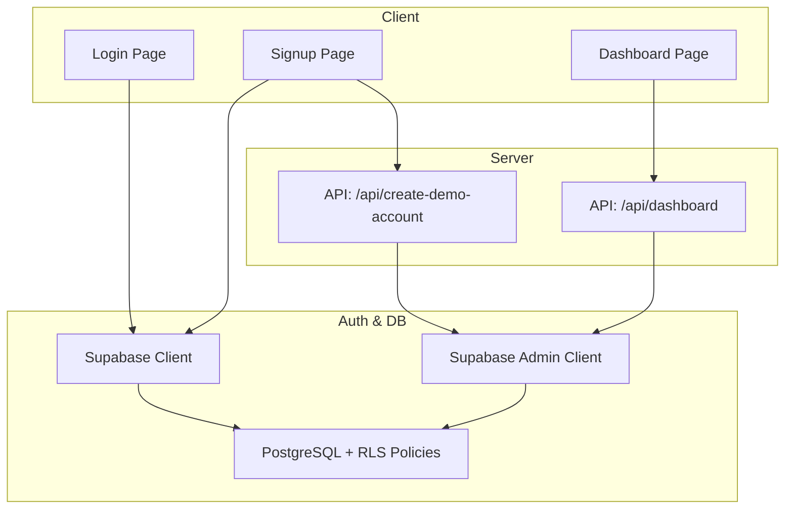
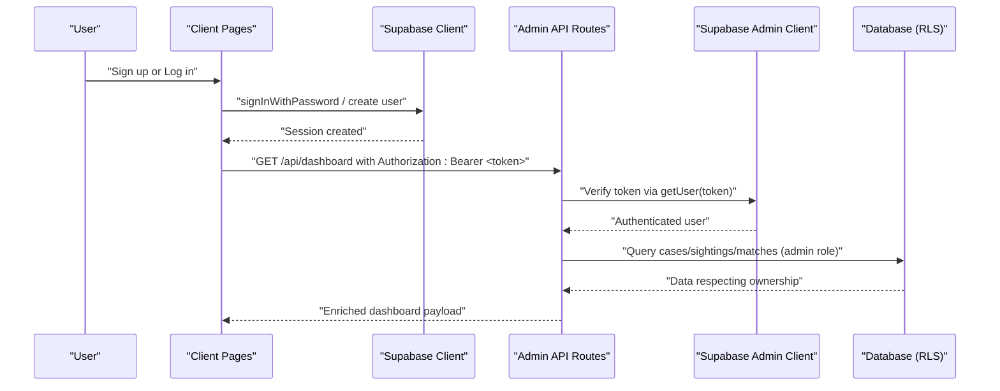
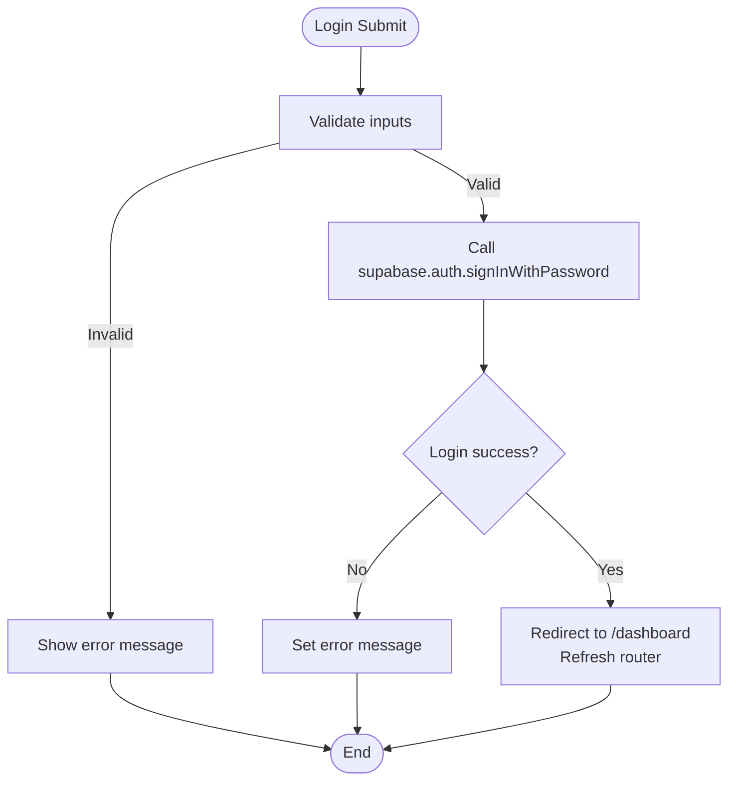
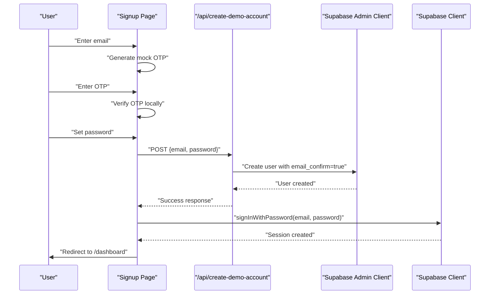
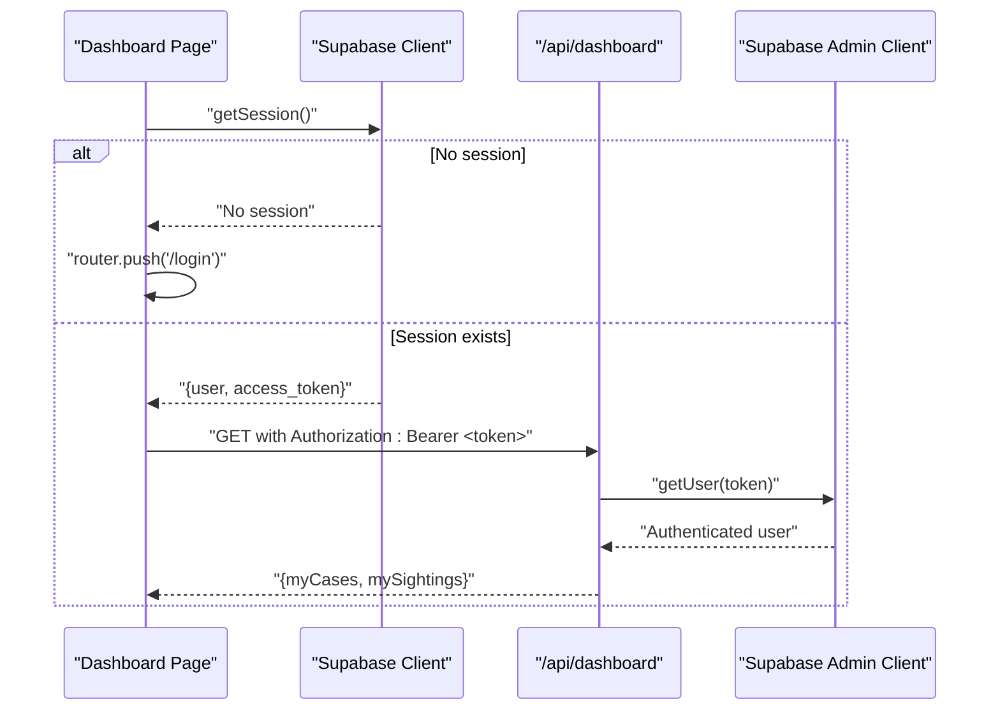
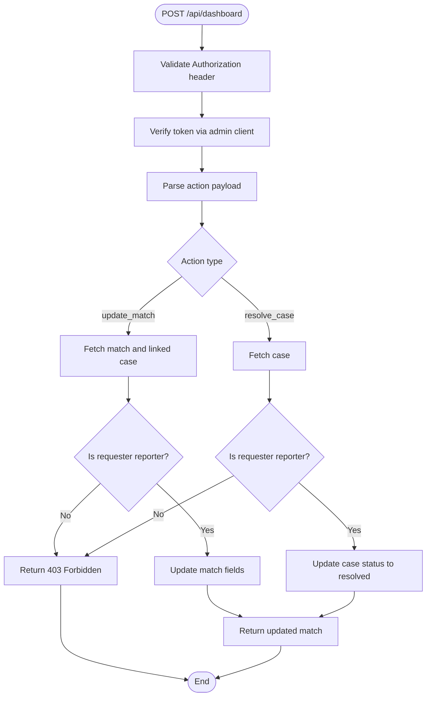
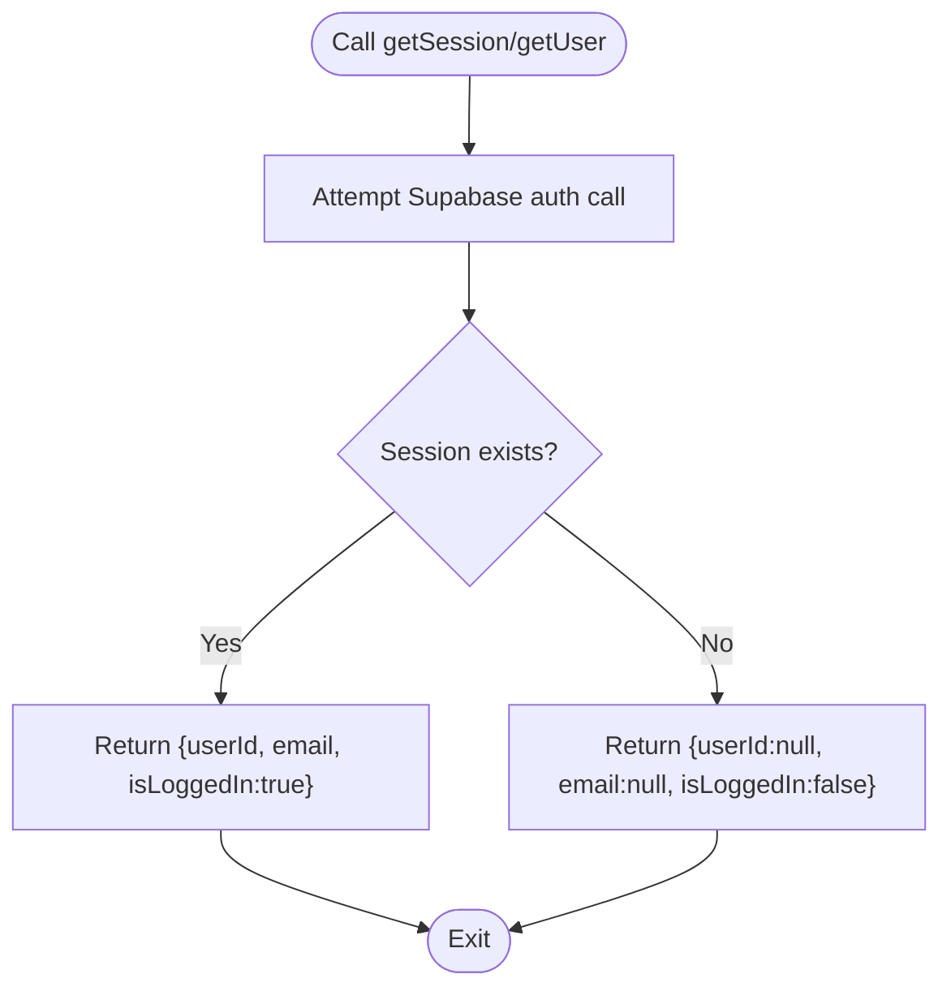
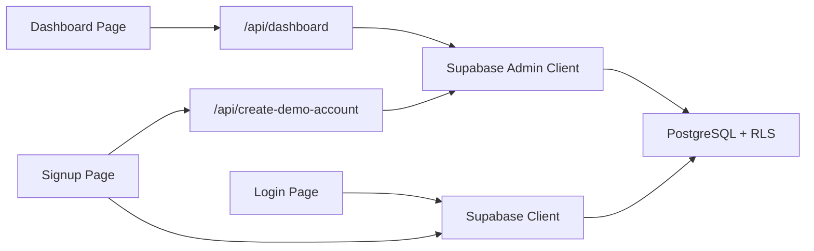

# Authentication System

<cite>
**Referenced Files in This Document**
- [app/login/page.tsx](file://app/login/page.tsx)
- [app/signup/page.tsx](file://app/signup/page.tsx)
- [app/api/create-demo-account/route.ts](file://app/api/create-demo-account/route.ts)
- [app/dashboard/page.tsx](file://app/dashboard/page.tsx)
- [app/api/dashboard/route.ts](file://app/api/dashboard/route.ts)
- [lib/auth/index.ts](file://lib/auth/index.ts)
- [lib/auth/session.ts](file://lib/auth/session.ts)
- [lib/db/supabase.ts](file://lib/db/supabase.ts)
- [lib/db/supabase-admin.ts](file://lib/db/supabase-admin.ts)
- [supabase/migrations/20260903_initial_schema.sql](file://supabase/migrations/20260903_initial_schema.sql)
</cite>

## Table of Contents
1. [Introduction](#introduction)
2. [Project Structure](#project-structure)
3. [Core Components](#core-components)
4. [Architecture Overview](#architecture-overview)
5. [Detailed Component Analysis](#detailed-component-analysis)
6. [Dependency Analysis](#dependency-analysis)
7. [Performance Considerations](#performance-considerations)
8. [Troubleshooting Guide](#troubleshooting-guide)
9. [Conclusion](#conclusion)

## Introduction
This document explains the authentication system in Findora-alt, focusing on Supabase-based user registration, login/logout, session management, and role-based access control for two roles:
- Reporter (family member): manages missing person cases and match outcomes.
- Finder (public contributor): submits sightings and receives contact details when families opt-in.

It also covers the demo account creation flow used during hackathon testing, security measures such as token validation and protected routes, and practical examples for checking authentication status, redirecting unauthenticated users, and managing sessions throughout the app.

## Project Structure
The authentication system spans client pages, server API routes, and shared libraries:
- Client-side auth UI: Login and Signup pages use Supabase client to authenticate users and manage sessions.
- Server-side admin API: Creates demo accounts with service role privileges and validates tokens for protected endpoints.
- Shared auth helpers: Provide utilities to get current user/session and sign out.
- Database schema: Defines profiles, cases, sightings, matches, and Row Level Security policies that enforce role-based data access.



**Diagram sources**
- [app/login/page.tsx:17-42](file://app/login/page.tsx#L17-L42)
- [app/signup/page.tsx:62-108](file://app/signup/page.tsx#L62-L108)
- [app/api/create-demo-account/route.ts:4-66](file://app/api/create-demo-account/route.ts#L4-L66)
- [app/api/dashboard/route.ts:4-23](file://app/api/dashboard/route.ts#L4-L23)
- [lib/db/supabase.ts:1-13](file://lib/db/supabase.ts#L1-L13)
- [lib/db/supabase-admin.ts:1-23](file://lib/db/supabase-admin.ts#L1-L23)
- [supabase/migrations/20260903_initial_schema.sql:7-199](file://supabase/migrations/20260903_initial_schema.sql#L7-L199)

**Section sources**
- [app/login/page.tsx:1-106](file://app/login/page.tsx#L1-L106)
- [app/signup/page.tsx:1-263](file://app/signup/page.tsx#L1-L263)
- [app/api/create-demo-account/route.ts:1-67](file://app/api/create-demo-account/route.ts#L1-L67)
- [app/dashboard/page.tsx:1-664](file://app/dashboard/page.tsx#L1-L664)
- [app/api/dashboard/route.ts:1-316](file://app/api/dashboard/route.ts#L1-L316)
- [lib/auth/index.ts:1-19](file://lib/auth/index.ts#L1-L19)
- [lib/auth/session.ts:1-35](file://lib/auth/session.ts#L1-L35)
- [lib/db/supabase.ts:1-13](file://lib/db/supabase.ts#L1-L13)
- [lib/db/supabase-admin.ts:1-23](file://lib/db/supabase-admin.ts#L1-L23)
- [supabase/migrations/20260903_initial_schema.sql:1-199](file://supabase/migrations/20260903_initial_schema.sql#L1-L199)

## Core Components
- Supabase client initialization for browser usage.
- Supabase admin client for server-only operations.
- Auth helper functions for current user retrieval and sign-out.
- Session utilities to check active sessions and extract user IDs.
- Protected dashboard API that validates tokens and enforces ownership.
- Demo account creation endpoint using admin privileges.
- Database schema with Row Level Security policies defining reporter and finder permissions.

Key responsibilities:
- Registration: Multi-step signup with mock OTP verification and server-side account creation.
- Login: Email/password sign-in with redirection to dashboard.
- Session management: Client-side session checks and server-side token validation.
- Role-based access: Enforced via database policies and server-side ownership checks.

**Section sources**
- [lib/db/supabase.ts:1-13](file://lib/db/supabase.ts#L1-L13)
- [lib/db/supabase-admin.ts:1-23](file://lib/db/supabase-admin.ts#L1-L23)
- [lib/auth/index.ts:1-19](file://lib/auth/index.ts#L1-L19)
- [lib/auth/session.ts:1-35](file://lib/auth/session.ts#L1-L35)
- [app/api/dashboard/route.ts:4-23](file://app/api/dashboard/route.ts#L4-L23)
- [app/api/create-demo-account/route.ts:4-66](file://app/api/create-demo-account/route.ts#L4-L66)
- [supabase/migrations/20260903_initial_schema.sql:7-199](file://supabase/migrations/20260903_initial_schema.sql#L7-L199)

## Architecture Overview
The authentication architecture combines client-side flows with server-side enforcement:
- Clients authenticate via Supabase client and maintain sessions.
- Protected routes require a valid bearer token validated by the server using the admin client.
- Data access is constrained by Row Level Security policies tied to user roles (reporter vs finder).
- The dashboard aggregates reporter-owned cases and finder-submitted sightings along with matches and optional family contact info.



**Diagram sources**
- [app/signup/page.tsx:62-108](file://app/signup/page.tsx#L62-L108)
- [app/login/page.tsx:17-42](file://app/login/page.tsx#L17-L42)
- [app/api/dashboard/route.ts:4-23](file://app/api/dashboard/route.ts#L4-L23)
- [lib/db/supabase-admin.ts:1-23](file://lib/db/supabase-admin.ts#L1-L23)
- [supabase/migrations/20260903_initial_schema.sql:7-199](file://supabase/migrations/20260903_initial_schema.sql#L7-L199)

## Detailed Component Analysis

### Login Flow
- Collects email and password, calls Supabase client to sign in, then navigates to the dashboard and refreshes routing state.
- Displays errors for invalid credentials and prevents navigation until successful authentication.



**Diagram sources**
- [app/login/page.tsx:17-42](file://app/login/page.tsx#L17-L42)

**Section sources**
- [app/login/page.tsx:1-106](file://app/login/page.tsx#L1-L106)

### Signup Flow (Demo Mode)
- Step 1: Enter email; Step 2: Verify on-screen mock OTP; Step 3: Set password and call server to create account without email confirmation or rate limits.
- After account creation, client signs in and redirects to dashboard.



**Diagram sources**
- [app/signup/page.tsx:25-108](file://app/signup/page.tsx#L25-L108)
- [app/api/create-demo-account/route.ts:4-66](file://app/api/create-demo-account/route.ts#L4-L66)

**Section sources**
- [app/signup/page.tsx:1-263](file://app/signup/page.tsx#L1-L263)
- [app/api/create-demo-account/route.ts:1-67](file://app/api/create-demo-account/route.ts#L1-L67)

### Dashboard Access and Token Validation
- On mount, the dashboard checks for an active session; if none, it redirects to login.
- It retrieves the access token and sends it in the Authorization header to the dashboard API.
- The API verifies the token using the admin client and returns enriched data for both reporter and finder views.



**Diagram sources**
- [app/dashboard/page.tsx:123-133](file://app/dashboard/page.tsx#L123-L133)
- [app/api/dashboard/route.ts:4-23](file://app/api/dashboard/route.ts#L4-L23)

**Section sources**
- [app/dashboard/page.tsx:1-664](file://app/dashboard/page.tsx#L1-L664)
- [app/api/dashboard/route.ts:1-316](file://app/api/dashboard/route.ts#L1-L316)

### Role-Based Access Control (Reporters vs Finders)
- Reporters (family members) can view and update their own cases and associated matches.
- Finders (public contributors) can view their own sightings and matches linked to those sightings.
- Contact sharing is controlled per match; finders receive reporter contact info only when contact_shared is true.

```mermaid
classDiagram
class Profile {
+id
+contact_email
+contact_phone
}
class Case {
+id
+reporter_id
+name
+status
+contact_share_enabled
}
class Sighting {
+id
+finder_id
+photo_url
+location_lat
+location_lng
+notes
}
class Match {
+id
+case_id
+sighting_id
+confidence_score
+tier
+contact_shared
+family_action
}
Profile ||--o{ Case : "owns"
Profile ||--o{ Sighting : "submits"
Case ||--o{ Match : "has"
Sighting ||--o{ Match : "linked to"
```

**Diagram sources**
- [supabase/migrations/20260903_initial_schema.sql:7-199](file://supabase/migrations/20260903_initial_schema.sql#L7-L199)

**Section sources**
- [supabase/migrations/20260903_initial_schema.sql:1-199](file://supabase/migrations/20260903_initial_schema.sql#L1-L199)

### Protected Route Handling and Ownership Checks
- The dashboard API enforces ownership by verifying that actions originate from the case owner (reporter).
- For example, updating a match or resolving a case requires the requesting user to be the reporter of the targeted case.



**Diagram sources**
- [app/api/dashboard/route.ts:206-310](file://app/api/dashboard/route.ts#L206-L310)

**Section sources**
- [app/api/dashboard/route.ts:1-316](file://app/api/dashboard/route.ts#L1-L316)

### Session Management Utilities
- getCurrentUser: Retrieves the current authenticated user from Supabase client.
- signOutUser: Signs out the current user.
- getCurrentSession: Returns a normalized session object indicating login state and user identity.
- getUserId: Extracts the current user ID for quick checks.



**Diagram sources**
- [lib/auth/session.ts:12-34](file://lib/auth/session.ts#L12-L34)
- [lib/auth/index.ts:10-18](file://lib/auth/index.ts#L10-L18)

**Section sources**
- [lib/auth/index.ts:1-19](file://lib/auth/index.ts#L1-L19)
- [lib/auth/session.ts:1-35](file://lib/auth/session.ts#L1-L35)

## Dependency Analysis
- Client components depend on the Supabase client for authentication and session persistence.
- Server routes depend on the Supabase admin client for token verification and privileged database operations.
- Database policies enforce role-based access at the row level, complementing server-side ownership checks.



**Diagram sources**
- [app/login/page.tsx:17-42](file://app/login/page.tsx#L17-L42)
- [app/signup/page.tsx:62-108](file://app/signup/page.tsx#L62-L108)
- [app/dashboard/page.tsx:123-133](file://app/dashboard/page.tsx#L123-L133)
- [app/api/dashboard/route.ts:4-23](file://app/api/dashboard/route.ts#L4-L23)
- [app/api/create-demo-account/route.ts:4-66](file://app/api/create-demo-account/route.ts#L4-L66)
- [lib/db/supabase.ts:1-13](file://lib/db/supabase.ts#L1-L13)
- [lib/db/supabase-admin.ts:1-23](file://lib/db/supabase-admin.ts#L1-L23)
- [supabase/migrations/20260903_initial_schema.sql:7-199](file://supabase/migrations/20260903_initial_schema.sql#L7-L199)

**Section sources**
- [lib/db/supabase.ts:1-13](file://lib/db/supabase.ts#L1-L13)
- [lib/db/supabase-admin.ts:1-23](file://lib/db/supabase-admin.ts#L1-L23)
- [supabase/migrations/20260903_initial_schema.sql:1-199](file://supabase/migrations/20260903_initial_schema.sql#L1-L199)

## Performance Considerations
- Use server-side token verification to avoid exposing sensitive logic to the client.
- Minimize redundant network calls by batching queries in the dashboard API and caching results where appropriate.
- Leverage Supabase client session persistence to reduce re-authentication overhead on page reloads.
- Ensure environment variables are correctly set to prevent runtime warnings and unnecessary retries.

[No sources needed since this section provides general guidance]

## Troubleshooting Guide
Common issues and resolutions:
- Missing environment variables: Ensure NEXT_PUBLIC_SUPABASE_URL, NEXT_PUBLIC_SUPABASE_ANON_KEY, and SUPABASE_SERVICE_ROLE_KEY are configured.
- Unauthorized errors: Verify that the Authorization header includes a valid bearer token and that the token has not expired.
- Forbidden errors: Confirm that the requesting user owns the resource being modified (e.g., reporter_id matches the user id).
- Demo account creation failures: Check server logs for admin client errors and ensure the profiles table trigger exists to create profile rows.

**Section sources**
- [lib/db/supabase.ts:6-10](file://lib/db/supabase.ts#L6-L10)
- [lib/db/supabase-admin.ts:9-14](file://lib/db/supabase-admin.ts#L9-L14)
- [app/api/dashboard/route.ts:6-23](file://app/api/dashboard/route.ts#L6-L23)
- [app/api/dashboard/route.ts:234-256](file://app/api/dashboard/route.ts#L234-L256)
- [app/api/create-demo-account/route.ts:15-53](file://app/api/create-demo-account/route.ts#L15-L53)

## Conclusion
Findora-alt’s authentication system integrates Supabase client and admin clients to provide secure, role-aware experiences for reporters and finders. Client-side pages handle user interactions and session management, while server-side APIs validate tokens and enforce ownership through explicit checks and database Row Level Security policies. The demo account creation flow streamlines testing by bypassing email confirmation and rate limits. Together, these components deliver a robust foundation for protecting sensitive data and enabling safe collaboration between families and public contributors.

[No sources needed since this section summarizes without analyzing specific files]