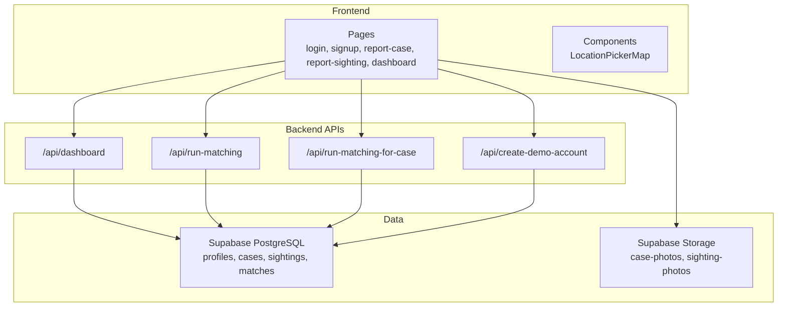
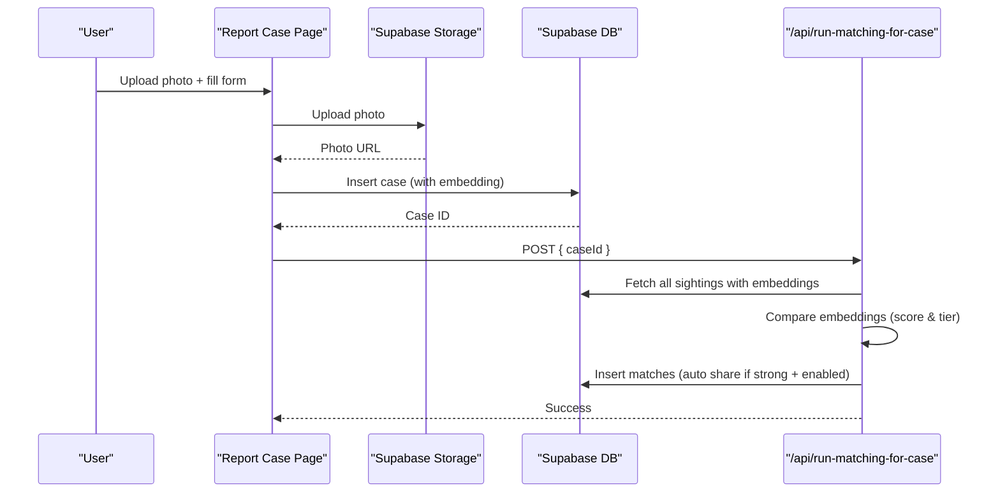
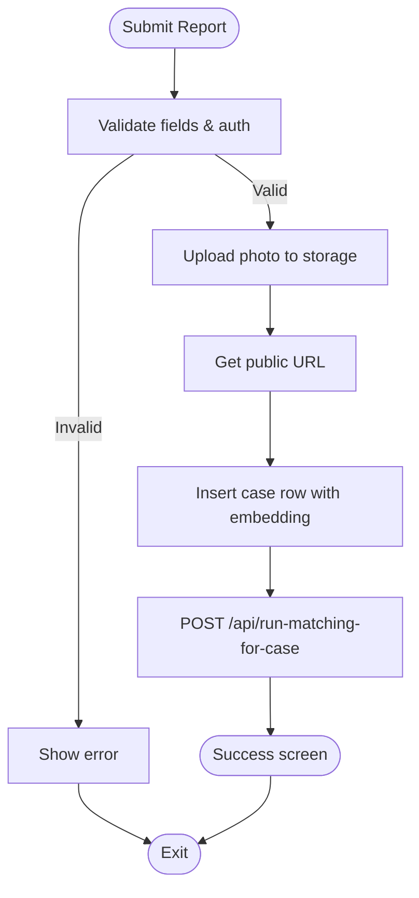
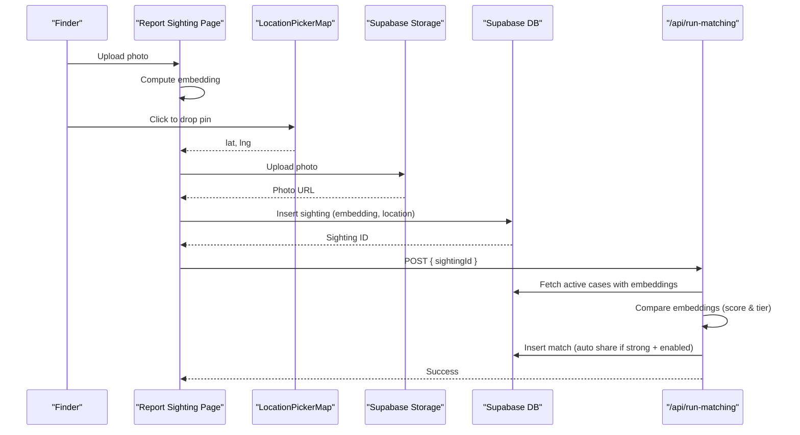
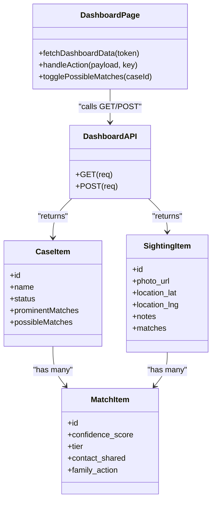
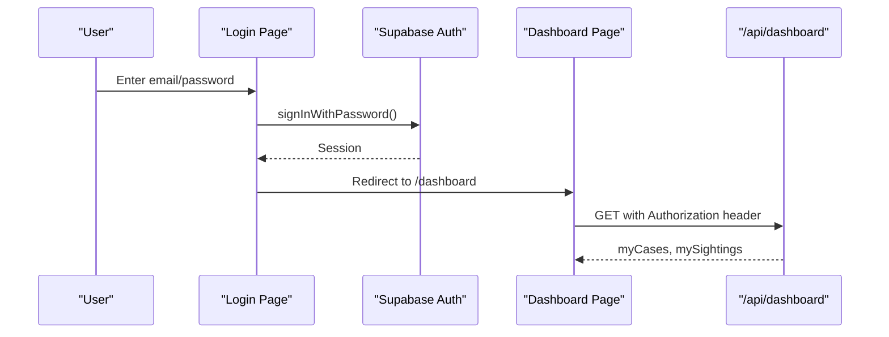
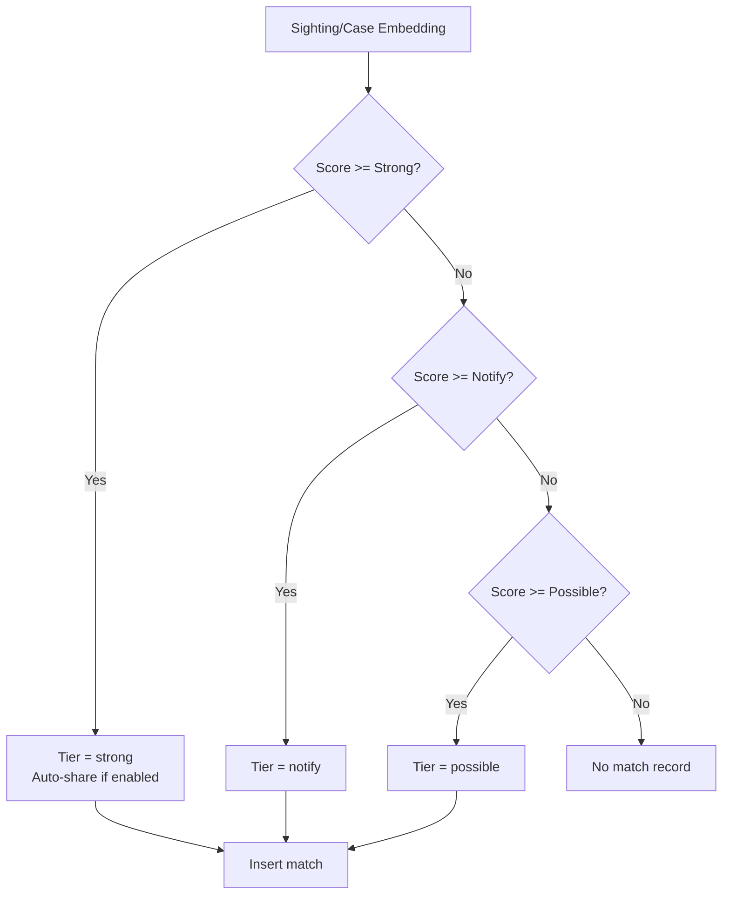
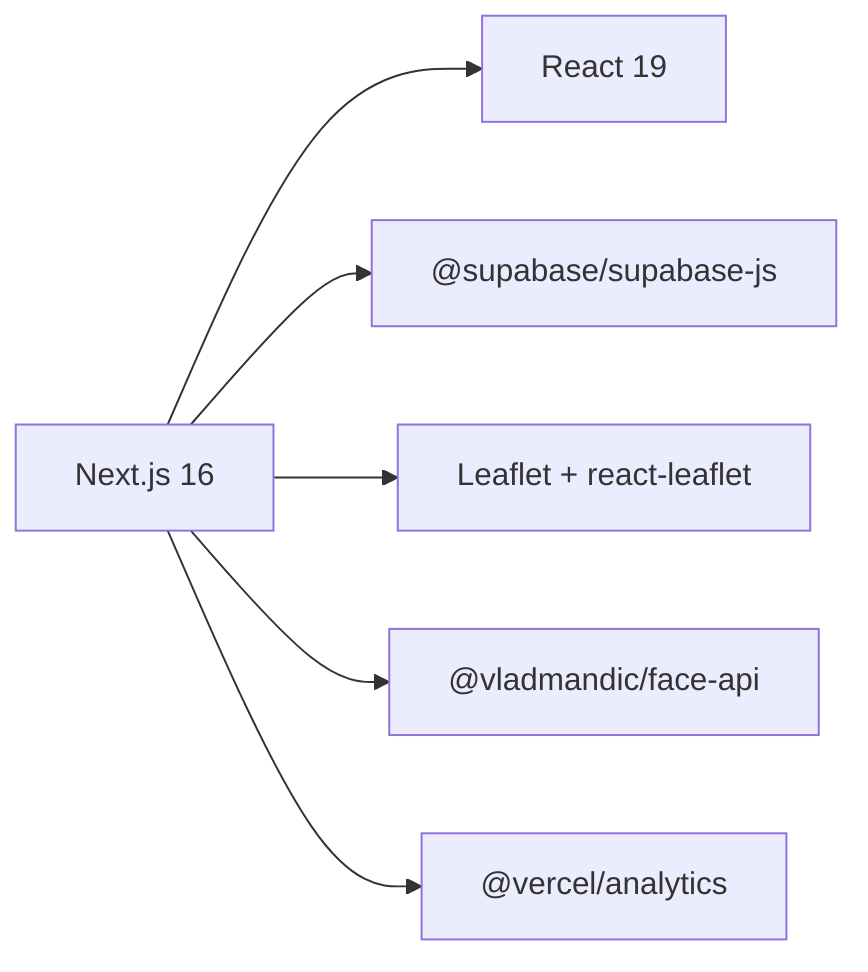

# Core Features

<cite>
**Referenced Files in This Document**
- [README.md](file://README.md)
- [package.json](file://package.json)
- [app/layout.tsx](file://app/layout.tsx)
- [app/page.tsx](file://app/page.tsx)
- [app/login/page.tsx](file://app/login/page.tsx)
- [app/signup/page.tsx](file://app/signup/page.tsx)
- [app/report-case/page.tsx](file://app/report-case/page.tsx)
- [app/report-sighting/page.tsx](file://app/report-sighting/page.tsx)
- [app/dashboard/page.tsx](file://app/dashboard/page.tsx)
- [components/LocationPickerMap.tsx](file://components/LocationPickerMap.tsx)
- [app/api/dashboard/route.ts](file://app/api/dashboard/route.ts)
- [app/api/run-matching/route.ts](file://app/api/run-matching/route.ts)
- [app/api/run-matching-for-case/route.ts](file://app/api/run-matching-for-case/route.ts)
- [app/api/create-demo-account/route.ts](file://app/api/create-demo-account/route.ts)
- [supabase/migrations/20260903_initial_schema.sql](file://supabase/migrations/20260903_initial_schema.sql)
</cite>

## Table of Contents
1. Introduction
2. Project Structure
3. Core Components
4. Architecture Overview
5. Detailed Component Analysis
6. Dependency Analysis
7. Performance Considerations
8. Troubleshooting Guide
9. Conclusion

## Introduction
Findora is a privacy-first, AI-assisted missing persons reunification platform. It enables families to report missing persons with photos and allows the public to submit sightings with precise locations. The system uses client-side face analysis to generate embeddings, then runs server-side matching to create matches with confidence tiers. A dual-role dashboard supports both reporters (families) and finders (public), including match management and controlled contact sharing. Authentication is role-aware via Supabase Auth, with Row Level Security enforcing data access boundaries.

## Project Structure
The application follows a Next.js App Router layout:
- Pages for authentication, reporting, and dashboard
- API routes for dashboard aggregation, matching, and demo account creation
- Shared components such as an interactive map
- Database schema with RLS policies for secure access
- Client-side AI embedding generation using face-api

**Diagram sources**
- [app/page.tsx:1-107](file://app/page.tsx#L1-L107)
- [app/dashboard/page.tsx:1-664](file://app/dashboard/page.tsx#L1-L664)
- [app/api/dashboard/route.ts:1-316](file://app/api/dashboard/route.ts#L1-L316)
- [app/api/run-matching/route.ts:1-186](file://app/api/run-matching/route.ts#L1-L186)
- [app/api/run-matching-for-case/route.ts:1-208](file://app/api/run-matching-for-case/route.ts#L1-L208)
- [app/api/create-demo-account/route.ts:1-67](file://app/api/create-demo-account/route.ts#L1-L67)
- [components/LocationPickerMap.tsx:1-267](file://components/LocationPickerMap.tsx#L1-L267)
- [supabase/migrations/20260903_initial_schema.sql:1-199](file://supabase/migrations/20260903_initial_schema.sql#L1-L199)

**Section sources**
- [README.md:1-37](file://README.md#L1-L37)
- [package.json:1-33](file://package.json#L1-L33)
- [app/layout.tsx:1-34](file://app/layout.tsx#L1-L34)

## Core Components
- Missing person reporting: photo upload, client-side face embedding, case creation, reverse matching against existing sightings.
- Public sighting submission: photo upload, interactive map pin selection, client-side face embedding, forward matching against active cases.
- Dual-role dashboard: reporter view (cases and matches) and finder view (sightings and matches), with match actions and contact sharing.
- Authentication: login, signup with mock OTP flow, session-based access control, admin endpoints for demo account creation.
- Privacy and security: Row Level Security policies, service-role-only server operations, optional contact sharing on strong matches only.

**Section sources**
- [app/report-case/page.tsx:1-414](file://app/report-case/page.tsx#L1-L414)
- [app/report-sighting/page.tsx:1-356](file://app/report-sighting/page.tsx#L1-L356)
- [app/dashboard/page.tsx:1-664](file://app/dashboard/page.tsx#L1-L664)
- [app/login/page.tsx:1-106](file://app/login/page.tsx#L1-L106)
- [app/signup/page.tsx:1-263](file://app/signup/page.tsx#L1-L263)
- [app/api/dashboard/route.ts:1-316](file://app/api/dashboard/route.ts#L1-L316)
- [app/api/run-matching/route.ts:1-186](file://app/api/run-matching/route.ts#L1-L186)
- [app/api/run-matching-for-case/route.ts:1-208](file://app/api/run-matching-for-case/route.ts#L1-L208)
- [app/api/create-demo-account/route.ts:1-67](file://app/api/create-demo-account/route.ts#L1-L67)
- [supabase/migrations/20260903_initial_schema.sql:1-199](file://supabase/migrations/20260903_initial_schema.sql#L1-L199)

## Architecture Overview
The system separates client-side AI from server-side orchestration:
- Clients compute 128-d face embeddings locally and upload photos to storage.
- Server APIs use Supabase Admin to query and update data while bypassing RLS where necessary.
- Matching algorithms compare embeddings and insert match records with tiered confidence and optional contact sharing.
- Dashboard aggregates per-user data and exposes safe actions through authenticated endpoints.

**Diagram sources**
- [app/report-case/page.tsx:61-157](file://app/report-case/page.tsx#L61-L157)
- [app/api/run-matching-for-case/route.ts:20-208](file://app/api/run-matching-for-case/route.ts#L20-L208)
- [supabase/migrations/20260903_initial_schema.sql:58-104](file://supabase/migrations/20260903_initial_schema.sql#L58-L104)

## Detailed Component Analysis

### Missing Person Reporting Workflow
- Photo upload to private storage bucket with user-scoped paths.
- Client-side face detection and embedding generation; warnings displayed when no face or low quality.
- Case record created with metadata and embedding; reverse matching triggered immediately.
- Optional automatic contact sharing on strong matches based on reporter preference.

**Diagram sources**
- [app/report-case/page.tsx:79-157](file://app/report-case/page.tsx#L79-L157)
- [app/api/run-matching-for-case/route.ts:20-208](file://app/api/run-matching-for-case/route.ts#L20-L208)

**Section sources**
- [app/report-case/page.tsx:1-414](file://app/report-case/page.tsx#L1-L414)

### Public Sighting Submission with Interactive Map
- Photo upload and client-side face embedding similar to case reporting.
- Location picker integrates geolocation, search via Nominatim, and click-to-pin.
- On submit, sighting is stored with coordinates and embedding; forward matching runs against active cases.

**Diagram sources**
- [app/report-sighting/page.tsx:69-172](file://app/report-sighting/page.tsx#L69-L172)
- [components/LocationPickerMap.tsx:91-184](file://components/LocationPickerMap.tsx#L91-L184)
- [app/api/run-matching/route.ts:10-186](file://app/api/run-matching/route.ts#L10-L186)

**Section sources**
- [app/report-sighting/page.tsx:1-356](file://app/report-sighting/page.tsx#L1-L356)
- [components/LocationPickerMap.tsx:1-267](file://components/LocationPickerMap.tsx#L1-L267)

### Dual-Role Dashboard Interface
- Reporter view: lists reported cases, prominent matches (strong/notify), collapsible possible matches, and actions to mark different person or resolve case.
- Finder view: lists submitted sightings with status badges, notes, and shared family contact info when allowed.
- Data fetched via authenticated dashboard API that enriches matches with sighting/case details and reporter profiles.

**Diagram sources**
- [app/dashboard/page.tsx:76-168](file://app/dashboard/page.tsx#L76-L168)
- [app/api/dashboard/route.ts:4-201](file://app/api/dashboard/route.ts#L4-L201)
- [app/api/dashboard/route.ts:206-316](file://app/api/dashboard/route.ts#L206-L316)

**Section sources**
- [app/dashboard/page.tsx:1-664](file://app/dashboard/page.tsx#L1-L664)
- [app/api/dashboard/route.ts:1-316](file://app/api/dashboard/route.ts#L1-L316)

### Authentication System and Session Management
- Login page validates credentials and redirects to dashboard upon success.
- Signup uses a three-step flow with on-screen mock OTP for demo reliability, then creates a user via admin API and logs them in.
- Dashboard enforces session checks and passes Bearer token to server endpoints.

**Diagram sources**
- [app/login/page.tsx:17-42](file://app/login/page.tsx#L17-L42)
- [app/signup/page.tsx:63-108](file://app/signup/page.tsx#L63-L108)
- [app/dashboard/page.tsx:123-133](file://app/dashboard/page.tsx#L123-L133)
- [app/api/dashboard/route.ts:4-23](file://app/api/dashboard/route.ts#L4-L23)

**Section sources**
- [app/login/page.tsx:1-106](file://app/login/page.tsx#L1-L106)
- [app/signup/page.tsx:1-263](file://app/signup/page.tsx#L1-L263)
- [app/dashboard/page.tsx:1-664](file://app/dashboard/page.tsx#L1-L664)
- [app/api/create-demo-account/route.ts:1-67](file://app/api/create-demo-account/route.ts#L1-L67)

### Face Analysis and Matching Logic
- Client-side: load models once, compute 128-d embedding from uploaded image, surface warnings when no face detected.
- Server-side: compare embeddings across datasets, classify into tiers, insert matches, and conditionally enable contact sharing for strong matches when reporter opted in.

**Diagram sources**
- [app/report-case/page.tsx:61-77](file://app/report-case/page.tsx#L61-L77)
- [app/report-sighting/page.tsx:69-85](file://app/report-sighting/page.tsx#L69-L85)
- [app/api/run-matching/route.ts:87-177](file://app/api/run-matching/route.ts#L87-L177)
- [app/api/run-matching-for-case/route.ts:102-199](file://app/api/run-matching-for-case/route.ts#L102-L199)

**Section sources**
- [app/report-case/page.tsx:1-414](file://app/report-case/page.tsx#L1-L414)
- [app/report-sighting/page.tsx:1-356](file://app/report-sighting/page.tsx#L1-L356)
- [app/api/run-matching/route.ts:1-186](file://app/api/run-matching/route.ts#L1-L186)
- [app/api/run-matching-for-case/route.ts:1-208](file://app/api/run-matching-for-case/route.ts#L1-L208)

### Privacy Controls and Data Protection
- Row Level Security restricts clients to own data:
  - Profiles: users can read/update their own profile.
  - Cases: reporters can manage only their own cases.
  - Sightings: finders can manage only their own sightings.
  - Matches: reporters see matches for their cases; finders see matches for their sightings.
- Contact sharing is opt-in by reporters and only exposed to finders when a strong match occurs and sharing is enabled.
- Server endpoints use Supabase Admin to perform cross-entity queries and updates safely.

**Section sources**
- [supabase/migrations/20260903_initial_schema.sql:14-34](file://supabase/migrations/20260903_initial_schema.sql#L14-L34)
- [supabase/migrations/20260903_initial_schema.sql:76-103](file://supabase/migrations/20260903_initial_schema.sql#L76-L103)
- [supabase/migrations/20260903_initial_schema.sql:121-135](file://supabase/migrations/20260903_initial_schema.sql#L121-L135)
- [supabase/migrations/20260903_initial_schema.sql:153-198](file://supabase/migrations/20260903_initial_schema.sql#L153-L198)
- [app/api/dashboard/route.ts:130-184](file://app/api/dashboard/route.ts#L130-L184)

## Dependency Analysis
Key runtime dependencies include Next.js, React, Supabase JS client, Leaflet and react-leaflet for maps, and face-api for client-side embeddings.

**Diagram sources**
- [package.json:11-21](file://package.json#L11-L21)

**Section sources**
- [package.json:1-33](file://package.json#L1-L33)

## Performance Considerations
- Client-side embedding avoids server CPU overhead and reduces latency by processing images in-browser.
- Reverse matching batches match inserts and updates sighting statuses in one pass after computing scores.
- Dashboard API minimizes round-trips by fetching related entities (cases, sightings, matches, profiles) in grouped queries and enriching results server-side.
- Map search uses debounced requests to reduce network calls during typing.

[No sources needed since this section provides general guidance]

## Troubleshooting Guide
Common issues and strategies:
- No face detected: client surfaces a warning; ensure clear, front-facing photos.
- Upload failures: check storage permissions and file size limits; errors are surfaced to UI.
- Unauthorized dashboard access: ensure valid session token is passed in Authorization header.
- Forbidden actions: dashboard POST verifies ownership before updating matches or resolving cases.
- Matching skipped: if embeddings are missing or below thresholds, no match records are created; re-upload better photos.

**Section sources**
- [app/report-case/page.tsx:225-229](file://app/report-case/page.tsx#L225-L229)
- [app/report-sighting/page.tsx:239-243](file://app/report-sighting/page.tsx#L239-L243)
- [app/api/dashboard/route.ts:6-23](file://app/api/dashboard/route.ts#L6-L23)
- [app/api/dashboard/route.ts:228-256](file://app/api/dashboard/route.ts#L228-L256)
- [app/api/run-matching/route.ts:54-61](file://app/api/run-matching/route.ts#L54-L61)
- [app/api/run-matching-for-case/route.ts:66-73](file://app/api/run-matching-for-case/route.ts#L66-L73)

## Conclusion
Findora combines privacy-preserving design with practical workflows for families and the public. Client-side face analysis ensures efficiency and privacy, while server-side matching orchestrates secure, policy-enforced data access. The dual-role dashboard provides actionable insights and controlled communication channels, enabling safe reunifications with minimal exposure of sensitive information.

[No sources needed since this section summarizes without analyzing specific files]