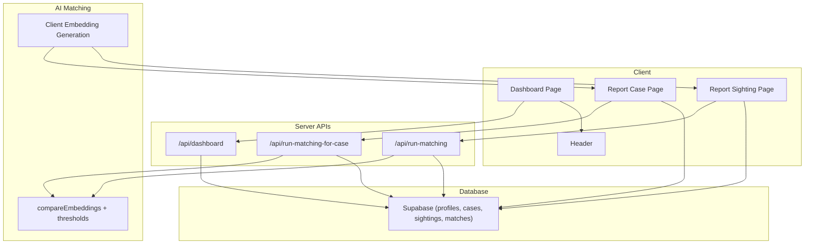
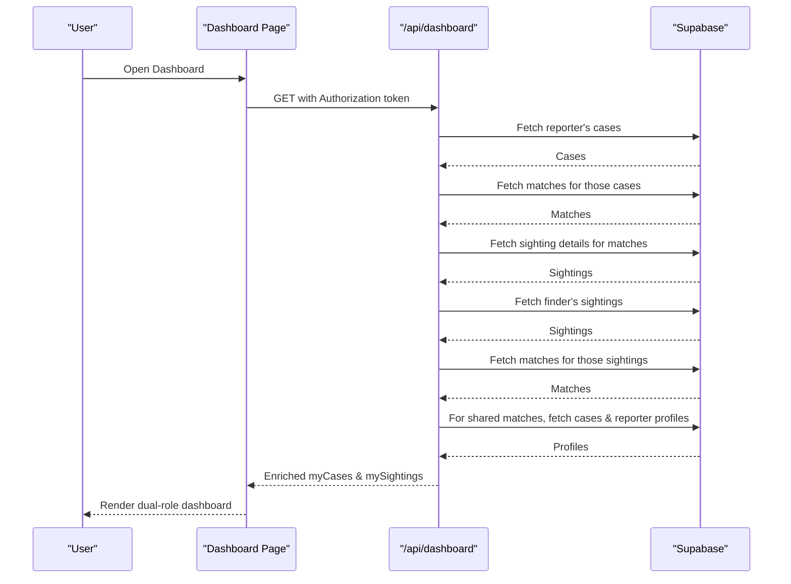
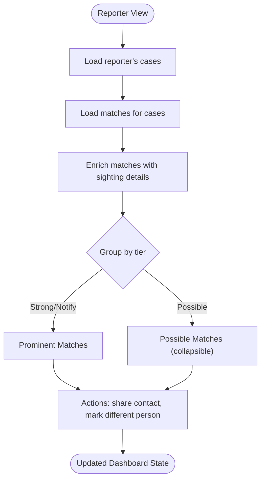
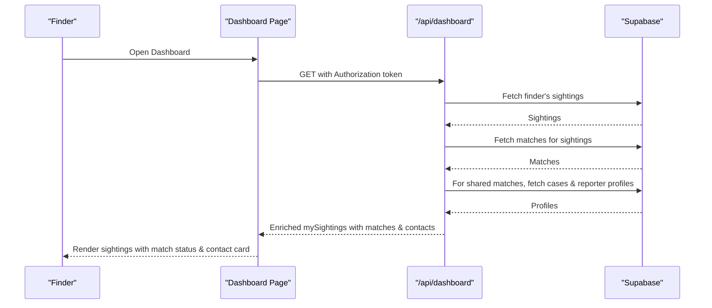
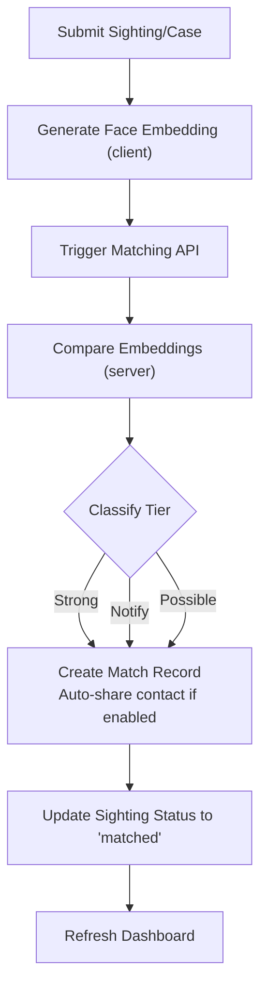
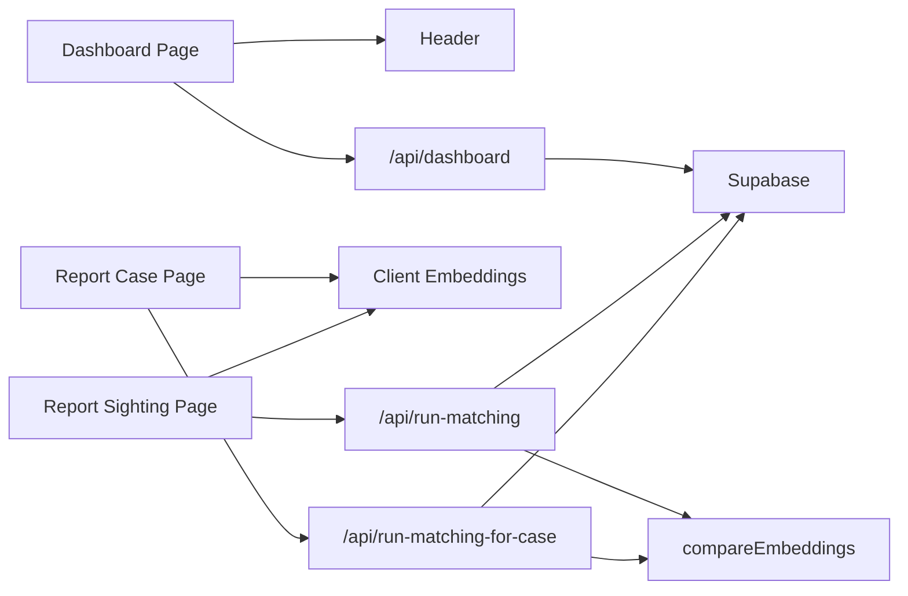

# Dashboard Interface

<cite>
**Referenced Files in This Document**
- [page.tsx](file://app/dashboard/page.tsx)
- [route.ts](file://app/api/dashboard/route.ts)
- [route.ts](file://app/api/run-matching/route.ts)
- [route.ts](file://app/api/run-matching-for-case/route.ts)
- [compare.ts](file://lib/ai-matching/compare.ts)
- [embeddings.ts](file://lib/ai-matching/embeddings.ts)
- [Header.tsx](file://components/Header.tsx)
- [initial_schema.sql](file://supabase/migrations/20260903_initial_schema.sql)
- [index.ts](file://types/index.ts)
- [page.tsx](file://app/report-case/page.tsx)
- [page.tsx](file://app/report-sighting/page.tsx)
</cite>

## Table of Contents
1. Introduction
2. Project Structure
3. Core Components
4. Architecture Overview
5. Detailed Component Analysis
6. Dependency Analysis
7. Performance Considerations
8. Troubleshooting Guide
9. Conclusion

## Introduction
This document explains the dual-role dashboard interface for Findora, a system that helps reunite missing persons by matching face embeddings from reported cases with sightings submitted by the public. The dashboard supports two roles:
- Reporter (family): views their reported missing person cases, AI match notifications, and manages contact sharing.
- Finder (public): views their submitted sightings, sees match results, and accesses reporter contact information when appropriate.

The dashboard integrates real-time-like updates via refresh actions, a secure contact-sharing mechanism that reveals contact details only on strong matches, and a responsive UI designed to handle large datasets efficiently.

## Project Structure
The dashboard is implemented as a Next.js client component with server-side API routes for data access and matching operations. Key areas include:
- Dashboard page: orchestrates both reporter and finder views, state management, and user interactions.
- API routes: fetch enriched data for both roles and perform matching operations using Supabase Admin.
- AI matching: client-side embedding generation and server-side comparison with thresholds.
- Database schema: defines tables for profiles, cases, sightings, and matches with Row Level Security policies.

**Diagram sources**
- [page.tsx](file://app/dashboard/page.tsx)
- [route.ts](file://app/api/dashboard/route.ts)
- [route.ts](file://app/api/run-matching/route.ts)
- [route.ts](file://app/api/run-matching-for-case/route.ts)
- [compare.ts](file://lib/ai-matching/compare.ts)
- [embeddings.ts](file://lib/ai-matching/embeddings.ts)
- [initial_schema.sql](file://supabase/migrations/20260903_initial_schema.sql)

**Section sources**
- [page.tsx](file://app/dashboard/page.tsx)
- [route.ts](file://app/api/dashboard/route.ts)
- [route.ts](file://app/api/run-matching/route.ts)
- [route.ts](file://app/api/run-matching-for-case/route.ts)
- [compare.ts](file://lib/ai-matching/compare.ts)
- [embeddings.ts](file://lib/ai-matching/embeddings.ts)
- [initial_schema.sql](file://supabase/migrations/20260903_initial_schema.sql)

## Core Components
- Dashboard Page: Central UI for both roles; fetches and displays cases and sightings; handles actions like marking matches as different persons, sharing contacts, and resolving cases.
- Header: Manages authentication state and navigation; shows logged-in user and sign-out option.
- Report Case Page: Allows reporters to submit missing person reports with photo upload and client-side face embedding; triggers reverse matching against existing sightings.
- Report Sighting Page: Allows finders to submit sightings with photo and location; triggers forward matching against active cases.
- API Routes:
  - /api/dashboard: Enriches and returns both reporter and finder data securely.
  - /api/run-matching: Performs forward matching for a new sighting against active cases.
  - /api/run-matching-for-case: Performs reverse matching for a new case against all sightings.
- AI Matching:
  - compareEmbeddings: Computes similarity score and classifies tiers based on thresholds.
  - Client Embedding Generation: Uses browser-based face-api to extract 128-d embeddings.

**Section sources**
- [page.tsx](file://app/dashboard/page.tsx)
- [Header.tsx](file://components/Header.tsx)
- [page.tsx](file://app/report-case/page.tsx)
- [page.tsx](file://app/report-sighting/page.tsx)
- [route.ts](file://app/api/dashboard/route.ts)
- [route.ts](file://app/api/run-matching/route.ts)
- [route.ts](file://app/api/run-matching-for-case/route.ts)
- [compare.ts](file://lib/ai-matching/compare.ts)
- [embeddings.ts](file://lib/ai-matching/embeddings.ts)

## Architecture Overview
The system uses a dual-role architecture with clear separation between client and server responsibilities:
- Client components manage UI state, user interactions, and local embedding generation.
- Server APIs enforce ownership checks, bypass RLS via Supabase Admin where necessary, and orchestrate matching logic.
- Database enforces security through Row Level Security policies, ensuring users can only access their own data unless explicitly allowed.

**Diagram sources**
- [page.tsx](file://app/dashboard/page.tsx)
- [route.ts](file://app/api/dashboard/route.ts)
- [initial_schema.sql](file://supabase/migrations/20260903_initial_schema.sql)

**Section sources**
- [route.ts](file://app/api/dashboard/route.ts)
- [page.tsx](file://app/dashboard/page.tsx)

## Detailed Component Analysis

### Reporter View (My Reported Cases)
- Displays each case with status, last seen details, and auto-share contact setting.
- Shows prominent matches (strong and notify tiers) with confidence scores and sighting details.
- Collapsible section for possible matches (medium confidence).
- Actions:
  - Share contact info with finder for specific matches.
  - Mark a match as different person.
  - Resolve case to stop further matching attention.

Data flow:
- Dashboard fetches reporter’s cases and associated matches.
- API enriches matches with sighting details and groups them into prominent vs possible.
- UI renders actionable cards with loading states and error handling.

**Diagram sources**
- [route.ts](file://app/api/dashboard/route.ts)
- [page.tsx](file://app/dashboard/page.tsx)

**Section sources**
- [page.tsx](file://app/dashboard/page.tsx)
- [route.ts](file://app/api/dashboard/route.ts)

### Finder View (My Sightings)
- Displays each sighting with photo, location coordinates, notes, and submission date.
- Shows match-aware status badges indicating strong, likely, or possible matches.
- When a match has contact_shared enabled, reveals reporter contact information (email/phone) for coordination.

Data flow:
- Dashboard fetches finder’s sightings and associated matches.
- API enriches matches with case names and reporter profiles when contact_shared is true.
- UI conditionally renders contact card for strong matches with sharing enabled.

**Diagram sources**
- [route.ts](file://app/api/dashboard/route.ts)
- [page.tsx](file://app/dashboard/page.tsx)

**Section sources**
- [page.tsx](file://app/dashboard/page.tsx)
- [route.ts](file://app/api/dashboard/route.ts)

### Real-Time Match Notification System
- Forward matching: When a sighting is submitted, the system compares its embedding against all active cases and creates match records if above threshold.
- Reverse matching: When a case is created, the system compares its embedding against all existing sightings and creates match records if above threshold.
- Tiers:
  - Strong: High confidence; may auto-share contact if enabled by reporter.
  - Notify: Medium-high confidence; notifies family for review.
  - Possible: Lower confidence; displayed in collapsible sections for manual review.

**Diagram sources**
- [route.ts](file://app/api/run-matching/route.ts)
- [route.ts](file://app/api/run-matching-for-case/route.ts)
- [compare.ts](file://lib/ai-matching/compare.ts)
- [embeddings.ts](file://lib/ai-matching/embeddings.ts)

**Section sources**
- [route.ts](file://app/api/run-matching/route.ts)
- [route.ts](file://app/api/run-matching-for-case/route.ts)
- [compare.ts](file://lib/ai-matching/compare.ts)

### Contact Sharing Mechanism
- Controlled by reporter’s contact_share_enabled flag on the case.
- Auto-sharing occurs only for strong-tier matches; otherwise, families can manually share contact info per match.
- Finder view reveals contact details only when contact_shared is true for a match.

Security considerations:
- Contact details are fetched via server-side queries using Supabase Admin to bypass RLS safely.
- Ownership checks ensure only authorized users can update match records or resolve cases.

**Section sources**
- [route.ts](file://app/api/dashboard/route.ts)
- [initial_schema.sql](file://supabase/migrations/20260903_initial_schema.sql)
- [page.tsx](file://app/dashboard/page.tsx)

### Responsive Design and Data Fetching Patterns
- Responsive layout: Uses Tailwind classes for adaptive grids and spacing across screen sizes.
- Data fetching: Single API call to /api/dashboard retrieves both reporter and finder data; subsequent actions trigger POST requests to update match fields or resolve cases.
- State management: Local React state tracks loading, errors, expanded sections, and action-specific loading indicators.

Performance considerations:
- Batching queries in API to reduce round trips.
- Conditional enrichment of sighting details and reporter profiles only when needed.

**Section sources**
- [page.tsx](file://app/dashboard/page.tsx)
- [route.ts](file://app/api/dashboard/route.ts)

## Dependency Analysis
Key dependencies and relationships:
- Dashboard Page depends on Header for auth state and navigation.
- Dashboard Page calls /api/dashboard for data and /api/dashboard POST for actions.
- Reporting pages depend on client-side embedding generation and trigger matching APIs.
- Matching APIs depend on compareEmbeddings and Supabase Admin client.
- Database schema enforces RLS policies for secure access.

**Diagram sources**
- [page.tsx](file://app/dashboard/page.tsx)
- [Header.tsx](file://components/Header.tsx)
- [page.tsx](file://app/report-case/page.tsx)
- [page.tsx](file://app/report-sighting/page.tsx)
- [route.ts](file://app/api/dashboard/route.ts)
- [route.ts](file://app/api/run-matching/route.ts)
- [route.ts](file://app/api/run-matching-for-case/route.ts)
- [compare.ts](file://lib/ai-matching/compare.ts)

**Section sources**
- [page.tsx](file://app/dashboard/page.tsx)
- [Header.tsx](file://components/Header.tsx)
- [page.tsx](file://app/report-case/page.tsx)
- [page.tsx](file://app/report-sighting/page.tsx)
- [route.ts](file://app/api/dashboard/route.ts)
- [route.ts](file://app/api/run-matching/route.ts)
- [route.ts](file://app/api/run-matching-for-case/route.ts)
- [compare.ts](file://lib/ai-matching/compare.ts)

## Performance Considerations
- Client-side embedding generation reduces server load and improves responsiveness during photo uploads.
- Server-side matching batches queries and limits processing to relevant datasets (active cases or all sightings depending on direction).
- Dashboard API minimizes network calls by enriching data in a single response.
- UI uses collapsible sections to manage large datasets and improve readability.

[No sources needed since this section provides general guidance]

## Troubleshooting Guide
Common issues and resolutions:
- Missing authorization header: Ensure session token is included in API requests.
- Unauthorized session: Verify Supabase auth state and token validity.
- No matches found: Check if embeddings exist and thresholds are met; verify active cases and sightings have embeddings.
- Contact not shared: Confirm reporter’s contact_share_enabled flag and match tier classification.

Error handling:
- API routes return structured error responses with messages.
- Dashboard displays user-friendly alerts and error banners.

**Section sources**
- [route.ts](file://app/api/dashboard/route.ts)
- [route.ts](file://app/api/run-matching/route.ts)
- [route.ts](file://app/api/run-matching-for-case/route.ts)
- [page.tsx](file://app/dashboard/page.tsx)

## Conclusion
The Findora dashboard provides a robust, dual-role interface that enables reporters and finders to collaborate effectively in locating missing persons. Through secure data access, intelligent matching, and controlled contact sharing, the system balances privacy with functionality. The responsive design and efficient data patterns ensure usability even with large datasets, while comprehensive error handling and clear UI feedback support a smooth user experience.

[No sources needed since this section summarizes without analyzing specific files]