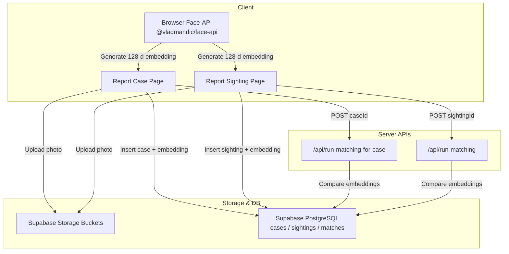
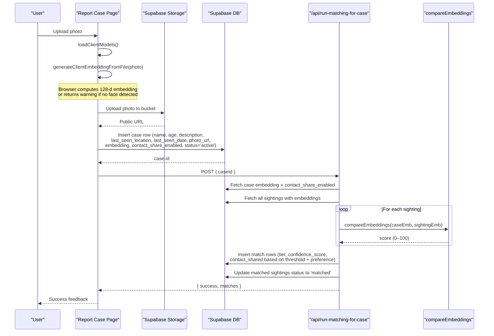
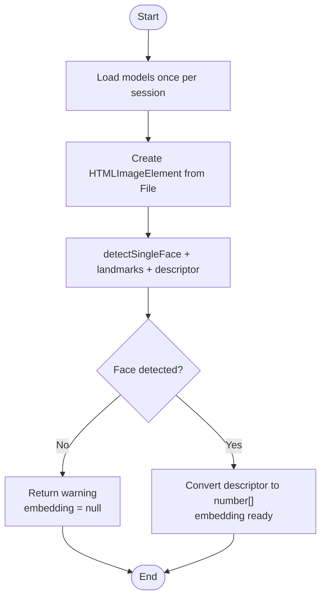
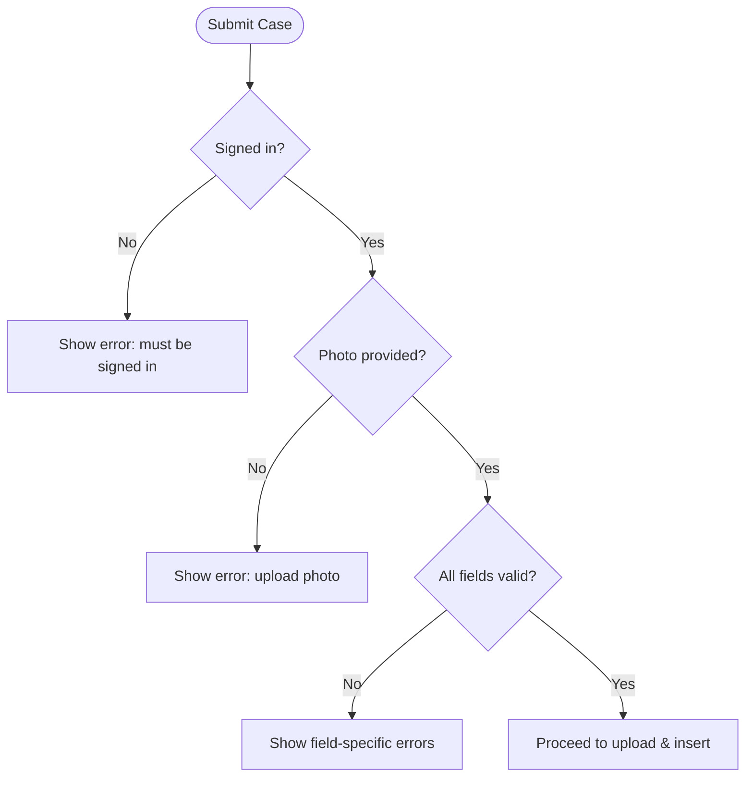
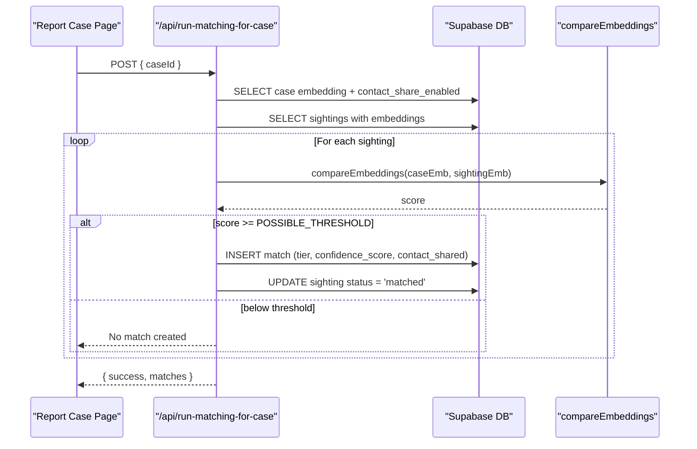
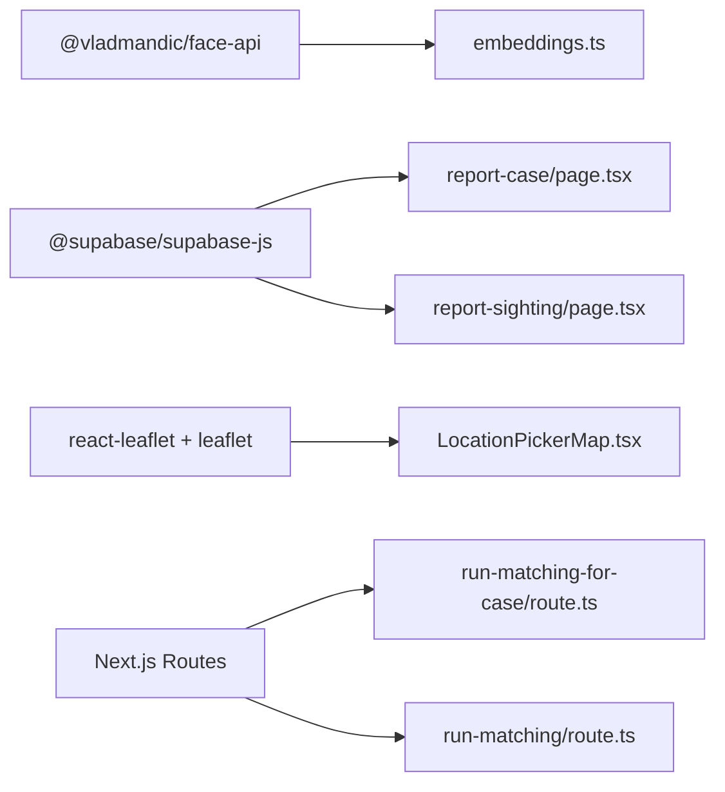

# Missing Person Reporting

<cite>
**Referenced Files in This Document**
- [page.tsx](file://app/report-case/page.tsx)
- [route.ts](file://app/api/run-matching-for-case/route.ts)
- [route.ts](file://app/api/run-matching/route.ts)
- [embeddings.ts](file://lib/ai-matching/embeddings.ts)
- [compare.ts](file://lib/ai-matching/compare.ts)
- [20260903_initial_schema.sql](file://supabase/migrations/20260903_initial_schema.sql)
- [index.ts](file://types/index.ts)
- [page.tsx](file://app/report-sighting/page.tsx)
- [LocationPickerMap.tsx](file://components/LocationPickerMap.tsx)
- [package.json](file://package.json)
</cite>

## Table of Contents
1. Introduction
2. Project Structure
3. Core Components
4. Architecture Overview
5. Detailed Component Analysis
6. Dependency Analysis
7. Performance Considerations
8. Troubleshooting Guide
9. Conclusion

## Introduction
This document explains the complete workflow for reporting a missing person, from uploading a photo to generating face embeddings in the browser, storing data securely, and triggering automatic reverse matching against existing sightings. It covers form fields, privacy controls (contact sharing preferences), file upload handling, image validation, storage integration with Supabase, and success feedback. The system uses client-side face analysis powered by @vladmandic/face-api to compute 128-dimensional embeddings directly in the browser, ensuring privacy and avoiding server-side model compilation issues.

## Project Structure
The missing person reporting flow spans client pages, server API routes, AI utilities, and database schema:
- Client page for reporting cases: app/report-case/page.tsx
- Reverse matching API route triggered after case creation: app/api/run-matching-for-case/route.ts
- Forward matching API route used when a sighting is submitted: app/api/run-matching/route.ts
- Client-side embedding generation: lib/ai-matching/embeddings.ts
- Embedding comparison and thresholds: lib/ai-matching/compare.ts
- Database schema defining cases, sightings, matches, and RLS policies: supabase/migrations/20260903_initial_schema.sql
- Types for roles, statuses, and entities: types/index.ts
- Sighting submission page and map component: app/report-sighting/page.tsx, components/LocationPickerMap.tsx
- Dependencies including face-api and Supabase SDK: package.json

**Diagram sources**
- [page.tsx:62-157](file://app/report-case/page.tsx#L62-L157)
- [route.ts:20-199](file://app/api/run-matching-for-case/route.ts#L20-L199)
- [route.ts:10-186](file://app/api/run-matching/route.ts#L10-L186)
- [embeddings.ts:20-103](file://lib/ai-matching/embeddings.ts#L20-L103)
- [compare.ts:1-72](file://lib/ai-matching/compare.ts#L1-L72)
- [20260903_initial_schema.sql:58-199](file://supabase/migrations/20260903_initial_schema.sql#L58-L199)

**Section sources**
- [page.tsx:20-157](file://app/report-case/page.tsx#L20-L157)
- [route.ts:20-199](file://app/api/run-matching-for-case/route.ts#L20-L199)
- [route.ts:10-186](file://app/api/run-matching/route.ts#L10-L186)
- [embeddings.ts:20-103](file://lib/ai-matching/embeddings.ts#L20-L103)
- [compare.ts:1-72](file://lib/ai-matching/compare.ts#L1-L72)
- [20260903_initial_schema.sql:58-199](file://supabase/migrations/20260903_initial_schema.sql#L58-L199)

## Core Components
- Client-side face embedding generator: loads models once per session and computes a 128-d embedding from uploaded images in the browser. Returns either an embedding or a warning if no face is detected.
- Case report form: collects name, age, physical description, last seen location and date, and a photo; includes a privacy control to automatically share contact info on strong matches.
- Storage integration: uploads photos to dedicated Supabase storage buckets and persists public URLs.
- Reverse matching engine: compares the new case’s embedding against all existing sightings that have embeddings, classifies matches into tiers, and inserts match records accordingly.
- Thresholds and scoring: configurable thresholds define strong, notify, and possible matches using Euclidean distance transformed via a sigmoid function.

**Section sources**
- [embeddings.ts:20-103](file://lib/ai-matching/embeddings.ts#L20-L103)
- [page.tsx:26-157](file://app/report-case/page.tsx#L26-L157)
- [route.ts:20-199](file://app/api/run-matching-for-case/route.ts#L20-L199)
- [compare.ts:1-72](file://lib/ai-matching/compare.ts#L1-L72)

## Architecture Overview
The reporting workflow integrates client-side AI, secure storage, and server-side matching:

**Diagram sources**
- [page.tsx:62-157](file://app/report-case/page.tsx#L62-L157)
- [route.ts:20-199](file://app/api/run-matching-for-case/route.ts#L20-L199)
- [compare.ts:1-72](file://lib/ai-matching/compare.ts#L1-L72)

## Detailed Component Analysis

### Client-Side Face Embedding Generation
- Model loading: Preloads SSD MobileNet v1, face landmarks, and recognition nets from /public/models once per session.
- Image processing: Converts File to HTMLImageElement, runs detection + landmarks + descriptor extraction in the browser.
- Error handling: If no face is detected or errors occur, returns null embedding with a user-friendly warning; allows submission to proceed without embedding.
- Output: A 128-element number array representing the face embedding.

**Diagram sources**
- [embeddings.ts:20-103](file://lib/ai-matching/embeddings.ts#L20-L103)

**Section sources**
- [embeddings.ts:20-103](file://lib/ai-matching/embeddings.ts#L20-L103)

### Case Report Form Fields and Validation
- Required fields:
  - Photo of missing person
  - Full name
  - Age
  - Physical description and distinctive features
  - Last seen location
  - Last seen date
- Privacy control:
  - Contact sharing preference checkbox: When enabled, contact info is automatically shared only on strong matches (confidence at or above the strong threshold).
- Validation:
  - Auth guard ensures user is signed in.
  - Photo required before submission.
  - All text/date fields validated via HTML attributes and UI state.

**Diagram sources**
- [page.tsx:79-157](file://app/report-case/page.tsx#L79-L157)

**Section sources**
- [page.tsx:26-157](file://app/report-case/page.tsx#L26-L157)

### File Upload Handling and Storage Integration
- Upload process:
  - Generates unique filename using userId and timestamp/random suffix.
  - Uploads to Supabase storage bucket (case-photos for reports).
  - Retrieves public URL for the uploaded image.
- Storage configuration:
  - Cache control set for short-lived caching.
  - Upsert disabled to avoid accidental overwrites.
- Database insertion:
  - Inserts case row with reporter_id, name, age, description, last_seen_location, last_seen_date, photo_url, embedding (nullable), contact_share_enabled, and status set to active.

**Section sources**
- [page.tsx:95-138](file://app/report-case/page.tsx#L95-L138)
- [20260903_initial_schema.sql:58-104](file://supabase/migrations/20260903_initial_schema.sql#L58-L104)

### Reverse Matching Against Existing Sightings
- Trigger: After successful case insertion, the client calls /api/run-matching-for-case with the new caseId.
- Data retrieval:
  - Fetches case embedding and contact_share_enabled.
  - Fetches all sightings that have embeddings (no status filter).
- Comparison:
  - Compares case embedding against each sighting embedding using compareEmbeddings.
  - Classifies scores into tiers: strong, notify, possible based on thresholds.
- Match creation:
  - Inserts one or more match rows per qualifying sighting.
  - Sets contact_shared to true only for strong tier matches when contact_share_enabled is true.
- Status update:
  - Updates matched sightings’ status to 'matched'.

**Diagram sources**
- [route.ts:20-199](file://app/api/run-matching-for-case/route.ts#L20-L199)
- [compare.ts:1-72](file://lib/ai-matching/compare.ts#L1-L72)

**Section sources**
- [route.ts:20-199](file://app/api/run-matching-for-case/route.ts#L20-L199)
- [compare.ts:1-72](file://lib/ai-matching/compare.ts#L1-L72)

### Sighting Submission Flow (Forward Matching)
- Sighting form collects photo, precise location via map, and optional notes.
- Uploads photo to sighting-photos bucket and inserts sighting row with embedding (nullable).
- Triggers forward matching via /api/run-matching to compare the sighting against active cases.
- Creates at most one match per sighting (best-scoring case), updates sighting status to 'matched' when a match is found.

**Section sources**
- [page.tsx:92-172](file://app/report-sighting/page.tsx#L92-L172)
- [route.ts:10-186](file://app/api/run-matching/route.ts#L10-L186)

### Privacy Controls and Automatic Matching Triggers
- Contact sharing preference:
  - Stored per case as contact_share_enabled.
  - Automatically shares contact info only on strong matches when enabled.
- Matching triggers:
  - Reverse matching runs immediately after case creation to check against all existing sightings.
  - Forward matching runs after sighting submission to check against active cases.

**Section sources**
- [page.tsx:379-397](file://app/report-case/page.tsx#L379-L397)
- [route.ts:140-152](file://app/api/run-matching-for-case/route.ts#L140-L152)
- [route.ts:143-168](file://app/api/run-matching/route.ts#L143-L168)

### Success Flow and User Feedback
- On successful submission:
  - Displays a success screen confirming the report was created and active in the matching engine.
  - Shows any face detection warnings if applicable.
  - Provides navigation to dashboard and option to submit another report.
- On failure:
  - Displays error messages for upload or insertion failures.

**Section sources**
- [page.tsx:172-215](file://app/report-case/page.tsx#L172-L215)
- [page.tsx:151-157](file://app/report-case/page.tsx#L151-L157)

## Dependency Analysis
Key dependencies and their roles:
- @vladmandic/face-api: Enables client-side face detection and embedding generation.
- @supabase/supabase-js: Handles authentication, storage, and database operations.
- react-leaflet and leaflet: Provide interactive map for precise location selection in sighting submissions.
- Next.js routing and serverless functions: Power API routes for matching logic.

**Diagram sources**
- [package.json:11-21](file://package.json#L11-L21)
- [embeddings.ts:12-37](file://lib/ai-matching/embeddings.ts#L12-L37)
- [LocationPickerMap.tsx:1-35](file://components/LocationPickerMap.tsx#L1-L35)
- [route.ts:20-199](file://app/api/run-matching-for-case/route.ts#L20-L199)
- [route.ts:10-186](file://app/api/run-matching/route.ts#L10-L186)

**Section sources**
- [package.json:11-21](file://package.json#L11-L21)
- [embeddings.ts:12-37](file://lib/ai-matching/embeddings.ts#L12-L37)
- [LocationPickerMap.tsx:1-35](file://components/LocationPickerMap.tsx#L1-L35)

## Performance Considerations
- Client-side processing: Face detection and embedding generation run in the browser, reducing server load and improving privacy.
- Model caching: Models are loaded once per session to avoid repeated downloads.
- Batch operations: Reverse matching batches match insertions and updates to minimize database round-trips.
- Threshold tuning: Configurable thresholds allow balancing sensitivity and specificity of matches.

[No sources needed since this section provides general guidance]

## Troubleshooting Guide
Common issues and resolutions:
- No face detected:
  - Ensure the uploaded photo contains a clear, front-facing face.
  - The system will still allow submission but matching may not work without an embedding.
- Upload failures:
  - Check network connectivity and Supabase storage permissions.
  - Verify file format and size constraints.
- Matching errors:
  - Confirm embeddings exist for both case and sighting.
  - Review thresholds and ensure embeddings are valid arrays.
- Authentication issues:
  - Ensure the user is signed in before submitting forms.

**Section sources**
- [embeddings.ts:81-103](file://lib/ai-matching/embeddings.ts#L81-L103)
- [page.tsx:88-91](file://app/report-case/page.tsx#L88-L91)
- [route.ts:178-186](file://app/api/run-matching/route.ts#L178-L186)
- [route.ts:200-207](file://app/api/run-matching-for-case/route.ts#L200-L207)

## Conclusion
The missing person reporting system combines client-side AI-powered face analysis with secure storage and robust server-side matching to streamline reunification efforts. By generating embeddings in the browser, enforcing privacy controls, and automating reverse and forward matching, the system provides efficient, user-friendly workflows for reporters and finders alike. The modular architecture, clear thresholds, and comprehensive error handling ensure reliability and scalability for real-world use.

[No sources needed since this section summarizes without analyzing specific files]