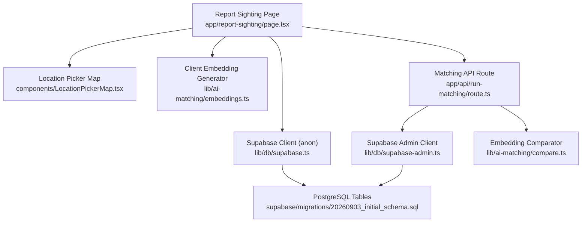
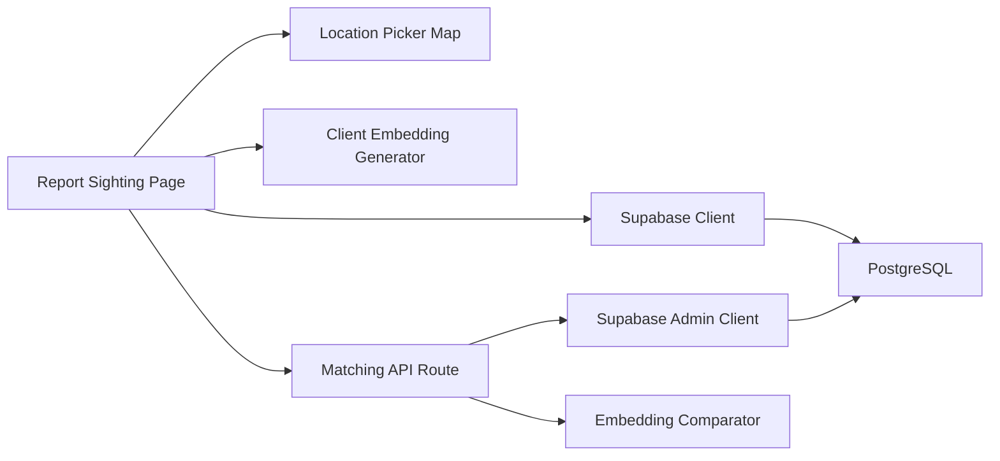

# Sighting Submission

<cite>
**Referenced Files in This Document**
- [page.tsx](file://app/report-sighting/page.tsx)
- [LocationPickerMap.tsx](file://components/LocationPickerMap.tsx)
- [route.ts](file://app/api/run-matching/route.ts)
- [embeddings.ts](file://lib/ai-matching/embeddings.ts)
- [compare.ts](file://lib/ai-matching/compare.ts)
- [supabase.ts](file://lib/db/supabase.ts)
- [supabase-admin.ts](file://lib/db/supabase-admin.ts)
- [20260903_initial_schema.sql](file://supabase/migrations/20260903_initial_schema.sql)
</cite>

## Table of Contents
1. [Introduction](#introduction)
2. [Project Structure](#project-structure)
3. [Core Components](#core-components)
4. [Architecture Overview](#architecture-overview)
5. [Detailed Component Analysis](#detailed-component-analysis)
6. [Dependency Analysis](#dependency-analysis)
7. [Performance Considerations](#performance-considerations)
8. [Troubleshooting Guide](#troubleshooting-guide)
9. [Conclusion](#conclusion)

## Introduction
This document explains the public sighting submission system that enables users to report sightings of missing persons. It covers:
- Interactive map integration using Leaflet for precise location selection and Nominatim geocoding for address search
- Client-side face detection and 128-dimensional embedding generation using @vladmandic/face-api
- Form structure with required photo and location, plus optional notes
- Error handling for face detection failures, map interactions, and location services
- The end-to-end submission workflow that persists data and triggers server-side matching against active cases
- User experience considerations for mobile devices and accessibility

## Project Structure
The sighting submission spans a Next.js client page, a reusable map component, an API route for matching, and supporting libraries for embeddings and database access.



**Diagram sources**
- [page.tsx:1-356](file://app/report-sighting/page.tsx#L1-L356)
- [LocationPickerMap.tsx:1-267](file://components/LocationPickerMap.tsx#L1-L267)
- [embeddings.ts:1-102](file://lib/ai-matching/embeddings.ts#L1-L102)
- [route.ts:1-186](file://app/api/run-matching/route.ts#L1-L186)
- [supabase.ts:1-13](file://lib/db/supabase.ts#L1-L13)
- [supabase-admin.ts:1-23](file://lib/db/supabase-admin.ts#L1-L23)
- [20260903_initial_schema.sql:1-199](file://supabase/migrations/20260903_initial_schema.sql#L1-L199)

**Section sources**
- [page.tsx:1-356](file://app/report-sighting/page.tsx#L1-L356)
- [LocationPickerMap.tsx:1-267](file://components/LocationPickerMap.tsx#L1-L267)
- [embeddings.ts:1-102](file://lib/ai-matching/embeddings.ts#L1-L102)
- [route.ts:1-186](file://app/api/run-matching/route.ts#L1-L186)
- [supabase.ts:1-13](file://lib/db/supabase.ts#L1-L13)
- [supabase-admin.ts:1-23](file://lib/db/supabase-admin.ts#L1-L23)
- [20260903_initial_schema.sql:1-199](file://supabase/migrations/20260903_initial_schema.sql#L1-L199)

## Core Components
- Report Sighting Page: Orchestrates authentication, photo upload, client-side face embedding, map interaction, form validation, and submission flow. Triggers matching after successful insert.
- Location Picker Map: Provides interactive Leaflet map with click-to-pin, browser geolocation fallback, and Nominatim search with debounced queries and result fly-to behavior.
- Matching API Route: Server-side process that fetches the sighting embedding, compares it against all active case embeddings, classifies match tiers, creates match records, and updates sighting status.
- Embedding Utilities: Loads face models once per session and generates a 128-d embedding from a user-uploaded image entirely in the browser.
- Database Layer: Supabase client for anon operations and admin client for service-role operations on the server.

**Section sources**
- [page.tsx:31-172](file://app/report-sighting/page.tsx#L31-L172)
- [LocationPickerMap.tsx:69-267](file://components/LocationPickerMap.tsx#L69-L267)
- [route.ts:10-186](file://app/api/run-matching/route.ts#L10-L186)
- [embeddings.ts:20-102](file://lib/ai-matching/embeddings.ts#L20-L102)
- [supabase.ts:1-13](file://lib/db/supabase.ts#L1-L13)
- [supabase-admin.ts:9-23](file://lib/db/supabase-admin.ts#L9-L23)

## Architecture Overview
The submission flow integrates client-side AI and mapping with server-side matching and persistence.

```mermaid
sequenceDiagram
participant U as "User"
participant P as "Report Sighting Page"
participant M as "Location Picker Map"
participant E as "Client Embedding Generator"
participant S as "Supabase Storage/DB"
participant R as "Matching API Route"
participant DB as "PostgreSQL"
U->>P : Upload photo
P->>E : generateClientEmbeddingFromFile(file)
E-->>P : {embedding|warning}
U->>M : Click map to drop pin
M-->>P : selectedLat, selectedLng
U->>P : Submit form
P->>S : Upload photo to storage
S-->>P : publicUrl
P->>S : Insert sighting row (with embedding, lat/lng, notes)
S-->>P : sightingId
P->>R : POST /api/run-matching {sightingId}
R->>DB : Fetch sighting embedding
R->>DB : Fetch active cases with embeddings
R->>R : Compare embeddings and classify tier
R->>DB : Insert match record; update sighting status
R-->>P : {success, match?}
P-->>U : Success UI
```

**Diagram sources**
- [page.tsx:70-172](file://app/report-sighting/page.tsx#L70-L172)
- [LocationPickerMap.tsx:91-184](file://components/LocationPickerMap.tsx#L91-L184)
- [embeddings.ts:51-102](file://lib/ai-matching/embeddings.ts#L51-L102)
- [route.ts:24-168](file://app/api/run-matching/route.ts#L24-L168)
- [20260903_initial_schema.sql:109-151](file://supabase/migrations/20260903_initial_schema.sql#L109-L151)

## Detailed Component Analysis

### Report Sighting Page
Responsibilities:
- Auth guard and preloading of face models
- Photo upload and preview
- Client-side face detection and embedding generation
- Validation of required fields (photo, precise location)
- Optional notes capture
- Persist sighting via Supabase Storage and DB
- Trigger server-side matching

Key behaviors:
- Uses dynamic import for Leaflet-based map to avoid SSR issues
- Preloads face models in background to reduce latency on first use
- Displays warnings when no face is detected but allows submission
- Validates presence of photo and coordinates before submission
- Uploads photo to storage bucket and inserts sighting with embedding and location
- Calls matching API after successful insertion

Error handling:
- Shows user-facing errors for missing fields, upload failures, and unexpected errors
- Gracefully handles absence of face detection by allowing submission without embedding

Accessibility and UX:
- Clear labels and hints for required fields
- Visual feedback during analysis and submission
- Keyboard-friendly controls and screen-reader friendly hidden inputs

**Section sources**
- [page.tsx:54-85](file://app/report-sighting/page.tsx#L54-L85)
- [page.tsx:92-172](file://app/report-sighting/page.tsx#L92-L172)
- [page.tsx:245-349](file://app/report-sighting/page.tsx#L245-L349)

### Location Picker Map
Responsibilities:
- Interactive Leaflet map with click-to-place pin
- Browser geolocation to center map if available
- Nominatim search with debounce and dropdown results
- Smooth fly-to animation when selecting a search result
- Display current selection coordinates or instruction hint

Key behaviors:
- Default center set to a specific region; can be overridden by geolocation
- Debounced search to limit requests to Nominatim
- Search results show display names; selecting one flies the map to that location
- Clicking anywhere on the map sets the selected coordinates used by the parent form

Error handling:
- Handles network errors and empty results gracefully
- Falls back to default center if geolocation fails

Mobile and accessibility:
- Responsive container with fixed height
- Clear instructions overlay for user guidance
- Accessible input and button elements

**Section sources**
- [LocationPickerMap.tsx:91-184](file://components/LocationPickerMap.tsx#L91-L184)
- [LocationPickerMap.tsx:186-267](file://components/LocationPickerMap.tsx#L186-L267)

### Matching API Route
Responsibilities:
- Validate input sightingId
- Retrieve sighting embedding (supports array or JSON string)
- Fetch all active cases with embeddings
- Compare sighting embedding against each case embedding
- Classify match into tiers based on thresholds
- Create match record and update sighting status

Thresholds and classification:
- Strong, notify, possible tiers determined by configured thresholds
- Contact sharing condition applied for strong matches when enabled

Error handling:
- Returns appropriate HTTP status codes for invalid input, not found, parsing errors, and server errors
- Logs detailed diagnostics for debugging

**Section sources**
- [route.ts:10-61](file://app/api/run-matching/route.ts#L10-L61)
- [route.ts:63-116](file://app/api/run-matching/route.ts#L63-L116)
- [route.ts:118-168](file://app/api/run-matching/route.ts#L118-L168)
- [route.ts:174-186](file://app/api/run-matching/route.ts#L174-L186)

### Client-Side Embedding Generation
Responsibilities:
- Load face detection, landmark, and recognition models once per session
- Generate a 128-dimensional embedding from a user-uploaded image in the browser
- Provide warning messages when face detection fails

Key behaviors:
- Models are cached to avoid repeated loading
- Converts descriptor to standard number array for storage
- Handles errors and returns null embedding with a user-friendly warning

**Section sources**
- [embeddings.ts:20-37](file://lib/ai-matching/embeddings.ts#L20-L37)
- [embeddings.ts:51-102](file://lib/ai-matching/embeddings.ts#L51-L102)

### Database Schema and Policies
Tables involved:
- profiles: Extends auth.users with contact info
- cases: Missing person reports with optional embedding and contact share flag
- sightings: Public submissions with photo URL, embedding, precise coordinates, and notes
- matches: Results linking cases and sightings with confidence score, tier, and contact sharing flag

Security:
- Row Level Security policies restrict access to relevant entities
- Admin client bypasses RLS for server-side matching operations

**Section sources**
- [20260903_initial_schema.sql:7-55](file://supabase/migrations/20260903_initial_schema.sql#L7-L55)
- [20260903_initial_schema.sql:58-104](file://supabase/migrations/20260903_initial_schema.sql#L58-L104)
- [20260903_initial_schema.sql:106-136](file://supabase/migrations/20260903_initial_schema.sql#L106-L136)
- [20260903_initial_schema.sql:138-199](file://supabase/migrations/20260903_initial_schema.sql#L138-L199)

## Dependency Analysis
High-level dependencies:
- Report Sighting Page depends on:
  - Supabase client for storage and DB writes
  - Client embedding generator for face detection
  - Location Picker Map for coordinate selection
  - Matching API route for post-submission processing
- Matching API Route depends on:
  - Supabase admin client for reading/writing with service role
  - Embedding comparator for scoring and threshold logic
  - PostgreSQL schema for sightings, cases, and matches



**Diagram sources**
- [page.tsx:14-23](file://app/report-sighting/page.tsx#L14-L23)
- [embeddings.ts:12-37](file://lib/ai-matching/embeddings.ts#L12-L37)
- [route.ts:2-8](file://app/api/run-matching/route.ts#L2-L8)
- [supabase-admin.ts:9-23](file://lib/db/supabase-admin.ts#L9-L23)
- [compare.ts:1-29](file://lib/ai-matching/compare.ts#L1-L29)
- [20260903_initial_schema.sql:109-151](file://supabase/migrations/20260903_initial_schema.sql#L109-L151)

**Section sources**
- [page.tsx:14-23](file://app/report-sighting/page.tsx#L14-L23)
- [embeddings.ts:12-37](file://lib/ai-matching/embeddings.ts#L12-L37)
- [route.ts:2-8](file://app/api/run-matching/route.ts#L2-L8)
- [supabase-admin.ts:9-23](file://lib/db/supabase-admin.ts#L9-L23)
- [compare.ts:1-29](file://lib/ai-matching/compare.ts#L1-L29)
- [20260903_initial_schema.sql:109-151](file://supabase/migrations/20260903_initial_schema.sql#L109-L151)

## Performance Considerations
- Model caching: Face models are loaded once per session to avoid repeated downloads and speed up subsequent detections.
- Debounced geocoding: Nominatim search uses a delay to reduce request volume while typing.
- Efficient comparisons: Matching iterates over active cases with embeddings; consider indexing or batching strategies if case volume grows significantly.
- Image handling: Object URLs are created and revoked promptly to manage memory usage.
- Network resilience: Geocoding and storage operations include error handling to prevent blocking the UI.

[No sources needed since this section provides general guidance]

## Troubleshooting Guide
Common issues and resolutions:
- No face detected:
  - Symptom: Warning displayed; embedding remains null.
  - Action: Encourage users to upload clearer photos with visible faces; submission still allowed.
  - Source references: [embeddings.ts:81-102](file://lib/ai-matching/embeddings.ts#L81-L102), [page.tsx:262-279](file://app/report-sighting/page.tsx#L262-L279)
- Geolocation unavailable:
  - Symptom: Map centers at default location; user must manually select pin.
  - Action: Ensure browser permissions allow location access; otherwise instruct manual pin placement.
  - Source references: [LocationPickerMap.tsx:91-107](file://components/LocationPickerMap.tsx#L91-L107)
- Nominatim search failures:
  - Symptom: Empty results or network errors.
  - Action: Retry later; verify connectivity; ensure correct User-Agent header is sent.
  - Source references: [LocationPickerMap.tsx:120-154](file://components/LocationPickerMap.tsx#L120-L154)
- Photo upload failure:
  - Symptom: Error message shown; submission blocked.
  - Action: Check storage bucket configuration and permissions; retry upload.
  - Source references: [page.tsx:118-127](file://app/report-sighting/page.tsx#L118-L127)
- Matching API errors:
  - Symptom: 400/404/500 responses; logs indicate parsing or DB errors.
  - Action: Verify sightingId format; check embedding presence; review server logs for details.
  - Source references: [route.ts:15-20](file://app/api/run-matching/route.ts#L15-L20), [route.ts:31-51](file://app/api/run-matching/route.ts#L31-L51), [route.ts:178-186](file://app/api/run-matching/route.ts#L178-L186)

**Section sources**
- [embeddings.ts:81-102](file://lib/ai-matching/embeddings.ts#L81-L102)
- [LocationPickerMap.tsx:91-107](file://components/LocationPickerMap.tsx#L91-L107)
- [LocationPickerMap.tsx:120-154](file://components/LocationPickerMap.tsx#L120-L154)
- [page.tsx:118-127](file://app/report-sighting/page.tsx#L118-L127)
- [route.ts:15-20](file://app/api/run-matching/route.ts#L15-L20)
- [route.ts:31-51](file://app/api/run-matching/route.ts#L31-L51)
- [route.ts:178-186](file://app/api/run-matching/route.ts#L178-L186)

## Conclusion
The sighting submission system combines an accessible, interactive map with robust client-side face detection and a secure server-side matching pipeline. Users can quickly provide essential information—photo, precise location, and optional notes—while the system automatically computes embeddings and runs matching against active cases. Error handling ensures resilience across network and device constraints, and the design supports mobile usability and accessibility best practices.

[No sources needed since this section summarizes without analyzing specific files]