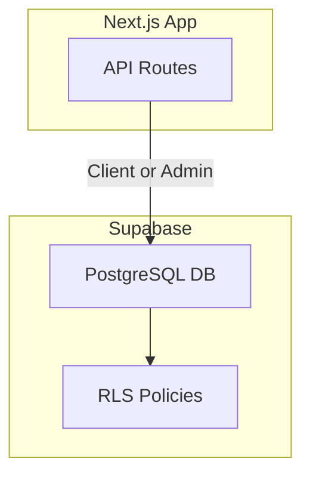
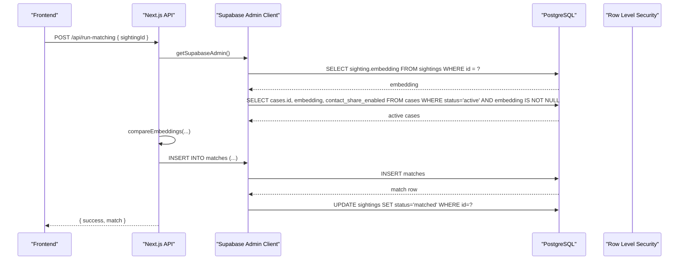
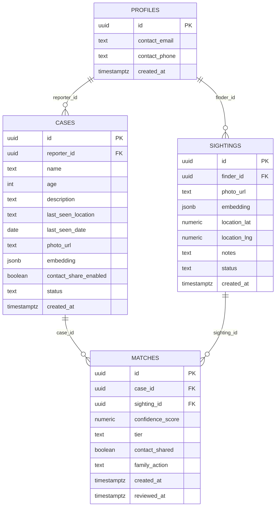
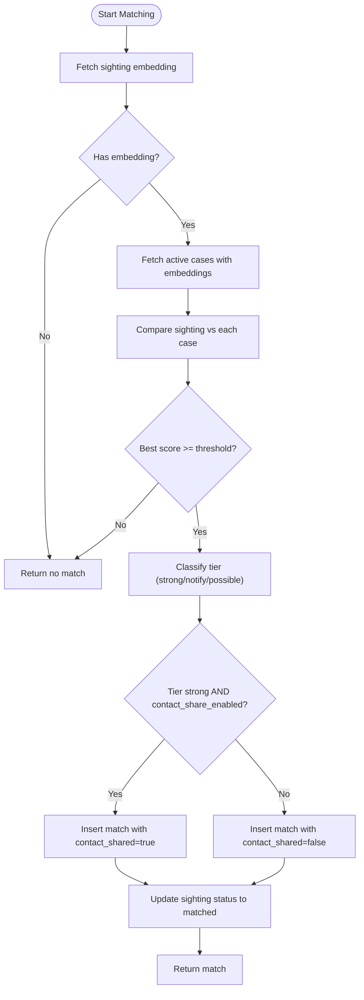
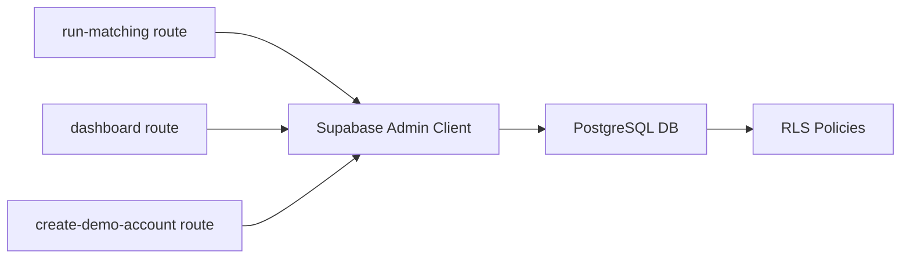

# Database Schema

<cite>
**Referenced Files in This Document**
- [20260903_initial_schema.sql](file://supabase/migrations/20260903_initial_schema.sql)
- [index.ts](file://types/index.ts)
- [route.ts](file://app/api/run-matching/route.ts)
- [route.ts](file://app/api/dashboard/route.ts)
- [route.ts](file://app/api/create-demo-account/route.ts)
- [supabase-admin.ts](file://lib/db/supabase-admin.ts)
- [supabase.ts](file://lib/db/supabase.ts)
</cite>

## Table of Contents
1. Introduction
2. Project Structure
3. Core Components
4. Architecture Overview
5. Detailed Component Analysis
6. Dependency Analysis
7. Performance Considerations
8. Troubleshooting Guide
9. Conclusion
10. Appendices

## Introduction
This document describes the Findora-alt database schema and data model, focusing on the relationships among cases, sightings, matches, and profiles. It details field definitions, constraints, validation rules, primary and foreign key relationships, Row Level Security (RLS) policies, indexing strategies, data lifecycle, retention considerations, backup procedures, migration management, and security measures implemented via RLS and server-side access controls.

## Project Structure
The database schema is defined in a Supabase PostgreSQL migration file. The application uses Next.js API routes to interact with the database through Supabase clients:
- Client-side client for standard operations under RLS
- Admin client for privileged operations that bypass RLS where necessary (e.g., matching engine)

**Section sources**
- [20260903_initial_schema.sql:1-199](file://supabase/migrations/20260903_initial_schema.sql#L1-L199)
- [supabase.ts:1-13](file://lib/db/supabase.ts#L1-L13)
- [supabase-admin.ts:1-23](file://lib/db/supabase-admin.ts#L1-L23)

## Core Components
The schema defines four core tables:
- profiles: User identity and contact information linked to auth.users
- cases: Missing person reports created by reporters
- sightings: Public submissions of potential sightings with location and optional face embedding
- matches: AI-driven associations between cases and sightings with confidence scores and tiers

Key characteristics:
- All tables are enabled with Row Level Security (RLS)
- Foreign keys enforce referential integrity with cascading deletes
- Enumerated fields use CHECK constraints to restrict values
- JSONB columns store face embeddings for similarity matching

**Section sources**
- [20260903_initial_schema.sql:7-12](file://supabase/migrations/20260903_initial_schema.sql#L7-L12)
- [20260903_initial_schema.sql:61-74](file://supabase/migrations/20260903_initial_schema.sql#L61-L74)
- [20260903_initial_schema.sql:109-119](file://supabase/migrations/20260903_initial_schema.sql#L109-L119)
- [20260903_initial_schema.sql:141-151](file://supabase/migrations/20260903_initial_schema.sql#L141-L151)

## Architecture Overview
The system enforces strict data access boundaries using RLS for client operations and admin privileges for server-only tasks like face matching.

**Diagram sources**
- [route.ts:10-186](file://app/api/run-matching/route.ts#L10-L186)
- [supabase-admin.ts:9-22](file://lib/db/supabase-admin.ts#L9-L22)
- [20260903_initial_schema.sql:109-119](file://supabase/migrations/20260903_initial_schema.sql#L109-L119)
- [20260903_initial_schema.sql:141-151](file://supabase/migrations/20260903_initial_schema.sql#L141-L151)

## Detailed Component Analysis

### Profiles
- Purpose: Extends Supabase auth.users with contact details and creation timestamp
- Primary Key: id (UUID) referencing auth.users(id) with CASCADE delete
- Fields:
  - contact_email: TEXT, NOT NULL
  - contact_phone: TEXT, nullable
  - created_at: TIMESTAMPTZ, default NOW(), NOT NULL
- Constraints:
  - RLS enabled; policies allow users to read, insert, and update only their own profile
- Lifecycle:
  - Created automatically via trigger after user signup
  - Updated by the owner; deletions cascade when auth.user is deleted

**Section sources**
- [20260903_initial_schema.sql:7-12](file://supabase/migrations/20260903_initial_schema.sql#L7-L12)
- [20260903_initial_schema.sql:14-34](file://supabase/migrations/20260903_initial_schema.sql#L14-L34)
- [20260903_initial_schema.sql:37-55](file://supabase/migrations/20260903_initial_schema.sql#L37-L55)

### Cases
- Purpose: Missing person reports submitted by reporters
- Primary Key: id (UUID, generated)
- Foreign Keys: reporter_id references profiles(id) with CASCADE delete
- Fields:
  - name: TEXT, NOT NULL
  - age: INT, NOT NULL
  - description: TEXT, NOT NULL
  - last_seen_location: TEXT, NOT NULL
  - last_seen_date: DATE, NOT NULL
  - photo_url: TEXT, NOT NULL
  - embedding: JSONB, nullable (face embedding vector)
  - contact_share_enabled: BOOLEAN, default FALSE, NOT NULL
  - status: TEXT, default 'active', CHECK IN ('active','resolved'), NOT NULL
  - created_at: TIMESTAMPTZ, default NOW(), NOT NULL
- Constraints:
  - RLS enabled; policies restrict CRUD to the reporter who owns the case
- Lifecycle:
  - Created by authenticated reporter
  - Status transitions from 'active' to 'resolved' by reporter via dashboard action
  - Deletions cascade to related matches

**Section sources**
- [20260903_initial_schema.sql:61-74](file://supabase/migrations/20260903_initial_schema.sql#L61-L74)
- [20260903_initial_schema.sql:76-103](file://supabase/migrations/20260903_initial_schema.sql#L76-L103)
- [route.ts:277-308](file://app/api/dashboard/route.ts#L277-L308)

### Sightings
- Purpose: Public submissions reporting a possible sighting with location and optional face embedding
- Primary Key: id (UUID, generated)
- Foreign Keys: finder_id references profiles(id) with CASCADE delete
- Fields:
  - photo_url: TEXT, NOT NULL
  - embedding: JSONB, nullable (face embedding vector)
  - location_lat: NUMERIC, NOT NULL
  - location_lng: NUMERIC, NOT NULL
  - notes: TEXT, nullable
  - status: TEXT, default 'pending', CHECK IN ('pending','matched','expired'), NOT NULL
  - created_at: TIMESTAMPTZ, default NOW(), NOT NULL
- Constraints:
  - RLS enabled; policies restrict visibility and inserts to the finder who submitted the sighting
- Lifecycle:
  - Created by authenticated finder
  - Status updated to 'matched' when a match is created by the matching pipeline
  - Deletions cascade to related matches

**Section sources**
- [20260903_initial_schema.sql:109-119](file://supabase/migrations/20260903_initial_schema.sql#L109-L119)
- [20260903_initial_schema.sql:121-135](file://supabase/migrations/20260903_initial_schema.sql#L121-L135)
- [route.ts:164-168](file://app/api/run-matching/route.ts#L164-L168)

### Matches
- Purpose: Associations between cases and sightings produced by face matching
- Primary Key: id (UUID, generated)
- Foreign Keys:
  - case_id references cases(id) with CASCADE delete
  - sighting_id references sightings(id) with CASCADE delete
- Fields:
  - confidence_score: NUMERIC, NOT NULL
  - tier: TEXT, CHECK IN ('strong','notify','possible'), NOT NULL
  - contact_shared: BOOLEAN, default FALSE, NOT NULL
  - family_action: TEXT, default 'none', CHECK IN ('none','different_person','resolved'), NOT NULL
  - created_at: TIMESTAMPTZ, default NOW(), NOT NULL
  - reviewed_at: TIMESTAMPTZ, nullable
- Constraints:
  - RLS enabled; policies allow:
    - Reporters to view/update matches for their cases
    - Finders to view matches for their sightings
- Lifecycle:
  - Created by matching pipeline when a sighting’s embedding meets thresholds against active cases
  - Updated by reporters to record family actions and review timestamps
  - Deleted when associated case or sighting is deleted

**Section sources**
- [20260903_initial_schema.sql:141-151](file://supabase/migrations/20260903_initial_schema.sql#L141-L151)
- [20260903_initial_schema.sql:153-199](file://supabase/migrations/20260903_initial_schema.sql#L153-L199)
- [route.ts:143-168](file://app/api/run-matching/route.ts#L143-L168)
- [route.ts:228-275](file://app/api/dashboard/route.ts#L228-L275)

### Entity Relationship Diagram

**Diagram sources**
- [20260903_initial_schema.sql:7-12](file://supabase/migrations/20260903_initial_schema.sql#L7-L12)
- [20260903_initial_schema.sql:61-74](file://supabase/migrations/20260903_initial_schema.sql#L61-L74)
- [20260903_initial_schema.sql:109-119](file://supabase/migrations/20260903_initial_schema.sql#L109-L119)
- [20260903_initial_schema.sql:141-151](file://supabase/migrations/20260903_initial_schema.sql#L141-L151)

### Data Flow: Matching Pipeline

**Diagram sources**
- [route.ts:10-186](file://app/api/run-matching/route.ts#L10-L186)

### Data Types and Validation Rules
- UUIDs: Used for all primary keys and foreign keys
- TEXT: Free-form strings for names, descriptions, locations, URLs
- INT: Age
- DATE: Last seen date
- NUMERIC: Latitude and longitude coordinates
- JSONB: Face embeddings stored as arrays or serialized strings; parsed server-side during matching
- BOOLEAN: Flags such as contact_share_enabled and contact_shared
- ENUM-like constraints via CHECK:
  - cases.status IN ('active','resolved')
  - sightings.status IN ('pending','matched','expired')
  - matches.tier IN ('strong','notify','possible')
  - matches.family_action IN ('none','different_person','resolved')

**Section sources**
- [20260903_initial_schema.sql:61-74](file://supabase/migrations/20260903_initial_schema.sql#L61-L74)
- [20260903_initial_schema.sql:109-119](file://supabase/migrations/20260903_initial_schema.sql#L109-L119)
- [20260903_initial_schema.sql:141-151](file://supabase/migrations/20260903_initial_schema.sql#L141-L151)

### Indexing Strategy
- Current schema does not define explicit indexes beyond primary keys
- Recommended indexes to improve query performance:
  - cases(reporter_id) to optimize reporter-scoped queries
  - cases(status) to filter active cases efficiently
  - sightings(finder_id) to optimize finder-scoped queries
  - matches(case_id), matches(sighting_id) to optimize joins and lookups
  - matches(tier), matches(confidence_score) for sorting/filtering
- Note: These are recommendations; they are not present in the current migration

[No sources needed since this section provides general guidance]

### Row Level Security (RLS) Policies
- profiles:
  - Users can select, insert, and update only rows where id equals their uid
- cases:
  - Reporters can select, insert, update, and delete only rows where reporter_id equals their uid
- sightings:
  - Finders can select and insert only rows where finder_id equals their uid
- matches:
  - Reporters can select and update matches for cases they own
  - Finders can select matches for sightings they submitted

These policies ensure fine-grained access control at the row level for client-side operations.

**Section sources**
- [20260903_initial_schema.sql:14-34](file://supabase/migrations/20260903_initial_schema.sql#L14-L34)
- [20260903_initial_schema.sql:76-103](file://supabase/migrations/20260903_initial_schema.sql#L76-L103)
- [20260903_initial_schema.sql:121-135](file://supabase/migrations/20260903_initial_schema.sql#L121-L135)
- [20260903_initial_schema.sql:153-199](file://supabase/migrations/20260903_initial_schema.sql#L153-L199)

### Data Lifecycle
- Creation:
  - Profile: Automatically created upon user signup via trigger
  - Case: Created by authenticated reporter
  - Sighting: Created by authenticated finder
  - Match: Created by server-side matching pipeline when thresholds are met
- Updates:
  - Case status transitions to 'resolved' by reporter
  - Match family_action and reviewed_at updated by reporter
  - Sighting status updated to 'matched' by matching pipeline
- Deletion:
  - Deleting a profile cascades to cases and sightings
  - Deleting a case or sighting cascades to matches

**Section sources**
- [20260903_initial_schema.sql:37-55](file://supabase/migrations/20260903_initial_schema.sql#L37-L55)
- [route.ts:277-308](file://app/api/dashboard/route.ts#L277-L308)
- [route.ts:164-168](file://app/api/run-matching/route.ts#L164-L168)

### Data Retention, Backup, and Migration Management
- Retention:
  - No explicit retention policies are defined in the schema; consider implementing periodic cleanup for expired sightings or resolved cases based on business needs
- Backup:
  - Use Supabase managed backups and point-in-time recovery features; schedule regular backups per organizational policy
- Migration Management:
  - Schema changes are versioned via Supabase migrations; apply new migrations incrementally and test thoroughly before deployment

[No sources needed since this section provides general guidance]

### Security Measures
- Encryption:
  - Transport encryption via HTTPS/TLS to Supabase
  - At-rest encryption handled by Supabase platform
- Access Controls:
  - RLS policies enforce per-row access for client operations
  - Server-side operations use Supabase Admin client with service role key to bypass RLS where necessary (e.g., matching pipeline)
- Privacy Protections:
  - Family contact information exposure controlled by contact_share_enabled and match tier logic
  - Finder views limited to their own sightings and associated matches

**Section sources**
- [20260903_initial_schema.sql:76-103](file://supabase/migrations/20260903_initial_schema.sql#L76-L103)
- [20260903_initial_schema.sql:153-199](file://supabase/migrations/20260903_initial_schema.sql#L153-L199)
- [route.ts:140-152](file://app/api/run-matching/route.ts#L140-L152)
- [supabase-admin.ts:1-23](file://lib/db/supabase-admin.ts#L1-L23)

## Dependency Analysis
The application layer depends on the database schema and uses two Supabase clients:
- Client client for standard operations under RLS
- Admin client for privileged operations that bypass RLS

**Diagram sources**
- [route.ts:10-186](file://app/api/run-matching/route.ts#L10-L186)
- [route.ts:4-316](file://app/api/dashboard/route.ts#L4-L316)
- [route.ts:4-67](file://app/api/create-demo-account/route.ts#L4-L67)
- [supabase-admin.ts:9-22](file://lib/db/supabase-admin.ts#L9-L22)

**Section sources**
- [route.ts:10-186](file://app/api/run-matching/route.ts#L10-L186)
- [route.ts:4-316](file://app/api/dashboard/route.ts#L4-L316)
- [route.ts:4-67](file://app/api/create-demo-account/route.ts#L4-L67)
- [supabase-admin.ts:9-22](file://lib/db/supabase-admin.ts#L9-L22)

## Performance Considerations
- Embedding comparisons run server-side; ensure efficient retrieval of active cases with embeddings
- Consider adding indexes on frequently filtered columns (status, reporter_id, finder_id)
- Batch operations where possible to reduce round trips
- Monitor query plans for large datasets and adjust indexes accordingly

[No sources needed since this section provides general guidance]

## Troubleshooting Guide
Common issues and resolutions:
- Missing environment variables:
  - Ensure NEXT_PUBLIC_SUPABASE_URL and NEXT_PUBLIC_SUPABASE_ANON_KEY are set for client operations
  - Ensure SUPABASE_SERVICE_ROLE_KEY is set for admin operations
- Unauthorized access:
  - Verify Authorization header format and token validity in dashboard endpoints
- Matching failures:
  - Confirm sighting has a valid embedding array or parseable string
  - Check that active cases have embeddings and status is 'active'
- Policy violations:
  - Validate that client requests adhere to RLS policies; use admin client only for server-only tasks

**Section sources**
- [supabase.ts:3-10](file://lib/db/supabase.ts#L3-L10)
- [supabase-admin.ts:6-14](file://lib/db/supabase-admin.ts#L6-L14)
- [route.ts:6-22](file://app/api/dashboard/route.ts#L6-L22)
- [route.ts:15-51](file://app/api/run-matching/route.ts#L15-L51)

## Conclusion
The Findora-alt database schema implements a secure, role-based data model with robust RLS policies to protect sensitive information while enabling powerful matching capabilities. The separation of client and admin access ensures privacy and correctness. Future enhancements should include indexing for performance, explicit retention policies, and comprehensive monitoring.

[No sources needed since this section summarizes without analyzing specific files]

## Appendices

### Type Definitions Alignment
The TypeScript types align closely with the database schema, providing compile-time safety for application code.

**Section sources**
- [index.ts:1-56](file://types/index.ts#L1-L56)