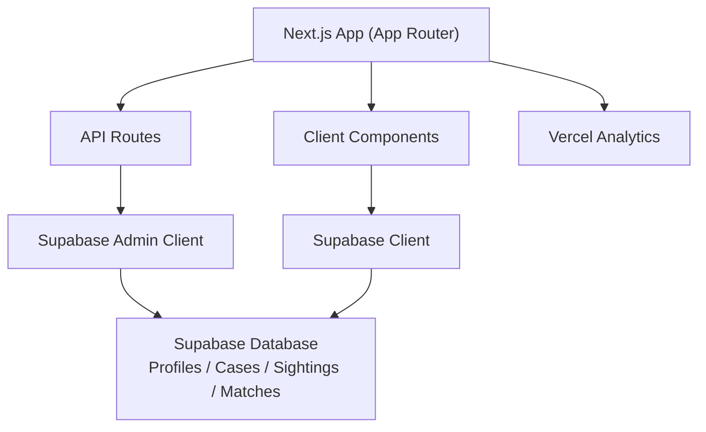
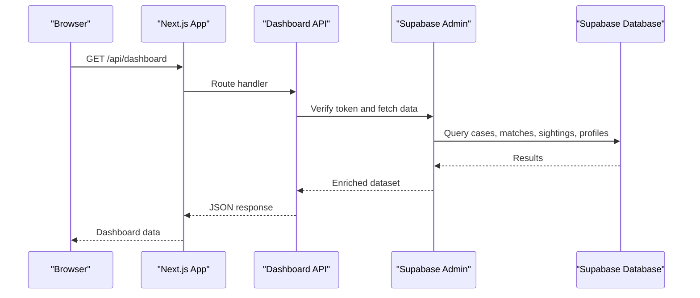
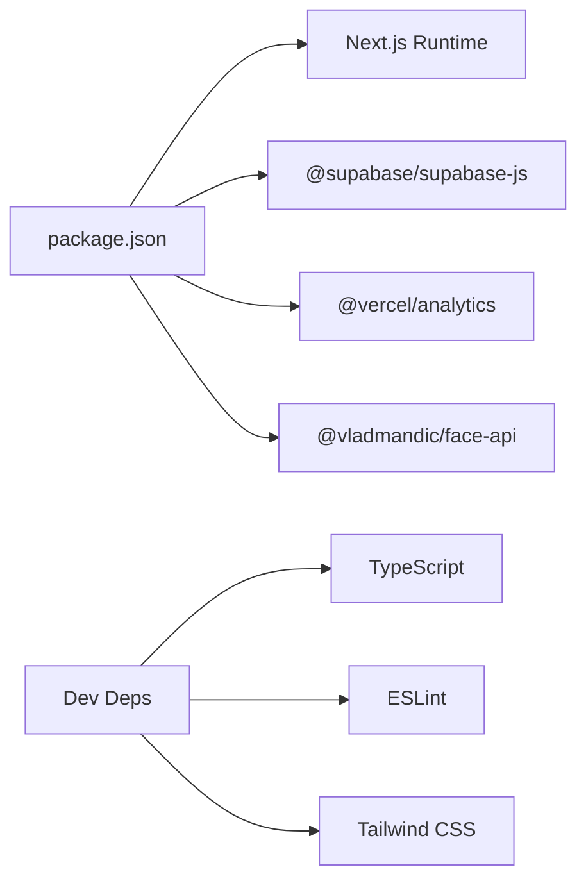

# Deployment Guide

<cite>
**Referenced Files in This Document**
- [package.json](file://package.json)
- [next.config.ts](file://next.config.ts)
- [README.md](file://README.md)
- [app/layout.tsx](file://app/layout.tsx)
- [lib/db/supabase.ts](file://lib/db/supabase.ts)
- [lib/db/supabase-admin.ts](file://lib/db/supabase-admin.ts)
- [lib/auth/index.ts](file://lib/auth/index.ts)
- [lib/auth/session.ts](file://lib/auth/session.ts)
- [app/api/create-demo-account/route.ts](file://app/api/create-demo-account/route.ts)
- [app/api/dashboard/route.ts](file://app/api/dashboard/route.ts)
- [supabase/migrations/20260903_initial_schema.sql](file://supabase/migrations/20260903_initial_schema.sql)
</cite>

## Table of Contents
1. Introduction
2. Project Structure
3. Core Components
4. Architecture Overview
5. Detailed Component Analysis
6. Dependency Analysis
7. Performance Considerations
8. Troubleshooting Guide
9. Conclusion
10. Appendices

## Introduction
This deployment guide covers production setup for the Findora-alt Next.js application, including environment variables, Supabase configuration, build optimization, Vercel deployment steps, Docker containerization options, CI/CD pipeline guidance, monitoring with Vercel Analytics, performance tuning, and operational procedures such as rollback, backup, and disaster recovery.

## Project Structure
Findora-alt is a Next.js App Router project that:
- Uses Supabase for authentication and database access via client and admin clients
- Exposes server routes for dashboard operations and demo account creation
- Integrates Vercel Analytics at the root layout level
- Defines a PostgreSQL schema with Row Level Security policies for profiles, cases, sightings, and matches

**Diagram sources**
- [app/layout.tsx:1-34](file://app/layout.tsx#L1-L34)
- [lib/db/supabase.ts:1-12](file://lib/db/supabase.ts#L1-L12)
- [lib/db/supabase-admin.ts:1-22](file://lib/db/supabase-admin.ts#L1-L22)
- [app/api/dashboard/route.ts:1-316](file://app/api/dashboard/route.ts#L1-L316)
- [supabase/migrations/20260903_initial_schema.sql:1-199](file://supabase/migrations/20260903_initial_schema.sql#L1-L199)

**Section sources**
- [package.json:1-33](file://package.json#L1-L33)
- [next.config.ts:1-8](file://next.config.ts#L1-L8)
- [README.md:1-37](file://README.md#L1-L37)
- [app/layout.tsx:1-34](file://app/layout.tsx#L1-L34)

## Core Components
- Supabase client initialization for browser usage
- Supabase admin client for server-only operations
- Authentication helpers and session utilities
- API routes for dashboard data aggregation and demo account creation
- Database schema with RLS policies for secure multi-role access

Key responsibilities:
- Securely initialize Supabase clients using environment variables
- Validate and enforce authorization in API routes
- Provide enriched dashboard responses by joining cases, matches, sightings, and profiles
- Create demo accounts and ensure profile rows exist on demand

**Section sources**
- [lib/db/supabase.ts:1-12](file://lib/db/supabase.ts#L1-L12)
- [lib/db/supabase-admin.ts:1-22](file://lib/db/supabase-admin.ts#L1-L22)
- [lib/auth/index.ts:1-19](file://lib/auth/index.ts#L1-L19)
- [lib/auth/session.ts:1-34](file://lib/auth/session.ts#L1-L34)
- [app/api/create-demo-account/route.ts:1-67](file://app/api/create-demo-account/route.ts#L1-L67)
- [app/api/dashboard/route.ts:1-316](file://app/api/dashboard/route.ts#L1-L316)
- [supabase/migrations/20260903_initial_schema.sql:1-199](file://supabase/migrations/20260903_initial_schema.sql#L1-L199)

## Architecture Overview
The runtime architecture separates client-side and server-side concerns:
- Client components use the public Supabase client to read/write under RLS policies
- Server routes use the admin client to perform privileged operations and aggregate data
- The root layout injects Vercel Analytics for tracking user interactions

**Diagram sources**
- [app/api/dashboard/route.ts:1-316](file://app/api/dashboard/route.ts#L1-L316)
- [lib/db/supabase-admin.ts:1-22](file://lib/db/supabase-admin.ts#L1-L22)
- [supabase/migrations/20260903_initial_schema.sql:1-199](file://supabase/migrations/20260903_initial_schema.sql#L1-L199)

## Detailed Component Analysis

### Environment Variables and Supabase Configuration
- Public client requires:
  - NEXT_PUBLIC_SUPABASE_URL
  - NEXT_PUBLIC_SUPABASE_ANON_KEY
- Admin client requires:
  - NEXT_PUBLIC_SUPABASE_URL
  - SUPABASE_SERVICE_ROLE_KEY
- Missing variables trigger warnings or errors during initialization

Operational notes:
- Never expose the service role key to the browser
- Ensure environment variables are set per environment (development, preview, production)

**Section sources**
- [lib/db/supabase.ts:1-12](file://lib/db/supabase.ts#L1-L12)
- [lib/db/supabase-admin.ts:1-22](file://lib/db/supabase-admin.ts#L1-L22)

### Authentication and Session Handling
- Session retrieval helper returns current user info or unauthenticated state
- Sign-out utility delegates to Supabase auth
- Used by client flows to gate UI and calls

**Section sources**
- [lib/auth/session.ts:1-34](file://lib/auth/session.ts#L1-L34)
- [lib/auth/index.ts:1-19](file://lib/auth/index.ts#L1-L19)

### API: Demo Account Creation
- POST route creates a user via Supabase admin API with email confirmation enabled
- Upserts a profile row linked to the new user
- Returns success payload or error details

Security considerations:
- Use this endpoint only in controlled environments or behind additional protections

**Section sources**
- [app/api/create-demo-account/route.ts:1-67](file://app/api/create-demo-account/route.ts#L1-L67)

### API: Dashboard Aggregation
- GET verifies the request token and authorizes the caller
- Fetches reporter’s cases and finder’s sightings
- Joins matches and sighting/case/profile details to produce enriched responses
- POST supports family actions (update match fields, resolve case) with ownership checks

Data flow highlights:
- Queries cases and sightings by authenticated user
- Aggregates related matches and enriches with sighting and profile data
- Updates match records and case status upon authorized actions

**Section sources**
- [app/api/dashboard/route.ts:1-316](file://app/api/dashboard/route.ts#L1-L316)

### Database Schema and Security Policies
- Tables: profiles, cases, sightings, matches
- Row Level Security policies restrict access by user roles
- Triggers auto-create profile entries on user signup
- Status enums constrain case and sighting lifecycle states

Deployment note:
- Apply migrations to your Supabase project before running the app in production

**Section sources**
- [supabase/migrations/20260903_initial_schema.sql:1-199](file://supabase/migrations/20260903_initial_schema.sql#L1-L199)

### Monitoring and Analytics
- Vercel Analytics is included in the root layout
- No additional configuration required beyond deploying on Vercel

**Section sources**
- [app/layout.tsx:1-34](file://app/layout.tsx#L1-L34)

## Dependency Analysis
Runtime dependencies relevant to deployment:
- Next.js framework and scripts for dev/build/start
- Supabase JS client for database and auth
- Vercel Analytics for frontend telemetry
- Face recognition libraries present in package.json (used by AI matching modules)

Build-time tooling:
- TypeScript, ESLint, Tailwind CSS configured via devDependencies

**Diagram sources**
- [package.json:1-33](file://package.json#L1-L33)

**Section sources**
- [package.json:1-33](file://package.json#L1-L33)

## Performance Considerations
- Build optimization
  - Use the standard Next.js build process; keep next.config.ts minimal unless custom optimizations are needed
- Asset optimization
  - Prefer static assets in public directory; leverage Next.js font optimization already configured
- Caching strategies
  - Rely on Next.js caching defaults; add cache headers in API routes if serving large datasets
- Database connection pooling
  - Supabase manages connections; avoid excessive concurrent queries from serverless functions by batching where possible
- Frontend analytics
  - Vercel Analytics adds minimal overhead and provides useful insights out of the box

[No sources needed since this section provides general guidance]

## Troubleshooting Guide
Common issues and resolutions:
- Missing Supabase environment variables
  - Symptoms: Console warnings or runtime errors when initializing clients
  - Resolution: Set NEXT_PUBLIC_SUPABASE_URL, NEXT_PUBLIC_SUPABASE_ANON_KEY, and SUPABASE_SERVICE_ROLE_KEY in your deployment platform
- Unauthorized dashboard requests
  - Symptoms: 401 responses from dashboard API
  - Resolution: Ensure Authorization header includes a valid bearer token
- Profile not created after demo account
  - Symptoms: Missing profile row for newly created users
  - Resolution: The route upserts profiles; check logs for errors and verify migration applied

**Section sources**
- [lib/db/supabase.ts:1-12](file://lib/db/supabase.ts#L1-L12)
- [lib/db/supabase-admin.ts:1-22](file://lib/db/supabase-admin.ts#L1-L22)
- [app/api/dashboard/route.ts:1-316](file://app/api/dashboard/route.ts#L1-L316)
- [app/api/create-demo-account/route.ts:1-67](file://app/api/create-demo-account/route.ts#L1-L67)

## Conclusion
Findora-alt is a Next.js application integrated with Supabase for authentication and data, with server routes handling sensitive operations and a secure database schema. Deploy to Vercel for seamless builds and hosting, configure environment variables, apply database migrations, and enable Vercel Analytics for monitoring. Follow the performance and operational recommendations to ensure a reliable production experience.

## Appendices

### Production Environment Setup
- Required environment variables
  - NEXT_PUBLIC_SUPABASE_URL
  - NEXT_PUBLIC_SUPABASE_ANON_KEY
  - SUPABASE_SERVICE_ROLE_KEY
- Apply database migrations to your Supabase project before first run
- Verify analytics integration by checking network requests in production

**Section sources**
- [lib/db/supabase.ts:1-12](file://lib/db/supabase.ts#L1-L12)
- [lib/db/supabase-admin.ts:1-22](file://lib/db/supabase-admin.ts#L1-L22)
- [supabase/migrations/20260903_initial_schema.sql:1-199](file://supabase/migrations/20260903_initial_schema.sql#L1-L199)
- [app/layout.tsx:1-34](file://app/layout.tsx#L1-L34)

### Build Process Optimization
- Use the provided npm scripts for development, building, and starting the app
- Keep next.config.ts minimal; add targeted optimizations only when necessary
- Leverage Next.js built-in optimizations for fonts and static assets

**Section sources**
- [package.json:1-33](file://package.json#L1-L33)
- [next.config.ts:1-8](file://next.config.ts#L1-L8)
- [README.md:1-37](file://README.md#L1-L37)

### Vercel Deployment Instructions
- Connect your repository to Vercel
- Configure environment variables in Vercel settings
- Deploy using the Next.js preset; Vercel will detect the project automatically
- Add a custom domain in Vercel settings and configure DNS as instructed
- Enable Vercel Analytics (already integrated in the app)

**Section sources**
- [README.md:32-37](file://README.md#L32-L37)
- [app/layout.tsx:1-34](file://app/layout.tsx#L1-L34)

### Docker Containerization Options
- Use a Node-based image to build and serve the Next.js app
- Build step runs the standard Next.js build command
- Serve with the Next.js start script
- Inject environment variables at runtime through your container orchestration platform

[No sources needed since this section provides general guidance]

### CI/CD Pipeline Setup
- Trigger builds on push to main or release branches
- Cache node_modules to speed up builds
- Run linting and tests (if added)
- Deploy to Vercel using the Vercel CLI or GitHub integration
- Protect production deployments with branch rules and approvals

[No sources needed since this section provides general guidance]

### Monitoring and Analytics
- Vercel Analytics is embedded in the root layout
- View metrics in the Vercel dashboard without additional code changes

**Section sources**
- [app/layout.tsx:1-34](file://app/layout.tsx#L1-L34)

### Rollback Procedures
- Revert code changes and redeploy to the previous stable version
- If database schema changes caused issues, restore from backups or roll back migrations if supported by your workflow
- Monitor error rates and latency post-deployment to validate stability

[No sources needed since this section provides general guidance]

### Backup Strategies
- Schedule regular backups of your Supabase database
- Export critical tables (cases, sightings, matches, profiles) periodically
- Store backups securely and test restoration procedures regularly

[No sources needed since this section provides general guidance]

### Disaster Recovery Planning
- Define RTO and RPO targets for your service
- Maintain documented runbooks for restoring from backups and re-applying migrations
- Test recovery procedures periodically to ensure readiness

[No sources needed since this section provides general guidance]