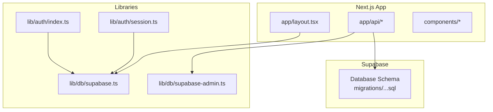
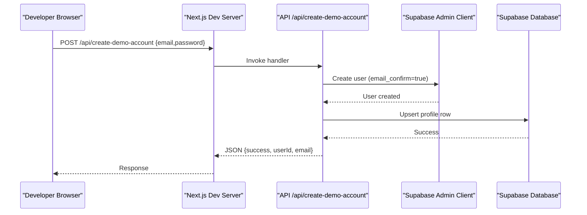
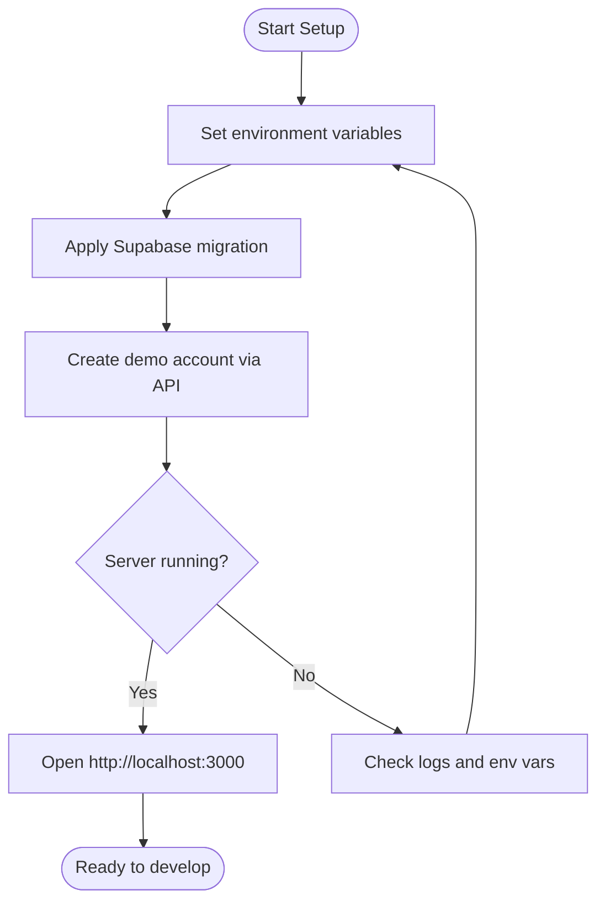
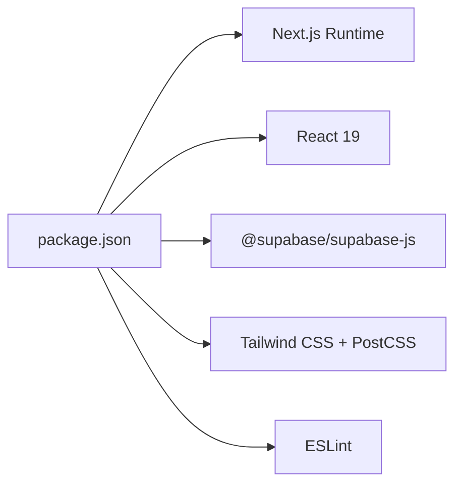

# Getting Started

<cite>
**Referenced Files in This Document**
- [package.json](file://package.json)
- [README.md](file://README.md)
- [next.config.ts](file://next.config.ts)
- [app/layout.tsx](file://app/layout.tsx)
- [lib/db/supabase.ts](file://lib/db/supabase.ts)
- [lib/db/supabase-admin.ts](file://lib/db/supabase-admin.ts)
- [lib/auth/index.ts](file://lib/auth/index.ts)
- [lib/auth/session.ts](file://lib/auth/session.ts)
- [app/api/create-demo-account/route.ts](file://app/api/create-demo-account/route.ts)
- [supabase/migrations/20260903_initial_schema.sql](file://supabase/migrations/20260903_initial_schema.sql)
</cite>

## Table of Contents
1. Introduction
2. Project Structure
3. Core Components
4. Architecture Overview
5. Detailed Component Analysis
6. Dependency Analysis
7. Performance Considerations
8. Troubleshooting Guide
9. Conclusion
10. Appendices

## Introduction
This guide helps you set up and run the Findora-alt project locally for development. You will install dependencies, configure Supabase environment variables, apply database migrations, and start the Next.js development server to access the application at http://localhost:3000.

## Project Structure
Findora-alt is a Next.js app that integrates with Supabase for authentication and data storage. It includes API routes for server-side operations (e.g., creating demo accounts), client-facing pages, and shared libraries for database and auth utilities.

**Diagram sources**
- [app/layout.tsx:1-34](file://app/layout.tsx#L1-L34)
- [lib/db/supabase.ts:1-12](file://lib/db/supabase.ts#L1-L12)
- [lib/db/supabase-admin.ts:1-23](file://lib/db/supabase-admin.ts#L1-L23)
- [lib/auth/index.ts:1-19](file://lib/auth/index.ts#L1-L19)
- [lib/auth/session.ts:1-34](file://lib/auth/session.ts#L1-L34)
- [supabase/migrations/20260903_initial_schema.sql:1-199](file://supabase/migrations/20260903_initial_schema.sql#L1-L199)

**Section sources**
- [package.json:1-33](file://package.json#L1-L33)
- [next.config.ts:1-8](file://next.config.ts#L1-L8)
- [app/layout.tsx:1-34](file://app/layout.tsx#L1-L34)

## Core Components
- Next.js Application: Provides routing, build scripts, and dev server commands.
- Supabase Client: Public client for browser and serverless functions using anon key.
- Supabase Admin Client: Server-only client using service role key for privileged operations.
- Auth Utilities: Helpers to get current user and session state.
- Database Migrations: SQL schema defining profiles, cases, sightings, matches, and Row Level Security policies.

Key responsibilities:
- Environment-driven configuration via process.env for Supabase URL and keys.
- Server route to create a demo account using admin API and ensure profile row exists.
- Migration file defines tables and triggers to auto-create profiles on user signup.

**Section sources**
- [lib/db/supabase.ts:1-12](file://lib/db/supabase.ts#L1-L12)
- [lib/db/supabase-admin.ts:1-23](file://lib/db/supabase-admin.ts#L1-L23)
- [lib/auth/index.ts:1-19](file://lib/auth/index.ts#L1-L19)
- [lib/auth/session.ts:1-34](file://lib/auth/session.ts#L1-L34)
- [app/api/create-demo-account/route.ts:1-67](file://app/api/create-demo-account/route.ts#L1-L67)
- [supabase/migrations/20260903_initial_schema.sql:1-199](file://supabase/migrations/20260903_initial_schema.sql#L1-L199)

## Architecture Overview
The app uses Next.js API routes to perform server-side actions with Supabase’s admin client, while client code uses the public client for auth and data access. The migration sets up tables and RLS policies to secure data by user identity.

**Diagram sources**
- [app/api/create-demo-account/route.ts:1-67](file://app/api/create-demo-account/route.ts#L1-L67)
- [lib/db/supabase-admin.ts:1-23](file://lib/db/supabase-admin.ts#L1-L23)
- [supabase/migrations/20260903_initial_schema.sql:1-199](file://supabase/migrations/20260903_initial_schema.sql#L1-L199)

## Detailed Component Analysis

### Prerequisites
- Node.js: Use a recent LTS version compatible with Next.js 16.x and React 19.x.
- Package Manager: npm, yarn, pnpm, or bun are supported by the project scripts.
- Supabase Account: Required to host the database and provide environment variables.

Notes:
- The project scripts support multiple package managers out of the box.
- The app reads Supabase credentials from environment variables at runtime.

**Section sources**
- [package.json:5-31](file://package.json#L5-L31)
- [lib/db/supabase.ts:1-12](file://lib/db/supabase.ts#L1-L12)

### Installation Steps
1. Clone the repository and open the project directory.
2. Install dependencies using your preferred package manager:
   - npm install
   - yarn install
   - pnpm install
   - bun install
3. Start the development server:
   - npm run dev
   - yarn dev
   - pnpm dev
   - bun dev
4. Open http://localhost:3000 in your browser.

Verification:
- The dev server should compile and serve the app without errors.
- If you see warnings about missing Supabase environment variables, proceed to environment setup below.

**Section sources**
- [package.json:5-10](file://package.json#L5-L10)
- [README.md:3-17](file://README.md#L3-L17)

### Environment Variables Setup
Create a .env.local file in the project root with the following keys:
- NEXT_PUBLIC_SUPABASE_URL: Your Supabase project URL.
- NEXT_PUBLIC_SUPABASE_ANON_KEY: Anon key for client-side access.
- SUPABASE_SERVICE_ROLE_KEY: Service role key for server-side admin operations.

Important:
- NEXT_PUBLIC_* keys are exposed to the browser; keep them limited to anon permissions.
- SUPABASE_SERVICE_ROLE_KEY must never be used in client code.

Runtime behavior:
- The public client warns if required keys are missing.
- The admin client throws an error if required keys are missing.

**Section sources**
- [lib/db/supabase.ts:1-12](file://lib/db/supabase.ts#L1-L12)
- [lib/db/supabase-admin.ts:1-23](file://lib/db/supabase-admin.ts#L1-L23)

### Supabase Project Initialization
1. Create a new Supabase project and note the project URL and keys.
2. Apply the provided migration to create tables and policies:
   - Run the SQL file in the Supabase SQL Editor or use the CLI to apply migrations.
3. Verify tables exist:
   - profiles, cases, sightings, matches
4. Confirm Row Level Security policies are enabled for each table.

What the migration does:
- Creates profiles linked to auth.users and enables RLS.
- Creates cases, sightings, and matches tables with appropriate constraints and RLS policies.
- Adds a trigger to auto-create a profile entry when a new user signs up.

**Section sources**
- [supabase/migrations/20260903_initial_schema.sql:1-199](file://supabase/migrations/20260903_initial_schema.sql#L1-L199)

### Authentication Configuration
- Sign-in/sign-up flows rely on Supabase Auth using the anon client.
- Session helpers retrieve current session and user ID safely.
- For server-side privileged operations (e.g., demo account creation), use the admin client.

Recommended steps:
- Ensure Email provider is enabled in Supabase if you plan to use email sign-ups.
- For local development, you can bypass email confirmation by using the demo account endpoint.

**Section sources**
- [lib/auth/index.ts:1-19](file://lib/auth/index.ts#L1-L19)
- [lib/auth/session.ts:1-34](file://lib/auth/session.ts#L1-L34)
- [lib/db/supabase.ts:1-12](file://lib/db/supabase.ts#L1-L12)

### Model File Deployment
- The migration file acts as the canonical model/schema definition for the database.
- Deploy it once to your Supabase project to establish the schema and policies.
- Future changes should be added as new migrations to maintain versioning.

**Section sources**
- [supabase/migrations/20260903_initial_schema.sql:1-199](file://supabase/migrations/20260903_initial_schema.sql#L1-L199)

### First-Time Setup Workflow
1. Set environment variables as described above.
2. Apply the initial migration in Supabase.
3. Create a demo account via the API route to quickly test functionality without email confirmation:
   - Send a POST request to /api/create-demo-account with email and password.
   - The route creates the user and ensures a profile row exists.
4. Access the app at http://localhost:3000 and verify login flows work with the created account.

[No diagram sources needed since this diagram shows conceptual workflow]

**Section sources**
- [app/api/create-demo-account/route.ts:1-67](file://app/api/create-demo-account/route.ts#L1-L67)
- [lib/db/supabase-admin.ts:1-23](file://lib/db/supabase-admin.ts#L1-L23)
- [supabase/migrations/20260903_initial_schema.sql:1-199](file://supabase/migrations/20260903_initial_schema.sql#L1-L199)

## Dependency Analysis
The app depends on Next.js, React, Supabase JS client, and UI libraries. Scripts define how to run dev, build, and lint tasks.

**Diagram sources**
- [package.json:11-31](file://package.json#L11-L31)

**Section sources**
- [package.json:1-33](file://package.json#L1-L33)

## Performance Considerations
- Keep environment variables minimal and scoped to their intended audience (public vs server-only).
- Avoid heavy computations in client components; offload to server routes where possible.
- Use Supabase RLS to enforce data access rules at the database layer.

[No sources needed since this section provides general guidance]

## Troubleshooting Guide
Common issues and resolutions:
- Missing Supabase environment variables:
  - Symptom: Console warning about missing NEXT_PUBLIC_SUPABASE_URL or NEXT_PUBLIC_SUPABASE_ANON_KEY.
  - Resolution: Add the required keys to .env.local and restart the dev server.
- Admin client errors:
  - Symptom: Error thrown indicating missing NEXT_PUBLIC_SUPABASE_URL or SUPABASE_SERVICE_ROLE_KEY.
  - Resolution: Ensure both keys are present in .env.local and the server has access to them.
- Demo account creation fails:
  - Symptom: 400 or 500 response from /api/create-demo-account.
  - Resolution: Check network requests, confirm environment variables, and verify Supabase project settings.
- Migration not applied:
  - Symptom: Tables or policies missing in Supabase.
  - Resolution: Run the migration SQL in Supabase SQL Editor or CLI.

Verification checklist:
- Dev server starts without errors.
- Console shows no Supabase environment variable warnings.
- API route responds successfully when creating a demo account.
- Supabase tables and policies exist after applying the migration.

**Section sources**
- [lib/db/supabase.ts:1-12](file://lib/db/supabase.ts#L1-L12)
- [lib/db/supabase-admin.ts:1-23](file://lib/db/supabase-admin.ts#L1-L23)
- [app/api/create-demo-account/route.ts:1-67](file://app/api/create-demo-account/route.ts#L1-L67)
- [supabase/migrations/20260903_initial_schema.sql:1-199](file://supabase/migrations/20260903_initial_schema.sql#L1-L199)

## Conclusion
You now have everything needed to set up Findora-alt locally: install dependencies, configure Supabase, apply the migration, and run the development server. Use the demo account endpoint to quickly validate authentication and database integration. Refer to the troubleshooting section if you encounter common setup issues.

[No sources needed since this section summarizes without analyzing specific files]

## Appendices

### Running the Development Server
Use any of the following commands based on your package manager:
- npm run dev
- yarn dev
- pnpm dev
- bun dev

After starting, open http://localhost:3000 in your browser.

**Section sources**
- [package.json:5-10](file://package.json#L5-L10)
- [README.md:3-17](file://README.md#L3-L17)