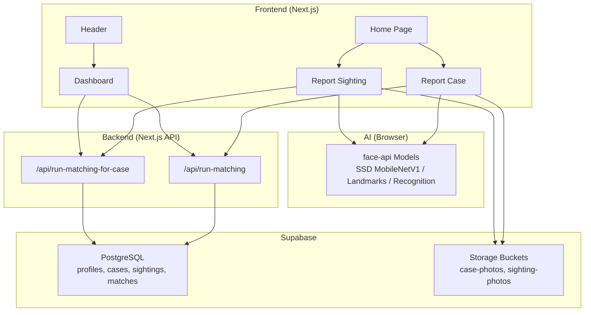
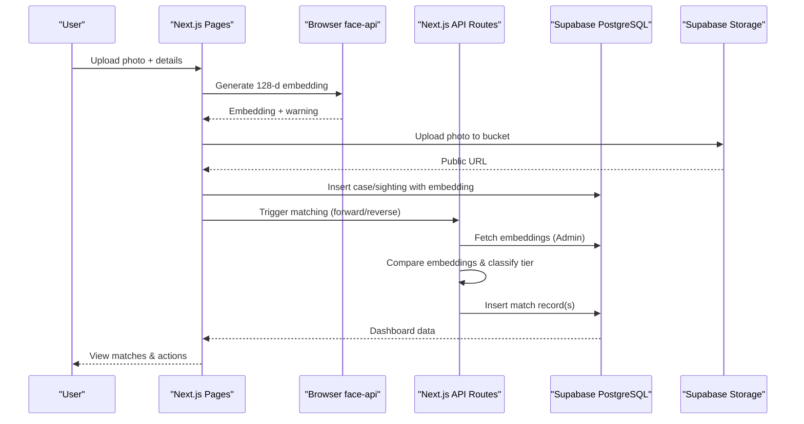
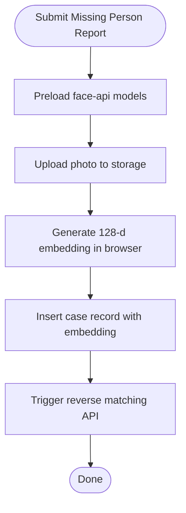
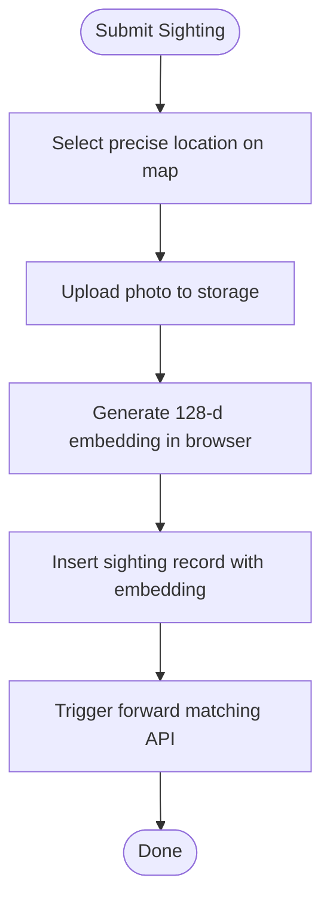
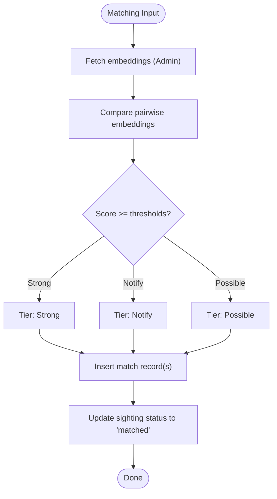
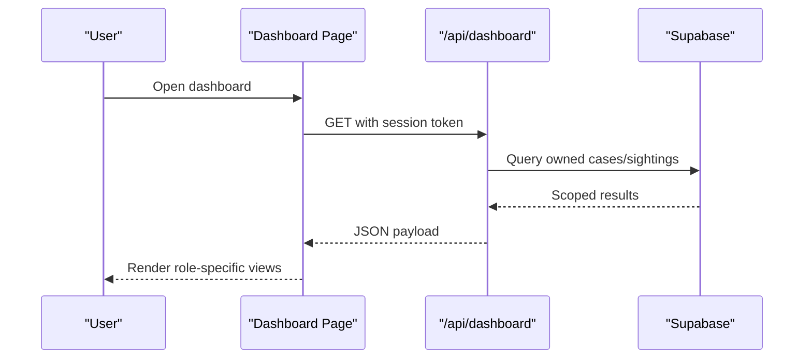
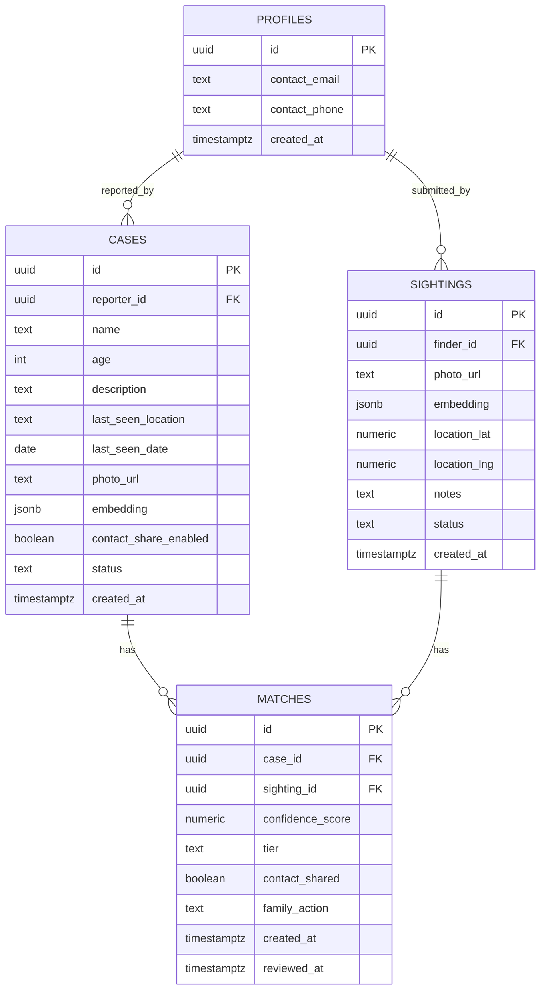

# Project Overview

<cite>
**Referenced Files in This Document**
- [README.md](file://README.md)
- [package.json](file://package.json)
- [app/page.tsx](file://app/page.tsx)
- [app/report-case/page.tsx](file://app/report-case/page.tsx)
- [app/report-sighting/page.tsx](file://app/report-sighting/page.tsx)
- [app/dashboard/page.tsx](file://app/dashboard/page.tsx)
- [components/Header.tsx](file://components/Header.tsx)
- [lib/ai-matching/embeddings.ts](file://lib/ai-matching/embeddings.ts)
- [app/api/run-matching/route.ts](file://app/api/run-matching/route.ts)
- [app/api/run-matching-for-case/route.ts](file://app/api/run-matching-for-case/route.ts)
- [supabase/migrations/20260903_initial_schema.sql](file://supabase/migrations/20260903_initial_schema.sql)
</cite>

## Table of Contents
1. [Introduction](#introduction)
2. [Project Structure](#project-structure)
3. [Core Components](#core-components)
4. [Architecture Overview](#architecture-overview)
5. [Detailed Component Analysis](#detailed-component-analysis)
6. [Dependency Analysis](#dependency-analysis)
7. [Performance Considerations](#performance-considerations)
8. [Troubleshooting Guide](#troubleshooting-guide)
9. [Conclusion](#conclusion)

## Introduction
Findora is a privacy-first, AI-powered platform designed to reunite missing persons with their families using automated facial recognition. The system enables family members to report missing persons and allows the public to submit sightings. In the background, Findora computes 128-dimensional face embeddings directly in the browser and compares them against stored records to identify potential matches. Matches are tiered by confidence and surfaced securely to authorized users through a private dashboard. There are no public feeds or search listings; all data access is role-scoped and protected by row-level security policies.

The core mission is to accelerate safe reunification while preserving privacy: photos and embeddings are processed privately, matching occurs behind authentication, and contact information is shared only when explicitly allowed by the reporting family on strong matches.

## Project Structure
Findora is a Next.js application with client-side AI processing and server-side APIs for secure matching and data operations. It uses Supabase for authentication, database storage, and storage buckets for photos. Face detection and embedding generation run in the browser using face-api models served from the public directory.

**Diagram sources**
- [app/page.tsx:25-98](file://app/page.tsx#L25-L98)
- [app/report-case/page.tsx:61-157](file://app/report-case/page.tsx#L61-L157)
- [app/report-sighting/page.tsx:69-172](file://app/report-sighting/page.tsx#L69-L172)
- [app/dashboard/page.tsx:97-133](file://app/dashboard/page.tsx#L97-L133)
- [lib/ai-matching/embeddings.ts:20-37](file://lib/ai-matching/embeddings.ts#L20-L37)
- [app/api/run-matching/route.ts:22-177](file://app/api/run-matching/route.ts#L22-L177)
- [app/api/run-matching-for-case/route.ts:32-199](file://app/api/run-matching-for-case/route.ts#L32-L199)

**Section sources**
- [README.md:1-37](file://README.md#L1-L37)
- [package.json:1-33](file://package.json#L1-L33)
- [app/page.tsx:25-98](file://app/page.tsx#L25-L98)

## Core Components
- Privacy-first design: No public feeds; all interactions require authentication. Row-level security restricts access to user-owned data.
- Client-side AI: Face detection and 128-d embedding generation run in the browser using face-api models loaded from /public/models.
- Dual workflows:
  - Family/Reporter: Report missing person cases with photo, details, last seen location/date, and optional contact sharing preference.
  - Finder/Public: Submit sightings with a photo and precise map location plus optional notes.
- Matching engine: Server APIs compare embeddings across active cases and existing sightings, classify matches into tiers (strong, notify, possible), and persist results with RLS-safe admin calls.
- Dashboard: Unified view for both roles—reporters manage cases and review matches; finders track submissions and receive contact info when permitted.

Key technology stack:
- Frontend: Next.js, React, Tailwind CSS
- Backend: Next.js API routes
- Database & Auth: Supabase (PostgreSQL, Storage, Auth)
- AI: @vladmandic/face-api running in-browser for face detection and descriptor extraction

**Section sources**
- [app/report-case/page.tsx:61-157](file://app/report-case/page.tsx#L61-L157)
- [app/report-sighting/page.tsx:69-172](file://app/report-sighting/page.tsx#L69-L172)
- [lib/ai-matching/embeddings.ts:20-103](file://lib/ai-matching/embeddings.ts#L20-L103)
- [app/api/run-matching/route.ts:22-177](file://app/api/run-matching/route.ts#L22-L177)
- [app/api/run-matching-for-case/route.ts:32-199](file://app/api/run-matching-for-case/route.ts#L32-L199)
- [supabase/migrations/20260903_initial_schema.sql:7-199](file://supabase/migrations/20260903_initial_schema.sql#L7-L199)

## Architecture Overview
Findora’s architecture separates privacy-sensitive logic from user-facing flows:

- Authentication and authorization via Supabase ensure only authenticated users can submit reports or view dashboards.
- Photos are uploaded to isolated storage buckets per role (case-photos, sighting-photos).
- Embeddings are computed in the browser and persisted alongside records.
- Matching APIs use Supabase Admin client to bypass RLS safely during server-side comparisons and insert match records.
- The dashboard fetches role-scoped data and exposes actions to manage matches and case status.

**Diagram sources**
- [app/report-case/page.tsx:61-157](file://app/report-case/page.tsx#L61-L157)
- [app/report-sighting/page.tsx:69-172](file://app/report-sighting/page.tsx#L69-L172)
- [lib/ai-matching/embeddings.ts:51-103](file://lib/ai-matching/embeddings.ts#L51-L103)
- [app/api/run-matching/route.ts:22-177](file://app/api/run-matching/route.ts#L22-L177)
- [app/api/run-matching-for-case/route.ts:32-199](file://app/api/run-matching-for-case/route.ts#L32-L199)

## Detailed Component Analysis

### Missing Person Reporting Workflow
- Users sign in and navigate to the report page.
- The page preloads face-api models in the background.
- On photo upload, the browser detects a face and generates a 128-d embedding.
- The photo is uploaded to the case-photos bucket; the public URL is captured.
- A new case record is inserted with metadata and the embedding.
- Reverse matching is triggered to check existing sightings against the new case.

**Diagram sources**
- [app/report-case/page.tsx:46-157](file://app/report-case/page.tsx#L46-L157)
- [lib/ai-matching/embeddings.ts:20-103](file://lib/ai-matching/embeddings.ts#L20-L103)
- [app/api/run-matching-for-case/route.ts:32-199](file://app/api/run-matching-for-case/route.ts#L32-L199)

**Section sources**
- [app/report-case/page.tsx:46-157](file://app/report-case/page.tsx#L46-L157)

### Sighting Submission Workflow
- Users sign in and navigate to the sighting page.
- The page preloads face-api models and shows an interactive map for pinning location.
- On photo upload, the browser generates a 128-d embedding.
- The photo is uploaded to the sighting-photos bucket; the public URL is captured.
- A new sighting record is inserted with coordinates, notes, and embedding.
- Forward matching is triggered to compare against active cases.

**Diagram sources**
- [app/report-sighting/page.tsx:69-172](file://app/report-sighting/page.tsx#L69-L172)
- [lib/ai-matching/embeddings.ts:20-103](file://lib/ai-matching/embeddings.ts#L20-L103)
- [app/api/run-matching/route.ts:22-177](file://app/api/run-matching/route.ts#L22-L177)

**Section sources**
- [app/report-sighting/page.tsx:69-172](file://app/report-sighting/page.tsx#L69-L172)

### AI Matching Engine
- Two complementary matching strategies:
  - Forward matching: When a sighting is submitted, compare it against all active cases.
  - Reverse matching: When a case is created, compare it against all existing sightings.
- Embeddings are compared using cosine similarity (or equivalent) and classified into tiers:
  - Strong: Highest confidence; may auto-share contact if enabled by reporter.
  - Notify: Medium-high confidence; flagged for attention.
  - Possible: Lower confidence; visible in collapsed sections for review.
- Match records include confidence scores, tier, and whether contact was shared.

**Diagram sources**
- [app/api/run-matching/route.ts:22-177](file://app/api/run-matching/route.ts#L22-L177)
- [app/api/run-matching-for-case/route.ts:32-199](file://app/api/run-matching-for-case/route.ts#L32-L199)

**Section sources**
- [app/api/run-matching/route.ts:22-177](file://app/api/run-matching/route.ts#L22-L177)
- [app/api/run-matching-for-case/route.ts:32-199](file://app/api/run-matching-for-case/route.ts#L32-L199)

### Dashboard and Role-Based Views
- The dashboard serves both reporters and finders:
  - Reporters see their cases, prominent matches, and options to mark different persons or resolve cases.
  - Finders see their sightings, match statuses, and contact info when auto-shared on strong matches.
- Data is fetched via a dedicated dashboard API that enforces ownership checks.

**Diagram sources**
- [app/dashboard/page.tsx:97-133](file://app/dashboard/page.tsx#L97-L133)

**Section sources**
- [app/dashboard/page.tsx:97-133](file://app/dashboard/page.tsx#L97-L133)

### Technology Stack Overview
- Next.js: Provides routing, server components, and API endpoints.
- Supabase: Handles authentication, relational data (profiles, cases, sightings, matches), storage buckets, and row-level security policies.
- face-api (@vladmandic): Runs entirely in the browser to detect faces and compute 128-d descriptors, avoiding server-side native dependencies.
- Leaflet and react-leaflet: Power the interactive map used for precise sighting locations.

How they work together:
- Browser-based AI ensures privacy by computing embeddings locally.
- Supabase secures data with RLS and provides scalable storage and auth.
- Next.js APIs orchestrate matching logic using admin credentials to read/write necessary tables safely.

**Section sources**
- [package.json:11-21](file://package.json#L11-L21)
- [lib/ai-matching/embeddings.ts:20-37](file://lib/ai-matching/embeddings.ts#L20-L37)
- [supabase/migrations/20260903_initial_schema.sql:7-199](file://supabase/migrations/20260903_initial_schema.sql#L7-L199)

## Dependency Analysis
- Client-side dependencies:
  - face-api models are loaded once per session from /public/models.
  - Map component is dynamically imported to avoid SSR issues with Leaflet.
- Server-side dependencies:
  - Supabase Admin client is used in matching APIs to bypass RLS safely.
  - Threshold constants define tier classification boundaries.
- Data model relationships:
  - profiles link to auth.users and store contact info.
  - cases link to profiles (reporter_id) and store embeddings.
  - sightings link to profiles (finder_id) and store embeddings and location.
  - matches link cases and sightings with confidence and tier.

**Diagram sources**
- [supabase/migrations/20260903_initial_schema.sql:7-199](file://supabase/migrations/20260903_initial_schema.sql#L7-L199)

**Section sources**
- [supabase/migrations/20260903_initial_schema.sql:7-199](file://supabase/migrations/20260903_initial_schema.sql#L7-L199)

## Performance Considerations
- Client-side AI reduces server load and latency by performing face detection and embedding generation in the browser.
- Model loading is cached per session to avoid repeated downloads.
- Matching APIs batch-insert match records to minimize database round-trips.
- Dynamic imports for heavy UI components (e.g., map) reduce initial bundle size.
- Storage caching headers are set for photos to improve performance.

[No sources needed since this section provides general guidance]

## Troubleshooting Guide
Common issues and resolutions:
- Face not detected:
  - Ensure the uploaded photo contains a clear, front-facing face.
  - The client returns a warning if no face is found; submission still proceeds but matching may be affected.
- Embedding parsing errors:
  - If embeddings are stored as strings, the matching API attempts to parse them; malformed data will return a 400 error.
- No matches found:
  - Verify there are active cases with embeddings and sightings with embeddings.
  - Check thresholds; low-confidence matches may not create records.
- Authentication redirects:
  - Unauthenticated access to report or sighting pages redirects to login.
- Map loading issues:
  - The map component is dynamically imported with SSR disabled; ensure client-side execution.

**Section sources**
- [lib/ai-matching/embeddings.ts:81-103](file://lib/ai-matching/embeddings.ts#L81-L103)
- [app/api/run-matching/route.ts:40-61](file://app/api/run-matching/route.ts#L40-L61)
- [app/report-case/page.tsx:46-157](file://app/report-case/page.tsx#L46-L157)
- [app/report-sighting/page.tsx:54-172](file://app/report-sighting/page.tsx#L54-L172)

## Conclusion
Findora delivers a secure, efficient, and privacy-preserving solution for reuniting missing persons with their families. By leveraging browser-based AI, robust authentication, and role-scoped data access, the platform minimizes exposure of sensitive information while maximizing the chances of successful matches. The dual workflows for reporters and finders, combined with tiered matching and controlled contact sharing, provide a practical and impactful tool for communities and administrators alike.

[No sources needed since this section summarizes without analyzing specific files]